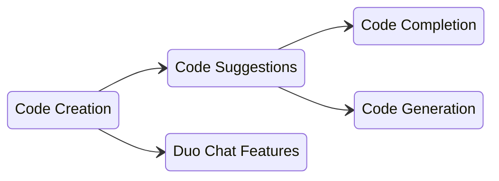

## Team Ownership

Features/capabilities Code Creation owns today:

- Code suggestions: completion + generation
- Code-related slash commands: `/explain`, `/refactor`, `/tests`, `/fix` 
- Repository X-Ray
- Code suggestions context (e.g. open tabs) - partnered with [Editor Extensions Group](/handbook/engineering/ai/editor-extensions/)

Code Creation is also responsible for evaluations for each of these features which includes:

- Creating datasets in LangSmith and registering them in the [Datasets repository](https://gitlab.com/gitlab-org/modelops/ai-model-validation-and-research/ai-evaluation/datasets/-/blob/main/doc/guidelines/register_dataset.md#registration-process)
- Creating evaluators in [Centralized Evaluation Framework](https://gitlab.com/gitlab-org/modelops/ai-model-validation-and-research/ai-evaluation/prompt-library)
- Running evaluations 

## About Code Suggestions

One of the main features we work on in the Code Creation group is Code Suggestions. Here is some quick information to get you started with Code Suggestions.

- [Code Suggestions Engineering Overview](/handbook/engineering/ai/code-creation/engineering_overview/) - Handbook technical overview of Code Suggestions
- [Code Suggestions Guide](/handbook/engineering/ai/code-creation/code-suggestions-guide/) - Handbook development guide for engineers
- [Code Suggestions Quick Start](https://docs.gitlab.com/ee/user/gitlab_duo/quick_start/) - GitLab Documentation
- [Difference between Code Completion and Code Generation](https://youtu.be/9dsyqMt9yg4) - YouTube
- [Code Suggestion Documentation](https://docs.gitlab.com/ee/user/project/repository/code_suggestions/) - GitLab Documentation

A lot of the terms we use in this area sound similar and can be confusing at first. Here are the basic terms we use:

- **Code Creation**: The group name and a collection of features relating to providing AI generated code
- **Code Suggestions**: A feature within Code Creation that provides AI-generated code within an IDE
  - **Code Completion**: A short AI-generated suggestion intended to complete an existing line or block of code
  - **Code Generation**: A longer AI-generated suggestion intended to create entire functions, classes, code blocks, etc.
- **Duo Chat**: Another feature that interacts with GitLab Duo Chat to write new code, refactor existing code, or scan code for vulnerabilities

If it helps, here are these terms in a diagram:

## Team Handles

Use this information to connect with the Code Creation group:

| Category                 | Handle                                |
|--------------------------|---------------------------------------|
| GitLab Team Handle       | @gitlab-org/code-creation/engineers   |
| Slack Channel            | #g_code_creation                      |
| Slack Handle (Engineers) | @code-creation-engs                   |

## Team Members

The following people are permanent members of the Code Creation Team:



You can reach the whole team on GitLab issues/MRs by using the `@code-creation-team` handle.

## Stable Counterparts

The following members of other functional teams are our stable counterparts:

| Category          | Counterpart                                                                          |
|-------------------|--------------------------------------------------------------------------------------|
| Product Manager   |                                                 |
| Technical Writing |                                                 |
| UX                | TBD                                                                                  |
| Support           | [TBD](/handbook/support/support-stable-counterparts/)                                |
| AppSec            | [TBD](/handbook/security/product-security/application-security/stable-counterparts/) |

## Other Related Pages

- Product Categories: [Code Creation](/handbook/product/categories/#code-creation-group)
- Direction: [Code Suggestion Direction](https://about.gitlab.com/direction/create/code_creation/code_suggestions/)

## Code Suggestion Dashboards

1. [Code Suggestions Metrics](https://10az.online.tableau.com/#/site/gitlab/views/PDCodeSuggestions/ExecutiveSummary) ([README](https://10az.online.tableau.com/#/site/gitlab/views/PDCodeSuggestions/README?:iid=1)) - usage, acceptance rate, latency, error rates, etc (Tableau)
1. [General Metric Reporting](https://10az.online.tableau.com/#/site/gitlab/views/DRAFTCentralizedGMAUDashboard/MetricReporting?:iid=1) - can find code suggestions rate limiting, X-Ray usage, etc (Tableau)
1. [Log Visualization Dashboard](https://log.gprd.gitlab.net/app/dashboards#/view/6c947f80-7c07-11ed-9f43-e3784d7fe3ca?_g=(refreshInterval:(pause:!t,value:0),time:(from:now-6h,to:now))) - another view of latency, response codes, number of requests, etc (Kibana)
1. [Code suggestions latency](https://log.gprd.gitlab.net/app/r/s/mMaY3): Breakdown of server-side latency for code suggestions (Kibana)
1. [X-Ray Dependency Parsing Errors Dashboard](https://log.gprd.gitlab.net/app/dashboards#/view/a828978b-8f41-489a-9e3b-aa71937e25b9?_g=h@e98e959): Breakdown of parsing errors triggered by X-Ray dependency scanning (Kibana)
1. [Metrics Dashboard](https://dashboards.gitlab.net/d/stage-groups-code_creation/stage-groups3a-code-creation3a-group-dashboard?orgId=1) (Grafana)
1. [Error Budget](https://dashboards.gitlab.net/d/stage-groups-detail-code_creation/stage-groups-code-creation-group-error-budget-detail?orgId=1) (Grafana)
