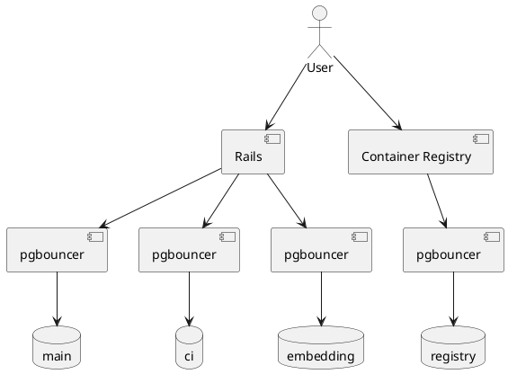



## Current GitLab.com Architecture

GitLab.com uses 4 PostgreSQL clusters running on virtual machines in GCP managed by Terraform, Chef and Ansible for complex tasks.
With Cells, we want to create significant more than 4 PostgreSQL clusters, if we want 50 Cells, we'll have to have 50+ PostgreSQL clusters.

We currently have 4 different database clusters, each hosting a single production database

| Database    | Description                                                                        | Size          | Scaling headroom |
| ----------- | ---------------------------------------------------------------------------------- | ------------- | ---------------- |
| `Main`      | Default location for all data                                                      | Over 20TB     | Very little      |
| `CI`        | All CI/CD related data                                                             | Over 20TB     | Very little      |
| `Registry`  | Container Registry data                                                            | Less than 2TB | Lots of headroom |
| `Embedding` | Running [pgvector](https://github.com/pgvector/pgvector) to store AI training data | Less than 2TB | Lots of headroom |

The data will be sharded by the `organization_id`, and an `organization_id` can live in 1 Cell.

During the Cells rollout most of the data will remain in the current database clusters, so it is important to accommodate for the requirements of this larger monolithic systems as well.

## Future Architecture

For the upcoming Cells project the requirements are different.
The current estimate is that each Cell will host a relatively small number of users compared to our current monolith, posing the new challenge to host many small database clusters and to create them on short notice

The exact requirements will develop over time, but the following is requested:

- Creation and removal of database clusters via API, which will be part of the provisioning of a cell.
- Database clusters up to the size of our reference architecture, [50,000 users API: 1000 RPS, Web: 100 RPS, Git (Pull): 100 RPS, Git (Push): 20 RPS](https://docs.gitlab.com/ee/administration/reference_architectures/50k_users.html).
- Up to 2,000 Cells and database clusters.

Our current automation involves many manual steps, including the creation of dedicated Chef roles for each cluster.
The change process to create new cluster is the largest overhead, requiring multiple Merge Requests and Peer Review as well execution by Change Request.
This is incompatible with the newly given requirements.

However, Cells will start iterative with one single Cell, needing one database cluster.
The current platform can therefore be used at least for Cells 1.0, but could be kept until all data is stored in the new Cell local database clusters.

It is also possible to migrate the current data to a new database platform, before the full sharing across multiple smaller Cells.
If this is desired, the requirements for the current monolith need to be meet by the target platform as well.

## Requirements

Requirements will be split into what we currently need for the monolithic data stores for GitLab.com and what we estimate for the individual cells.

Requirements can be put into the following categories.
They can be *high*, *soft*, *low*.

- *high*, is needed to operate GitLab.com.
- *medium*, is currently needed for operation, but could be replaced
- *low*, nice to have

### Universal Requirements

| Requirement                                        | Description                                                                                                                                                                                                                                                                              | Priority | Cloud SQL | Crunchy K8s Operator | Amazon RDS          |
| -------------------------------------------------- | ---------------------------------------------------------------------------------------------------------------------------------------------------------------------------------------------------------------------------------------------------------------------------------------- | -------- | --------- | ------------ | ------------------- |
| Support GitLab                                     | Ability to support GitLab application with minimal, or no changes                                                                                                                                                                                                                        | high     | ✅        | ✅           | ✅                  |
| PostgreSQL Major Release                           | Support for stable releases within 6 months, so development and infrastructure teams can work on integration.                                                                                                                                                                            | high     | ❌        | ✅         | ✅                  |
| PostgreSQL Major Release                           | Support for stable releases within 3 months, so development and infrastructure teams can work on integration.                                                                                                                                                                            | medium   | ❌        | ✅         | ✅/partial          |
| PostgreSQL Patch Release                           | Support for minor releases (bugfixes) within 7 days.                                                                                                                                                                                                                                     | high     | ❌        | ✅         | ✅                  |
| PostgreSQL Security Fixes                          | Any security fix to follow out [Security SLAs](../../../../threat-management/vulnerability-management/#remediation-slas), critical within 24 hours.                                                                                                                                      | high     | ❌        | ✅/partial           | ✅                  |
| PostgreSQL Beta Release                            | Support for current PostgreSQL beta release, so development and infrastructure teams can test early.                                                                                                                                                                                     | low      | ❌        | ✅           | ✅/only preview env |
| Near Zero Downtime Upgrade                         | Upgrades need to be possible with only seconds, not minutes or hours, of APDEX degradation.                                                                                                                                                                                              | high     | ❌        | ✅/partial, requires engineering efforts         | ✅/partial          |
| HA solution                                        | High availability and failover automation, on-par or better than current Patroni solution. Switchover / Failover in seconds without human intervention and not allowing split-brain scenarios.                                                                                           | high     | ✅        | ✅           | ✅                  |
| Logging Integration                                | Structured logging on Postgres available.                                                                                                                                                                                                                                                | high     | ✅        | ✅/Configurable & Sidecar option           | ✅                  |
| Metrics                                            | Integration in our Prometheus / Grafana monitoring setup.                                                                                                                                                                                                                                | high     | ✅        | ✅           | ✅                  |
| PostgreSQL Extensions - Operation (high)           | The following extensions are currently necessary:    - pg_stat_statements   - pg_wait_sampling   - amcheck   - [pgvector](https://github.com/pgvector/pgvector)   - pg_trgm   - btree_gin   - btree_gist   - plpgsql   - pg_repack                            | high     | ✅        | ✅/not wait_sampling, repack;but option to rebuild image            | ✅                  |
| PostgreSQL Extensions - Debug (medium)             | The following extensions are used for debugging: - pg_stat_kcache   - pgstattuple   - pageinspect   - pg_buffercache                                                                                                                                                         | medium   | ❌        | ✅/not kcache;but option to rebuild image           | ✅/not kcache       |
| PostgreSQL Extensions - Migration / Sharding (low) | The following extensions are not used yet, but might become important in the future:   - postgres_fdw   - file_fdw                                                                                                                                                                 | low      | ❌        | ✅           | ✅/not file_fdw     |
| Debug Tooling                                      | We currently use tools like strace to hook into PostgreSQL processes to find performance root causes. In a SaaS we would need to make sure the service provider is willing and able to do such analysis instead.                                                                         | medium   | ❌        | ✅/On-demand package install or container image rebuild           | ❌                  |
| Backups with third-party tools                     | Automated and manual base backups with third party tools such as wal-g, pgBackRest, with custom backup/archive repositories and retention policies.                                                                                                                                      | high     | ❌        | ✅           | ❌                  |
| Disk based backup / restore                        | Automated and manual fast backup like disk / volume snapshots, configurable retention policy, atomic snapshots or integration with [pg_start_backup / pg_stop_backup](https://www.postgresql.org/docs/14/functions-admin.html#FUNCTIONS-ADMIN-BACKUP-TABLE) to guarantee consistent data | high     | ✅        | ✅/Clone-only, no multi-AZ support yet; on roadmap.           | ✅                  |
| Incremental backups                                | Customize incremental backup execution, which allow us to perform more frequent backups, which reduces RTO.                                                                                                                                                                              | medium   | ✅        | ✅           | ✅                  |
| Backup Export                                      | Ability to export backups to generic storage e.g. GCS buckets.                                                                                                                                                                                                                           | high     | ❌        | ✅           | ❌/only S3 .parquet |
| Local Streaming Replication                        | Streaming Physical Replication to the same region is required to offload read-only workload and for horizontal scaling.                                                                                                                                                                  | high     | ✅        | ✅           | ✅                  |
| Multi-Region Streaming Replication                 | SR to remote locations, like multi-region, is needed for DR and future migrations.                                                                                                                                                                                                       | high     | ✅        | ✅           | ✅                  |
| External Streaming Replication                     | SR to an external PostgreSQL database outside of the production environment, a different account, or even a different Cloud provider, can be required for DR, testing and future migrations.                                                                                             | medium   | ❌        | ✅           | ❌                  |
| WAL Archiving Replication                          | WAL Archiving Replication eliminates the impact of hot standby feedback and streaming replication, which is useful for analytics (eg. execution of long/slow queries and reports), query testing and performance debug                                                                   | high     | ✅        | ✅           | ✅                  |
| WAL Delayed Archiving Replication                  | WAL Delayed Archiving Replication allow to keep a Replica continuously recoverying in a previous point-in-time (eg. 8 hours ago), this provides a very quick Disaster Recovery method for issues such as human errors.                                                                   | medium   | ❌        | ✅           | ❌                  |
| Logical Replication                                | Logical Replication is needed for zero downtime upgrades, future migrations or any kind of infrastucture change that might not support PostgreSQL physical replication.                                                                                                                  | high     | ✅ / ?    | ✅           | ✅                  |
| Read Load Distribution                             | Standbys to distribute read load need to be deployable on short notice, to mitigate performance bottlenecks, a suitable automation is acceptable as well.                                                                                                                                | high     | ✅        | ✅/use pgBackRest instead of volume snapshot           | ✅                  |
| Regional deployment                                | We need to be able to define the region of individual standbys for DR requirements.                                                                                                                                                                                                      | low      | ✅        | ✅           | ✅                  |
| Database Lab Integration                           | [Database Lab](https://postgres.ai/docs/platform) is used by our backend developers and needs to be integrated.                                                                                                                                                                          | low      | ✅ / ?    | ✅           | ✅ / ?              |

### Current Platform Requirements

#### Performance

Performance is a key factor. The first task is to define performance outlines and a reliable method to test if they are met.

{- TODO: Define performance requirements and test procedure -}

We observed the following load peaks and can use them as an indication:

- `~100k` read-write TPS on the primaries
  - `~80k` [TPS on the Main primary](https://dashboards.gitlab.net/d/000000144/postgresql-overview?orgId=1&from=1707696000000&to=1708387199000&var-prometheus=PA258B30F88C30650&var-environment=gprd&var-type=patroni)
  - `~32k` [TPS on the CI primary](https://dashboards.gitlab.net/d/000000144/postgresql-overview?orgId=1&from=1707696000000&to=1708387199000&var-prometheus=PA258B30F88C30650&var-environment=gprd&var-type=patroni-ci)
- `~1M` read-only TPS distributed among the standbys
  - `~714k` [TPS on the Main standbys](https://dashboards.gitlab.net/d/000000144/postgresql-overview?orgId=1&from=1707696000000&to=1708387199000&var-prometheus=PA258B30F88C30650&var-environment=gprd&var-type=patroni)
  - `~150k` [TPS on the CI standbys](https://dashboards.gitlab.net/d/000000144/postgresql-overview?orgId=1&from=1707696000000&to=1708387199000&var-prometheus=PA258B30F88C30650&var-environment=gprd&var-type=patroni-ci)

### Cells Requirements

| Requirement          | Description                                                                                              | Priority |
| -------------------- | -------------------------------------------------------------------------------------------------------- | -------- |
| API                  | Provision a ready to receive traffic PostgreSQL cluster via an API.                                      | high     |
| Manage 100+          | We need to be able to efficiently manage 100+ clusters.                                                  | high     |
| Homogenous databases | All the databases need to behave the same way, and we don't have special snowfalkes for each deployment. | medium   |

TODO: Define performance requirements and check with different steak holders. Discussed with @rnienaber, we will start with the largest reference architecture.

- Up to around 50.000 users, our largest reference architecture, [Up to 50,000 users API: 1000 RPS, Web: 100 RPS, Git (Pull): 100 RPS, Git (Push): 20 RPS](https://docs.gitlab.com/ee/administration/reference_architectures/50k_users.html)
- This might increase in the future, or multiple hundred Cells are required to host all current users

#### Decomposition

The application data for [GitLab.com](https://gitlab.com/) is currently decomposed into two separate database clusters, `Main` and `CI`.
We are evaluating if we can further decompose the `Main` database with [decomposing `Secure- and Software Supply Chain Security-related tables to a separate Postgres DB](https://gitlab.com/gitlab-org/gitlab/-/issues/427973) to gain more headroom and scalability for the current platform.

For Cells it is a design choice to scale horizontally by adding more Cells and to rebalance by moving organizations to less saturated cells.
Cells should not be scaled vertically to a point where decomposition is reasonable.
Therefore decomposition within Cells will not be needed and is also **not** supported by the current Dedicated / GET / Cells tooling.
Adding support for Decomposition in GET and Dedicated in the future would be possible as a medium-complexity task.

In line with this, only a single database cluster is provisioned per Cell, capable of hosting all needed databases.

## Overview - Possible Solutions

### Non-PostgreSQL Offerings

We briefly looked into non-PostgreSQL, claiming certain levels of PostgreSQL compatibility, like [AlloyDB](https://cloud.google.com/alloydb).
We came to the conclusion that cost and risk are not in any meaningful proportion to the expected benefit.
Currently, there is no inherent shortcoming of PostgreSQL itself that justifies further investigation.

Further details below:

- [Alternatives To Postgres DB (Google Spanner vs AlloyDB)](https://gitlab.com/gitlab-com/gl-infra/production-engineering/-/issues/24662)
- [Switching to a proprietary database, instead of PostgreSQL](https://gitlab.com/gitlab-com/gl-infra/production-engineering/-/issues/24673)

### Cloud SQL

[Cloud SQL](https://cloud.google.com/sql) is Google's standard PostgreSQL offering.
It is a custom fork, claimed to be 100% compatible to the upstream Releases and is simply referenced as `PostgreSQL` in the [Cloud SQL documentation](https://cloud.google.com/sql/docs/postgres/).
GitLab currently recognizes Cloud SQL as a [supported PostgreSQL implementation](https://docs.gitlab.com/ee/administration/reference_architectures/index.html#recommended-cloud-providers-and-services).

| Pro             | Description                                                                                                                    | Priority / Importance |
| --------------- | ------------------------------------------------------------------------------------------------------------------------------ | --------------------- |
| DBaaS           | Minimal operation overhead, in theory most efficient. We only need to define what DB we need and get it provided as a Service. | high                  |
| Outsourced      | We don't need to maintain infrastructure beyond our hooks, interfaces, monitoring, alerting and forecast.                      | high                  |
| Ops. Extensions | The essential extensions necessary to run GitLab.com are [available](https://cloud.google.com/sql/docs/postgres/extensions).   | high                  |
| API             | An API for all offered featured is already provided.                                                                           | high                  |

| Cons / Risks                     | Description                                                                                                                                                                                                                                                                                                                                                                                                                                                                                                                                                                                                                | Priority / Importance |
| -------------------------------- | -------------------------------------------------------------------------------------------------------------------------------------------------------------------------------------------------------------------------------------------------------------------------------------------------------------------------------------------------------------------------------------------------------------------------------------------------------------------------------------------------------------------------------------------------------------------------------------------------------------------------- | --------------------- |
| Product Lock-in                  | Cloud SQL is a One-Way door decision. Currently, we can replicate our data to any given destination providing PostgreSQL's Streaming Replication interface. GCP activity prohibits users from migrating away by multiple measures, e.g.: no base backup export, no WAL archiving, no Streaming Replication. A migration away will require significant downtime, unacceptable by our current availability goals for GitLab.com.                                                                                                                                                                                             | high / blocker        |
| Release Delay                    | It is vital to get PostgreSQL releases in a reasonable time and having a reliable roadmap to as source of truth for planing. Google gives no guarantee, only an estimate to offer GA in 3 months time. This estimate is not correct for `PG16` was released `2023-09-14` and is today `2024-02-16` [not available](https://cloud.google.com/sql/docs/postgres/db-versions) yet. This is no isolated case, [`PG15` became available `2023-05-24`](https://cloud.google.com/sql/docs/postgres/db-versions#support-timeline), 7 months after the [release](https://www.postgresql.org/docs/release/15.0/).                    | high / blocker        |
| Bugfix Delay                     | Fixes to critical bugs regarding data consistency or open vulnerabilities need to be available quickly, ideally within hours, at least in a few days time. Google gives no guarantee, only an estimate of 30 days. This estimate is not correct. [`15.3` was released `2023-05-11`](https://www.postgresql.org/docs/release/15.3/) and is today `2024-02-16` [not available](https://cloud.google.com/sql/docs/postgres/db-versions) yet, `281` days after the release. In the meantime the versions `15.4`, `15.5` and `15.6` have been released and are also not available yet, leaving Cloud SQL 4 patch levels behind. | high / blocker        |
| No Zero Downtime Upgrade         | Upgrades need to be possible with only seconds, not minutes or hours, of APDEX degradation. We found inconsistent data for maintenance time, ranging from [10s](https://cloud.google.com/sql/docs/mysql/maintenance#nearzero) to 30+ minutes and need to validate this claim with our data set.                                                                                                                                                                                                                                                                                                                            | high / blocker        |
| Base Backups                     | We regularly export base backups for testing, data analysis, export to Database Labs for the Database Team, or disaster recovery preparation. Google currently denies export of backups to generic storage, e.g. GCS buckets.                                                                                                                                                                                                                                                                                                                                                                                              | high / blocker        |
| External Streaming Replication   | CloudSQL supports [multi-region physical Replication](https://cloud.google.com/sql/docs/postgres/replication/cross-region-replicas), but it doesn't support physical replication to external database.                                                                                                                                                                                                                                                                                                                                                                                                                     | medium                |
| WAL Archiving Delayed Replication | CloudSQL doesn't support `recovery_min_apply_delay` to configure delayed replication. But in case `hot_standby_feedback` is disabled and a lag is created due to a large query CloudSQL automatically move a Replica from Streaming to Archive replication.                                                                                                                                                                                                                                                                                                                                                               | medium                |
| Observability: DB                | We loose observability (eg; `strace`/ `perf`) by not having full access to the database machine. We need GCP to execute low level debugging, but currently have indication that this would happen in a timely manner.                                                                                                                                                                                                                                                                                                                                                                                                      | medium                |
| Observability: Queries           | We get most of the observability we currently have, but we won't have the ability to dig into the database internals like lock contention with Cloud SQL because we don't have access to the database process. When we only have small instances e.g. 50k users this might be medium, but for larger instances could be high.                                                                                                                                                                                                                                                                                              | medium                |
| Escalation to database engineers | We could not find a specific support path where we can reliably reach Cloud SQL experts in a timely manner. A Cloud SQL expert needs to be available within minutes to collaborate with us on S1 incidents.                                                                                                                                                                                                                                                                                                                                                                                                                | high                  |

Most of the information above can be found in the official [Cloud SQL documentation](https://cloud.google.com/sql/docs/postgres/). Some estimates were given to us verbally by the GCP team, as seen in the meeting notes [Discuss Cloud SQL and AlloyDB with GitLab (internal)](https://docs.google.com/document/d/1axwqnCJLzy0RfcPF5HAeowmg3fjf5iC1Wp9V-Vdp_EU).

#### Things to validate

Dividing the scope based on the Cells iterations https://handbook.gitlab.com/handbook/engineering/architecture/design-documents/cells/#cells-iterations

##### Cells 1.0 (Initial Scope)

(Focus: Foundational validation and integration tasks for the Cells 1.0 release)

The target of Cells [Cells 1.0] (../iterations/cells-1.0.md) is to deliver a solution for internal customers using the SaaS GitLab.com offering, and foundational work for Cells.

- Evaluate and integrate CloudSQL's database observability and automated telemetry collection tools into GitLab's observability suite.
  - Is [Query Insights](https://cloud.google.com/sql/docs/postgres/using-query-insights) a sufficient replacement for the current observability tooling?
  - We need to validate how to export [Cloud SQL metrics](https://cloud.google.com/sql/docs/postgres/admin-api/metrics) and [Cloud SQL System insights](https://cloud.google.com/sql/docs/postgres/use-system-insights) into our Monitoring tools
  - How to integrate [CloudSQL query insights](https://cloud.google.com/sql/docs/postgres/using-query-insights) into our Monitoring tools?
  - How to export PostgreSQL logs into Elastic?
- Validate CloudSQL's backup and recovery strategies, including Point-in-Time Recovery (PITR), and review the [the high availability (HA) configuration for CloudSQL](https://cloud.google.com/sql/docs/postgres/high-availability) to minimize downtime during a zonal outage or hardware failure.
- [Configure and validate SSL/TLS certificates](https://cloud.google.com/sql/docs/postgres/configure-ssl-instance) to ensure PostgreSQL connections are encrypted.
- Auto-storage-increase behavior – Trigger multiple sequential storage increases and observe any "cool-off" period between increases, operational delays, or performance degradation.
- Instance scaling downtime – Measure downtime when scaling up/down with and without HA enabled.
- Minor version upgrade impact – Validate the downtime experienced during minor version upgrades with and without HA.

##### Cells 1.5 (Future Considerations & Enhancements)

(Focus: Features and validations for later iterations)

The target of [Cells 1.5](../iterations/cells-1.5.md) is to deliver a migration solution for existing and new enterprise customers using the SaaS GitLab.com offering, built on top of the Cells 1.0 architecture.

- Validate a connection pooling solution for both Write and Read-Only workloads:
  - PgBouncer on VMs
  - [CloudSQL Manage database connections] (https://cloud.google.com/sql/docs/postgres/manage-connections) / [Managed Connection Pooling (MCP)](https://www.youtube.com/watch?v=rGI3hIBl2s0). It only offers limited functionality compared to self-managed PgBouncers.
- Evaluate [CloudSQL Proxy](https://cloud.google.com/sql/docs/postgres/sql-proxy)
- Compare database migration options:
  - Native logical replication - [logical replication feature](https://cloud.google.com/sql/docs/postgres/replication/configure-external-replica) ([pglogical](https://github.com/2ndQuadrant/pglogical))
  - [CloudSQL Database Migration Services](https://cloud.google.com/database-migration)
  - Also, evaluate options to migrate data out of CloudSQL.
- Evaluate time and impact of PostgreSQL major version upgrades in a 50k reference architecture.
  - CloudSQL does not have a direct equivalent to AWS RDS Blue/Green deployments, so solutions must be engineered in-house.
- How long does it take to create a read-replica, or a new cluster from a backup? `10GB`, `100GB`, `1TB`, `2TB`?
- Evaluate disaster recovery options, including delayed replicas.
- Performance impact of storage increase – Measure query performance before and after a manual storage increase.
- High-load stress testing – Load large datasets and measure how CloudSQL handles sustained write-heavy operations.

##### Evaluate Changes Over the Dedicated Deployment

- Assess options to implement Enhanced Monitoring with finer granularity (<10 seconds), utilizing Postgres Exporter with custom queries (e.g., `pg_stat_activity`, `pg_stat_statements`) and Prometheus with more frequent scraping.
- Evaluate offloading read operations to Standby Replicas.
- Evaluate "Enable auto minor version upgrade".
- Assess performance improvements with the "Dedicated Log Volume.".
- Increase logging levels to capture slow queries, temp usage, autovacuum, lock waits, connections/disconnections, and DDL statements.
- Configure `pg_stat_statements` settings.
- Load and Configure `auto_explain`.
- Implement "logical backup" solution.
- Review [Cloud Monitoring](https://cloud.google.com/monitoring) and (Alerting](https://cloud.google.com/monitoring/alerts).

### k8s Operator

There are currently multiple available operators that seam feasible, but detailed evaluation and benchmarking to ensure our requirements are met is critical.
One feature that might be lacking is zero downtime upgrades.
Currently, we maintain our own automation for this as well and could adapt it until an operator provides this feature.

| Pro                         | Description                                                                                                                                                                                                      | Priority / Importance |
| --------------------------- | ---------------------------------------------------------------------------------------------------------------------------------------------------------------------------------------------------------------- | --------------------- |
| API                         | An API for all offered featured is already provided.                                                                                                                                                             | high                  |
| Reduced operation tooling   | By only supporting k8s, we remove the need to manage VM via Chef. We need to maintain less code and reduce complexity.                                                                                           | High                  |
| Off-the-shelf automation    | Utilizing an off-the-shelf operator reduces the amount of automation code to maintain. We do not need to develop an API from scratch.                                                                            | high                  |
| Control over our data       | Observability and control are not given away. We can decide if and when we want to migrate to any other solution. We can decide on where our data is stored, level of redundancy air gab backups, ect.           | medium                |
| Future proof                | When there is a better or more desirable solution available in the future we are not restricted in any way to migrate.                                                                                           | high                  |
| No product lock-in          | We are not locked in to one product we can not leave in the future.                                                                                                                                              | medium                |
| Debugging capability        | Compared to any SaaS offering we do not rely on a vendor to be willing and able to debug our problems in a timely manner.                                                                                        | high                  |
| Good integration with Cells | Compared to other self-hosted solutions, the database will run in the same k8s cluster as the rest of the workloads. This removes the need to integrate external components as well as multiple failure vectors. | medium                |
| Near Zero Downtime Upgrade | We can adapt Gitlab's ([db-migration/pg-upgrade-logical](https://gitlab.com/gitlab-com/gl-infra/db-migration#zero-downtime-postgresql-upgrades) Automation to achieve near-zero downtime for PostgreSQL MVU over k8s | high / blocker            |

| Cons / Risks     | Description                                                                                                                  | Priority |
| ---------------- | ---------------------------------------------------------------------------------------------------------------------------- | -------- |
| Know how         | k8s is widely used among our infrastructure, but not within Database Reliability. We need to build up knowledge in the team. | medium   |
| Missing Features | Missing features need to be implemented by us, e.g. not supported extension.                                                 | medium   |

#### Things to validate

- Compare Candidates (4-5 weeks)
  - [CYBERTEC PostgreSQL Operator](https://github.com/cybertec-postgresql/CYBERTEC-pg-operator) ([zalando](https://github.com/zalando/postgres-operator) with commercial support)
  - [CloudNativePG](https://github.com/cloudnative-pg/cloudnative-pg)

### Amazon RDS PostgreSQL

[Amazon Relational Database Services PostgreSQL](https://aws.amazon.com/rds/postgresql/) is AWS's managed database service offering fully compatible with PostgreSQL community version. In fact, Amazon only packs and deploys the PostgreSQL community binaries into the [RDS instance underlying infrastructure](https://aws.amazon.com/blogs/database/amazon-rds-multi-az-with-two-readable-standbys-under-the-hood/).
GitLab currently recognizes Amazon RDS PostgreSQL as a [supported PostgreSQL implementation](https://docs.gitlab.com/ee/administration/reference_architectures/#recommended-cloud-providers-and-services).

| Pro                                  | Description                                                                                                                                                                                                                                                                                                                                                                               | Priority / Importance |
| ------------------------------------ | ----------------------------------------------------------------------------------------------------------------------------------------------------------------------------------------------------------------------------------------------------------------------------------------------------------------------------------------------------------------------------------------- | --------------------- |
| DBaaS                                | Minimal operation overhead, in theory. We only need to define what DB we need and get it provided as a Service.                                                                                                                                                                                                                                                                           | high                  |
| Outsourced                           | We don't need to maintain infrastructure beyond our hooks, interfaces, monitoring, alerting and forecast.                                                                                                                                                                                                                                                                                 | high                  |
| Ops. Extensions                      | The essential extensions necessary to run GitLab.com are [available](https://docs.aws.amazon.com/AmazonRDS/latest/PostgreSQLReleaseNotes/postgresql-extensions.html).                                                                                                                                                                                                                     | high                  |
| API                                  | An API for all offered features is already provided.                                                                                                                                                                                                                                                                                                                                      | high                  |
| Gitlab Dedicated Compatibility       | Amazon RDS PostgreSQL is already used by our Gitlab Dedicated architecture, therefore is already integrated into Gitlab Dedicated-tooling                                                                                                                                                                                                                                                 | ?                     |
| Less Risk of Vendor lock-in          | Currently, we are not fully locked into the RDS infrastructure. Migration is possible via PostgreSQL native logical replication, [Export to S3](https://docs.aws.amazon.com/AmazonRDS/latest/UserGuide/postgresql-s3-export.html), or even [Amazon DMS](https://docs.aws.amazon.com/dms/latest/userguide/CHAP_Introduction.html), which supports migrating RDS databases to "on-premises" | medium                |
| Commitment to PostgreSQL development | Amazon currently employs [9 committers and major contributors to PostgreSQL source code](https://www.postgresql.org/community/contributors/). In contrast, Microsoft employs 8 committers/major contributors and Google just 1.                                                                                                                                                           | low                   |
| Bugfix/Patches within 7 days         | [Proven history](https://docs.aws.amazon.com/AmazonRDS/latest/PostgreSQLReleaseNotes/postgresql-release-calendar.html) for minor releases (bugfixes) within 7 days. A few patches were released even in the same day.                                                                                                                                                                     | high                  |
| Release within 6 months              | Track record that PostgreSQL major versions always was released for RDS in less than 6 months, sometimes even in less than 3 months.                                                                                                                                                                                                                                                      | high                  |
| Near-Zero Downtime Upgrade           | The default RDS option for MVU is based in `pg_upgrade` without logical replication, therefore it requires downtime of dozens of minutes. However, the downtime can be reduced (usually under 60 seconds) with the [RDS Blue/Green deployment for database updates](https://docs.aws.amazon.com/AmazonRDS/latest/UserGuide/blue-green-deployments.html).                                  | high / blocker        |
| Escalation to RDS expert engineers   | There's no specific support path to reach an Internal RDS engineer in a timely manner. However, RDS support has the SME (subject matter experts) program, which is part of Amazon Support escalation and should be available within minutes to collaborate with us on S1 incidents.                                                                                                       | high                  |
| Support custom Backup Plans          | Amazon RDS supports custom backup plans and not only "daily" backups.                                                                                                                                                                                                                                                                                                                     |                       |

| Cons / Risks                             | Description                                                                                                                                                                                                                                                                                                                                                                                                                                                                                                                                                                      | Priority / Importance |
| ---------------------------------------- | -------------------------------------------------------------------------------------------------------------------------------------------------------------------------------------------------------------------------------------------------------------------------------------------------------------------------------------------------------------------------------------------------------------------------------------------------------------------------------------------------------------------------------------------------------------------------------- | --------------------- |
| Export of Backups with third-party tools | We regularly export base backups for testing, data analysis, export to Database Labs for the Database Team, or disaster recovery preparation, but third-party backup tools are not supported by RDS. The only option to export data for external usage is [Snapshot Expott into Apache Parquet format](https://docs.aws.amazon.com/AmazonRDS/latest/UserGuide/USER_ExportSnapshot.html), which might not be supported by all consumers, or [exporting pg_dump to S3](https://docs.aws.amazon.com/AmazonRDS/latest/UserGuide/postgresql-s3-export.html), which is slow to process | high / blocker        |
| External Streaming Replication           | RDS supports [cross-region physical Replication](https://docs.aws.amazon.com/AmazonRDS/latest/UserGuide/Concepts.RDS_Fea_Regions_DB-eng.Feature.CrossRegionReadReplicas.html#Concepts.RDS_Fea_Regions_DB-eng.Feature.CrossRegionReadReplicas.pg), but it doesn't support physical replication to an external database.                                                                                                                                                                                                                                                           | medium                |
| WAL Archiving Delayed Replication        | RDS PostgreSQL doesn't support `recovery_min_apply_delay` to configure delayed replication.                                                                                                                                                                                                                                                                                                                                                                                                                                                                                      | medium                |
| Debug capability                         | We lose observability (eg; `strace`/ `perf`) by not having full access to the database machine, however, if absolutely necessary RDS internal engineers might be escalated to perform any low-level debugging. Currently, we have evidences that this would happen in a timely manner.                                                                                                                                                                                                                                                                                           | medium                |
| No direct access to WAL files            | We can't export WAL files nor execute `pg_waldump` into an RDS instance. This sometimes was required to debug frequently modified objects and their respective content                                                                                                                                                                                                                                                                                                                                                                                                           | low                   |

#### Things to validate

- We need to validate how to [export RDS Performance Insights metrics](https://docs.aws.amazon.com/AmazonRDS/latest/UserGuide/USER_PerfInsights.API.html) into our Monitoring tools
- How to export PostgreSQL logs into Elastic
- Validate a connection pooling solution for both Write and Read-Only workloads
  - pgbouncer over VMs
  - [RDS Proxy](https://docs.aws.amazon.com/AmazonRDS/latest/UserGuide/rds-proxy.html)
- Compare Migration options
  - Native logical replication
  - Amazon Database Migration Services
- Evaluate time and impact of Major Version Upgrades 50k reference architecture?
  - Also evaluate Blue/Green deployments
- How long does it take to create a read-replica, or a new cluster from a backup? `10GB`, `100GB`, `1TB`
- How long is the database service downtime with Blue/Green major version upgrade method?
  - We should also test if pgbouncer or RDS Proxy can hold requests to alleviate the impact during a Blue/Green deployment.

##### Evaluate changes over current Dedicated-RDS deployment

- Cost of [Enable Enhanced Monitoring](https://docs.aws.amazon.com/AmazonRDS/latest/UserGuide/USER_Monitoring.OS.html) with small granularity ( < 10 seconds)
- Evaluate offload of read operations into Standby Replicas
- Evaluate "Enable auto minor version upgrade"
- Evaluate performance gain with "Dedicated Log Volume"
- Increase logging level: slow queries, temp usage, autovacuum, lock waits, connections/disconnections, DDL statements
- Configure `pg_stat_statements` settings
- Load and Configure `auto_explain`
- Implement "logical backup" solution
- Review Alarms: RDS Event Subscriptions, AWS Cloud Watch

### Refactor Current Automation

The current platform to host all PostgreSQL clusters for GitLab.com is based mainly on Terrafrom and Chef, managing GCP virtual machines.
Some complex operations are orchestrated via Ansible.

The main problems currently with this architecture is the historical growth and technical debt.
It was designed to host a single, or small fixed number of database clusters.
Hosting any arbitrary number of clusters is theoretically possible, but requires manual steps and overhead.

These inefficiencies are incompatible with the estimated requirements of hosting many database clusters, e.g. >100.

Some examples:

- For each database cluster we have to create multiple Chef roles
- For each database cluster we have to manually define a network subnet and write it in a configuration file
- By policy for each database cluster in production, we have an equivalent in staging

These shortcomings and bottlenecks could be removed by improving the automation with Chef or replacing it by a different tool set.

| Pro                 | Description                                                                                                                                                                                                                                                          | Priority / Importance |
| ------------------- | -------------------------------------------------------------------------------------------------------------------------------------------------------------------------------------------------------------------------------------------------------------------- | --------------------- |
| Iteration, Low Risk | We have an inefficient but fully working platform, therefore we can deploy enhancements iteratively, one step at a time. There is no "big bang" migration, no risk of not having certain features or to discover shortcomings of a new platform late in the process. | high                  |

| Cons / Risks              | Description                                                                                                                                                                                                                                                                                                                   | Priority / Importance |
| ------------------------- | ----------------------------------------------------------------------------------------------------------------------------------------------------------------------------------------------------------------------------------------------------------------------------------------------------------------------------- | --------------------- |
| Chef Know-How             | Chef know-how and usage inside GitLab (and outside) is already decreasing. The current team does not have the needed know-how and capacity to implement the needed changes in a timely manner. Moving other SRE with Chef and domain knowledge into the DBRE team would be necessary, as well as GitLab's commitment to Chef. | high / blocker        |
| Efficiency                | The ideal outcome will most likely still be not as efficient as a DBaaS solution.                                                                                                                                                                                                                                             | medium                |
| Development / Maintenance | We still have to develop and maintain the full automation code in-house.                                                                                                                                                                                                                                                      | high / blocker        |
| Integration               | Each Cell will run in a single k8s cluster, this solution will not be Cell local. This brings higher complexity and possible failure vectors.                                                                                                                                                                                 | medium                |

## Cells 1.0

Cells 1.0 is the first iteration for Cells, which should become GA during 2024.
This first iteration will only host a limited number of test users and projects and therefore does not have the full requirements.
It poses an opportunity to learn and iterate on the database platform.

During the development the number of Cells can grow from `1` to up to `10`.
The estimate is that it will take multiple month until a second Cell will be created, and a second cluster is needed.

Cloud SQL currently does not fulfill the given high priority requirements, and there is no roadmap which fully includes them as well.
We will use Cloud SQL temporary for Cells 1.0 despite that to unblock the Cells 1.0 time-line.
Therefor we acknowledge and agree to the associated risks and bottlenecks.

- There will be downtime to migrate to the final platform!
- The quality of service will not be equal to GitLab.com.
  - There is no clear SLO for deep level support.
  - No major version upgrades with reasonable downtime.
- We can not grow reliable grow this solution to the target of 50k users, we see problems for 3k users regarding connection pooling already.

We prioritize finding a solution meeting the requirements, to make it available after Cells 1.0.
The most promising candidates are the existing k8s PostgreSQL operators, offering PostgreSQL as a Service like experience.

## Cells 1.x

As highlighted in Cells 1.0 we start with Cloud SQL as a temporary solution to free resource to build a sufficient platform for the long-term requirements.

The first phase will evaluate which k8s operators are available and which are the most fitting candidates for a full evaluation.

## Current Database Platform

The current database platform is limited in future growth, but currently not at the edge of saturation.
It is not clear when the database will become a bottleneck, but based on the prior experience from before decomposition a database with 200% size poses operational challenges.

There are currently no predictions how long it takes for our database to double in size, but it is fair to assume this will not happen in the next 24 month, until 2026.

This gives enough time to migrate significant data into cells, or to improve / change the database platform here as well.
