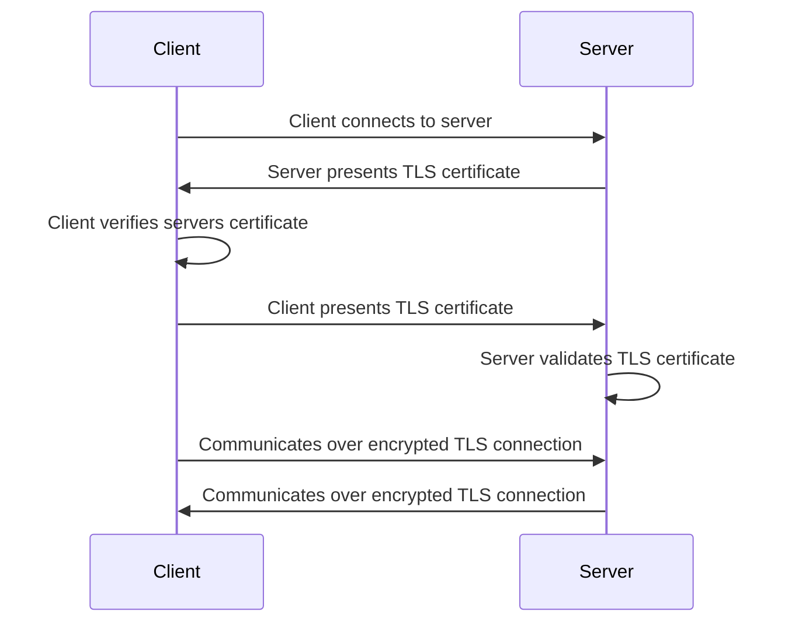
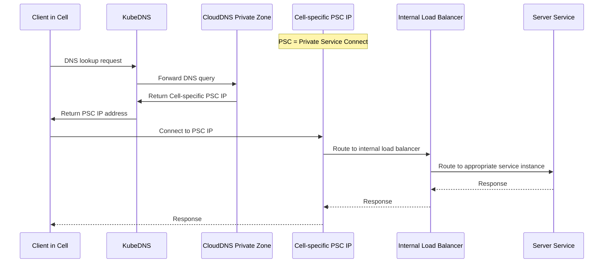



## Pre-Reads

- [Internal TLS](https://gitlab-com.gitlab.io/gl-infra/gitlab-dedicated/team/architecture/blueprints/internal_tls.html)

## Summary

We require that all communication between Cell services is secure and both parties identities are verified.

## Goals

- Ensure that all communication between Cell services is encrypted, uniquely identified, authenticated, and authorized on both sides.
- Leverage the existing PKI Interface that is used for Internal TLS.
- Provide a clear implementation path for both server and client services.
- Enable secure service-to-service authentication without introducing unnecessary complexity.
- Support Authorization based on mTLS certificates where appropriate.

### Scope

This document focuses specifically on implementing mutual TLS (mTLS) for Authentication and Authorization between Cell and its services.

### Out of Scope

- Implementation of a service mesh (e.g., Istio) for encrypting traffic via mTLS is out of scope for the following reasons:
  - We already leverage TLS inside a cell using [Internal TLS](https://gitlab-com.gitlab.io/gl-infra/gitlab-dedicated/team/architecture/blueprints/internal_tls.html), so extending this existing blueprint to support external services is more consistent with our architecture.
  - While service mesh provides a transparent way for application developers to implement mTLS with external services, this approach introduces significant security risks when used as your sole authorization mechanism without additional application-level controls (such as JWTs). If a vulnerability exists, attackers could exploit it to use the client as a proxy to send unauthorized requests to the mTLS server. The fundamental issue is that service meshes authorize communications based solely on service identity rather than validating the legitimacy of individual requests within those services, making it inadequate as a complete authorization solution in the absence of request-level validation mechanisms.
- While TLS is used to secure communications between CDNs/load balancers and their backends, as well as between internal services, this scope explicitly excludes:
  - Communication from external clients to GitLab services.
  - Communication between services inside a cell and those outside a cell that are not managed cells services

### Implementation Principles

- **Developer Experience:** mTLS implementation should be transparent to developers with minimal code changes.
- **Security:** Only authorized services should be able to communicate with one another.
- **High Availability:** Certificate rotation must occur automatically without service interruption.
- **Scalability:** Solution must work for all Cell services.

## Requirements

| Requirement                            | Description                                                                                     | Priority |
| ---------------------------------------| ------------------------------------------------------------------------------------------------| -------- |
| Security                               | Only authorized services can communicate with one another                                       | high     |
| High availability                      | Certificates can be rotated automatically without service interruption                          | high     |
| Cells support                          | Can be used for all cells services                                                              | high     |
| Authorization support                  | Application Developers can use mTLS for authorization                                           | high     |
| Provision certificates within seconds  | We can create a new certificate in seconds                                                      | high     |
| Multiple Protocol support              | Support HTTP/1.1, HTTP/2, gRPC                                                                  | high     |
| Internal Traffic                       | All traffic between client and server services must remain within the cloud provider's network  | high     |
| Gradual Adoption                       | First allow traffic without a certificate to be accepted                                        | med      |
| Auditable                              | Can validate all services are using secure authentication via mTLS                              | med      |
| Cloud-managed                          | Can be integrated with cloud services                                                           | med      |

## Non-Goals

- mTLS should not be considered for managing user level authorization

## Design and implementation details

### mTLS Architecture



### mTLS Implementation Flow

From the [Internal TLS Blueprint](https://gitlab-com.gitlab.io/gl-infra/gitlab-dedicated/team/architecture/blueprints/internal_tls.html#end-entity-certificates), we obtain end-entity client certificates from GCP Secrets Manager for the GKE cluster.

#### Server/Producer Configuration

The external service host requires these changes:

- Deploy the service behind an [Internal Load Balancer](https://cloud.google.com/load-balancing/docs/l7-internal) to ensure the service is not publicly accessible
- Configure [mTLS Client Authentication on the Load Balancer](https://cloud.google.com/load-balancing/docs/mtls#validation-steps)
  - Upload the Private Root CA Certificate to the [Trust Config to enforce authenticated access only](https://cloud.google.com/load-balancing/docs/mtls#architecture)
- Configure [Private Service Connect] with the Load Balancer as a backend
- Set up the permissions for the Cell's GCP project to connect to the [Private Service Connect] endpoint of the Server.

#### Client/Consumer Configuration

The service consuming the external API requires these changes:

- Connect to the [Private Service Connect] endpoint using the VPC where the client service is deployed
- Mount the certificate/key pair in the client application
- Update client code to establish mTLS connections through the [Private Service Connect] endpoint

The diagram below illustrates the complete request flow between a Pod in a Cell and an external service, including the supporting infrastructure:


For detailed implementation examples and proof-of-concept documentation of this architecture, refer to: https://gitlab.com/gitlab-org/gitlab/-/issues/468640.

### Authentication and Authorization with mTLS

#### Authentication

mTLS authentication in our Cell services architecture works through explicit certificate loading and connection setup rather than transparent proxying:

- **Certificate Loading**: Each service must explicitly load its client certificate and private key from the filesystem. This is done in trusted code paths, as shown in the [mTLS POC client code](https://gitlab.com/gitlab-com/gl-infra/cells/mtls_poc/-/blob/e1b90bb4a241c63389bb366f0dacd7c9e1dac10c/client/main.go#L30).
- **Connection Establishment**: The service must explicitly add the TLS credentials to outgoing requests, as demonstrated in the [request creation code](https://gitlab.com/gitlab-com/gl-infra/cells/mtls_poc/-/blob/e1b90bb4a241c63389bb366f0dacd7c9e1dac10c/client/main.go#L124).
- **Certificate Validation**: The GCP Loadbalancer validates the client's certificate against the trusted CA, ensuring only services with valid certificates can connect.

Example of loading and using TLS credentials in a Go client:

```go
tlsCredentials, err := loadTLSCredentials()
if err != nil {
    log.Fatalf("Failed to load TLS credentials: %v", err)
}

// Create a connection with the TLS credentials
conn, err := grpc.Dial(serverAddr, grpc.WithTransportCredentials(tlsCredentials))

...
// loadTLSCredentials loads TLS credentials from file paths provided in environment variables
func loadTLSCredentials() (credentials.TransportCredentials, error) {
    // Get paths to TLS files from environment variables
    serverCACertPath := os.Getenv("SERVER_CA_CERT")
    if serverCACertPath == "" {
        return nil, fmt.Errorf("SERVER_CA_CERT environment variable is not set")
    }

    clientCertPath := os.Getenv("MTLS_CERT_CHAIN")
    if clientCertPath == "" {
        return nil, fmt.Errorf("MTLS_CERT_CHAIN environment variable is not set")
    }

    clientKeyPath := os.Getenv("MTLS_KEY")
    if clientKeyPath == "" {
        return nil, fmt.Errorf("MTLS_KEY environment variable is not set")
    }

    // Load server CA certificate
    serverCACertBytes, err := ioutil.ReadFile(serverCACertPath)
    if err != nil {
        return nil, fmt.Errorf("failed to read server CA certificate file: %v", err)
    }

    certPool := x509.NewCertPool()
    if !certPool.AppendCertsFromPEM(serverCACertBytes) {
        return nil, fmt.Errorf("failed to add server CA's certificate to pool")
    }

    // Load client certificate and key
    clientCert, err := tls.LoadX509KeyPair(clientCertPath, clientKeyPath)
    if err != nil {
        return nil, fmt.Errorf("failed to load client certificate and key: %v", err)
    }

    // Create the credentials and return it
    config := &tls.Config{
        Certificates: []tls.Certificate{clientCert},
        RootCAs:      certPool,
    }

    return credentials.NewTLS(config), nil
}
```

Source: [mTLS POC client code](https://gitlab.com/gitlab-com/gl-infra/cells/mtls_poc/-/blob/e1b90bb4a241c63389bb366f0dacd7c9e1dac10c/client/main.go#L30)

#### Authorization

Authorization in our mTLS implementation occurs after successful authentication and relies on client identity information:

- **Certificate-Based Identity**: After authenticating the client connection, the server extracts identity information from the client's certificate for authorization decisions.
- **GCP LoadBalancer Headers**: We leverage [custom mTLS headers](https://cloud.google.com/load-balancing/docs/https/custom-headers#mtls-variables) passed by GCP LoadBalancer to the backend service, which contain pre-extracted certificate information.
- **Header Processing**: The server extracts these headers from incoming requests to determine the client's identity and permissions without needing to re-parse the certificate.
- **Access Control Enforcement**: Based on the extracted identity (typically the Common Name), the server determines whether the client is authorized to access the requested resource.

Example of extracting and using certificate information for authorization in a gRPC server:

```go
md, ok := metadata.FromIncomingContext(ctx)
if !ok {
    return nil, status.Error(codes.Internal, "failed to get metadata")
}

// Get the value of X-Client-Cert-Subject-Dn
// Header keys in gRPC metadata are lowercase
clientCertDNs := md.Get("x-client-cert-subject-dn")

var cellName string
if len(clientCertDNs) > 0 {
    // Call the function to extract common name
    commonName, err := extractCommonNameFromSubjectDN(clientCertDNs[0])
```

Function to extract the Common Name from the Subject DN:

```go
func extractCommonNameFromSubjectDN(base64SubjectDN string) (string, error) {
    // Decode base64
    derBytes, err := base64.StdEncoding.DecodeString(base64SubjectDN)
    if err != nil {
        return "", fmt.Errorf("failed to decode base64: %w", err)
    }

    // Parse the DER-encoded subject DN
    var rdnSequence pkix.RDNSequence
    _, err = asn1.Unmarshal(derBytes, &rdnSequence)
    if err != nil {
        return "", fmt.Errorf("failed to parse ASN.1 DER encoding: %w", err)
    }

    // Convert to a Name
    var subject pkix.Name
    subject.FillFromRDNSequence(&rdnSequence)

    // Return the common name
    return subject.CommonName, nil
}
```

Source: [mTLS Server Code](https://gitlab.com/gitlab-com/gl-infra/cells/mtls_poc/-/blob/e1b90bb4a241c63389bb366f0dacd7c9e1dac10c/server/main.go#L31)

#### Advantages of mTLS over Alternative Authentication Methods

We chose mTLS as our primary mechanism for both authentication and authorization in our Cell services architecture for several key reasons:

1. **Infrastructure-Managed Identity**: mTLS allows us to leverage infrastructure-provided identity rather than application-managed tokens. This shifts the responsibility of identity management from application code to our infrastructure components, which are more specialized for this purpose.

1. **Simplified Secret Management**: Unlike token-based approaches (such as JWT tokens) that often require storing tokens as environment variables or in configuration files, mTLS certificates can be automatically provisioned, rotated, and managed by our existing PKI infrastructure. This provides several benefits:
   - No hardcoded secrets in application code or environment variables
   - Reduced risk of token leakage through logs or configuration dumps
   - Standard certificate lifecycle management rather than custom token management

1. **Multi-Service Compatibility**: The mTLS approach scales effectively across multiple services without requiring service-specific implementation details. Each service follows the same pattern for authentication and authorization, providing a consistent security model across our entire Cell architecture.

1. **Automated Certificate Rotation**: Certificates can be rotated automatically without service interruption, which is often more complex with token-based approaches. Our existing certificate management infrastructure handles rotation seamlessly, reducing operational overhead.

1. **Dual-Purpose Security**: mTLS provides both encryption and authentication in a single mechanism, simplifying our security architecture compared to approaches that separate these concerns.

#### Security Considerations

- If an attacker gains Remote Code Execution (RCE) on a pod, they could access certificates and keys stored on the filesystem. This is an inherent limitation, as RCE generally compromises all security boundaries within the pod.
- The design focuses on preventing unauthorized service-to-service communication in scenarios where an attacker has limited access to manipulate network requests but not full system access.
- Certificate rotation and proper secret management help mitigate risks associated with potential certificate compromise.

### Private Root CA Regional Resilience

#### Regional Limitations of Certificate Authority Service

Google Cloud Certificate Authority Service is a regional service, meaning that [CA Service resources are stored in specific geographical regions and cannot be moved or exported after creation](https://cloud.google.com/certificate-authority-service/docs/locations). As documented in Google Cloud's disaster recovery guidance, [regional resources cannot withstand a regional failure](https://cloud.google.com/architecture/disaster-recovery), making them vulnerable to regional outages.

This regional limitation presents a specific risk for our Cell architecture:

- **New Cell Provisioning Disruption**: Having a single Private Root CA means that during a regional outage, when we want to create a Cell in a different region, we won't be able to as the Private Root CA would be unavailable, making Cell provisioning fail.
- **Existing Cell Operations**: Importantly, existing Cells would continue to operate normally during a regional CA outage, as they rely on already-issued certificates that remain valid and functional.

#### Multi-Regional Private Root CA Strategy

To achieve regional resilience and ensure continuous certificate operations for new Cell provisioning, we implement a multi-regional Private Root CA strategy where each Cell uses the Private Root CA located in its deployment region.

##### Current Implementation

We currently provision Private Root CAs in the following regions:

- **us-east1** - For Cells deployed in the US East region
- **us-central1** - For Cells deployed in the US Central region

##### Planned Expansion

The strategy includes expanding Private Root CA deployment to cover all primary regions where Cells will be deployed:

- **Americas**: us-east1, us-central1, us-west1, northamerica-northeast1
- **Europe**: europe-west1, europe-west3, europe-north1
- **Asia Pacific**: asia-northeast1, asia-southeast1, australia-southeast1

##### Implementation Architecture and Considerations

Each Cell is provisioned with certificates from the Private Root CA located in the same region:

- **Regional Alignment**: Cells deployed in `us-east1` use the Private Root CA in `us-east1`
- **Certificate Trust Configuration**: All Cells, and the Server (Topology Service) must be configured to trust certificates issued by any of the regional Root CAs to maintain interoperability between Cells across regions
- **Monitoring and Alerting**: Comprehensive monitoring ensures rapid detection of regional CA failures and provides visibility into provisioning capabilities across regions
- **Certificate Lifecycle Coordination**: Ensure certificate rotation and lifecycle management works consistently across all regional CAs
- **Regional Capacity Planning**: Monitor certificate issuance capacity and usage across regions to ensure adequate resources for Cell provisioning demands

##### Benefits of Multi-Regional Approach

- **New Cell Provisioning Resilience**: Even if one region experiences an outage, new Cells can continue to be provisioned in other regions using their respective regional Private Root CAs
- **Reduced Latency**: Each Cell uses a geographically close Root CA for optimal performance during certificate operations
- **Regional Independence**: Each region operates independently, so a regional outage only affects new Cell provisioning in that specific region
- **Regional Isolation**: A regional outage is contained to that region and doesn't affect Cell operations or provisioning in other regions
- **Existing Operations Continuity**: Existing Cells continue operating normally during regional outages, as they don't require new certificate issuance for ongoing operations

This multi-regional strategy ensures that our Cell provisioning capabilities remain resilient to regional outages while maintaining the security posture and operational efficiency of our Cell architecture. While existing Cells continue to operate during regional CA outages, this approach ensures we can continue expanding our infrastructure in unaffected regions.

### Certificate Lifecycle Management

#### Certificate TTLs

Certificate Time-To-Live (TTL) values are configured according to industry best practices and our internal security requirements. The following TTL values have been established for our PKI infrastructure ([discussed in detail here](https://gitlab.com/gitlab-com/gl-infra/tenant-scale/cells-infrastructure/team/-/issues/335)):

| Certificate Type | TTL |
| --------------- | --- |
| Root CA | 10 years |
| Intermediate/Subordinate CA | 5 years |
| End-entity certificates | 13 months |

These TTL values strike a balance between security requirements (limiting exposure time of compromised certificates) and operational overhead (frequency of rotation).

#### Certificate Rotation

To ensure continuous operation without interruption, certificates are proactively rotated before expiration:

- **Intermediate CA certificates**: Rotated 90 days before expiry, aligned with the [Internal TLS blueprint](https://gitlab-com.gitlab.io/gl-infra/gitlab-dedicated/team/architecture/blueprints/internal_tls.html).
- **End-entity certificates**: Rotated 60 days before expiry.

The rotation of intermediate and end-entity certificates is automated through the [Instrumentor](https://gitlab.com/gitlab-com/gl-infra/gitlab-dedicated/instrumentor), which handles the provisioning and rotation of these certificates as implemented in:

- [End-entity certificate rotation](https://gitlab.com/gitlab-com/gl-infra/gitlab-dedicated/instrumentor/-/blob/7003562f05ead918fa236f5d7810030f248c14ea/aws/onboard/modules/gitlab-inter-pod-tls-certs/main.tf#L17)
- [Intermediate certificate rotation](https://gitlab.com/gitlab-com/gl-infra/gitlab-dedicated/instrumentor/-/blob/7003562f05ead918fa236f5d7810030f248c14ea/aws/onboard/modules/intermediate-internal-cert/cert.tf#L18)

##### Root CA Rotation

Root CA rotation requires more careful orchestration. The rotation is performed every 5 years (or as needed) following Google Cloud's CA rotation best practices outlined in the [Certificate Authority Service documentation](https://cloud.google.com/certificate-authority-service/docs/managing-ca-rotation).

The Root CA rotation process is summarized as follows:

1. Identify the CA pool containing the existing Root CA that is due to expire.
2. Create a new CA in the same CA pool in STAGED state.
3. Change the state of the new CA to ENABLED, enabling certificate issuance from both old and new CAs.
4. Update the Trust Store configuration on the Server (Topology Service) to accept requests authenticated with certificates issued by the new CA.
5. Update the [Instrumentor](https://gitlab.com/gitlab-com/gl-infra/gitlab-dedicated/instrumentor) to use the new Root CA for provisioning new Intermediate CA certificates.
6. Change the state of the old CA to DISABLED, preventing new certificate issuance while maintaining trust.
7. Wait until all clients have stopped using certificates issued from the old CA (either by waiting for maximum certificate lifetime or by monitoring client certificate usage).
8. Delete the old CA once all intermediate certificates have been issued using the new CA.

This carefully orchestrated process ensures zero downtime during Root CA rotation while maintaining the security integrity of the PKI infrastructure.

### DNS Resolution for mTLS Server Communication

For mTLS to function correctly, clients must reach the server using the DNS name present in the server certificate's Subject Alternative Name (SAN) field. In our Cell architecture with [Private Service Connect], this presents a unique challenge as each Cell may have a different IP address for the same service.

#### Implementation Details

To ensure consistent DNS resolution across all Cells while maintaining proper certificate validation, we will implement the following approach:



1. **Private CloudDNS Zone per Cell**:
   - Each Cell project will have its own CloudDNS Private Zone
   - This zone will contain the same DNS name (e.g., `topology-service.gitlab.net`) for all Cells
   - Each zone will resolve to the Cell-specific Private Service Connect IP that is dynamically reserved from the Cell's VPC when the PSC endpoint is created

2. **DNS Resolution Flow**:
   - Client services use the standard DNS name in their requests
   - KubeDNS forwards the request to CloudDNS Private Zone
   - CloudDNS resolves the name to the Cell's specific [Private Service Connect] endpoint IP
   - The request reaches the correct service through the [Private Service Connect] endpoint

3. **Certificate Validation**:
   - The server certificate's SAN includes the standard DNS name
   - Clients validate the certificate against this name, ensuring proper mTLS authentication

#### Advantages

- **Consistent Naming**: All Cells use the same DNS name to access services, simplifying configuration
- **Certificate Compatibility**: The DNS name matches the certificate's SAN, enabling proper mTLS validation
- **Isolation**: Each Cell maintains its own DNS resolution to its specific [Private Service Connect] endpoint
- **Proven Solution**: This approach is already implemented and tested in our Production environment for Vault services
- **Infrastructure as Code**: All DNS configurations are managed through Terraform

#### Implementation Reference

This implementation leverages our existing infrastructure patterns:

1. **Service Exposure**: The internal Load Balancer is exposed through [Private Service Connect] via serviceAttachment
2. **Access Control**: Projects are dynamically configured to connect to the service
3. **DNS Configuration**: Private CloudDNS zones are created in each consumer project

This approach works seamlessly with KubeDNS as the DNS provider for the cluster without requiring additional permissions or switching to CloudDNS as the cluster's DNS provider. This solution is already implemented and running in our Production environment for Vault services, with the following reference configurations:

- [Service Exposure via Private Service Connect serviceAttachment](https://ops.gitlab.net/gitlab-com/gl-infra/config-mgmt/-/blob/addc5fbd9627fa2fc4a097be36e6563bfe310f44/environments/ops/private-service-connect.tf#L9)
- [Project Authorization for service access](https://ops.gitlab.net/gitlab-com/gl-infra/config-mgmt/-/blob/addc5fbd9627fa2fc4a097be36e6563bfe310f44/environments/ops/private-service-connect.tf#L22)
- [DNS Zone Configuration in consumer projects](https://ops.gitlab.net/gitlab-com/gl-infra/config-mgmt/-/blob/addc5fbd9627fa2fc4a097be36e6563bfe310f44/environments/gitlab-analysis/private_service_connect.tf#L54)

  [Private Service Connect]: https://cloud.google.com/vpc/docs/private-service-connect/

## Supported clients & servers

| Client | Server |
| ------ | ------ |
|GitLab|Topology Service|
