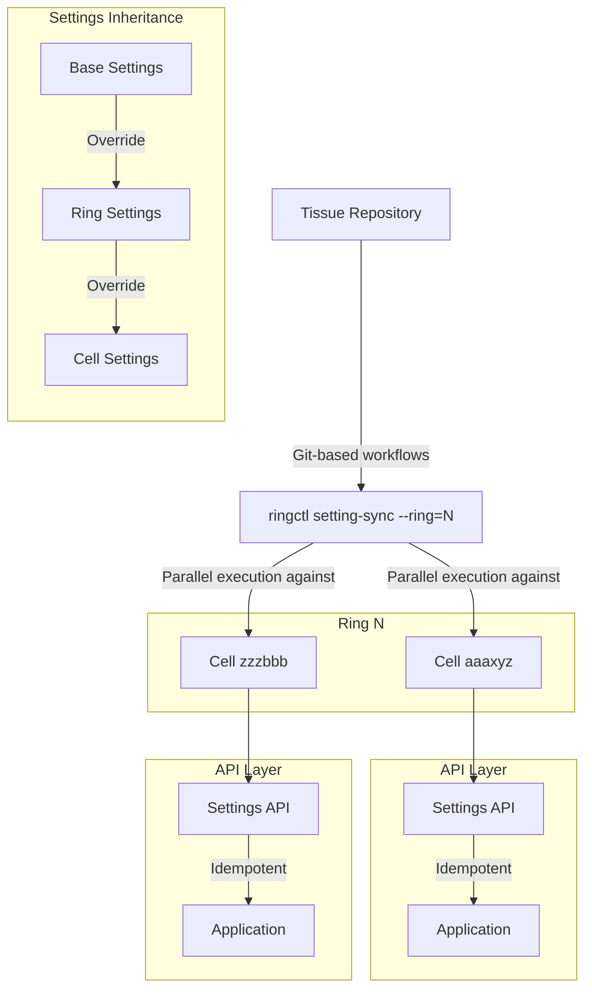



## Goals

We desire an automated solution for synchronizing application settings across multiple cells. This solution must integrate with the existing ring-based deployment model while supporting both global consistency and local customizations.

Currently, GitLab.com's transition to a distributed deployment model with cells organized in rings presents operational challenges. While Ring 0 (legacy monolith) uses Helm charts for settings control, Ring 1+ cells require manual SRE updates, creating operational overhead, configuration drift risk, and scalability concerns as the number of cells and rings expands.

## Key Terminology

- **Desired State**: The intended configuration defined in version-controlled repositories (imperative configuration-as-code)
- **Actual State**: The current runtime configuration present in live cell instances
- **Configuration Drift**: When actual state diverges from desired state

## Requirements

| Requirement | Description |
|-------------|-------------|
| Configuration as Code | Store all settings in version-controlled repositories |
| Live states | Read the states from the current live cells |
| Ring-Based Integration | Build upon existing ring deployment model |
| Hierarchical Settings | Support inheritance from base → ring → cell overrides |
| Feedback Mechanism | Provide clear success/failure feedback for operations |
| Scalability Design | Handle increasing numbers of cells and rings efficiently |
| Secure Authentication | Authentication between solution and cell should have minimum privileges and can be rotated. |
| Minimal Secret Management | Reduce need to transmit or store secrets |

## Proposed Solution

To achieve this, a solution that leverages efficient concurrent execution and API-based communication with cells would be beneficial. While several implementation approaches might be viable (discussed later), extending the existing `ringctl` tool represents one potential path.

## Implementation Ideas

To address the requirements outlined above, a potential settings synchronization system could include:

### API Considerations

The Backend team would be essential partners in developing secure API endpoints for settings management. Key requirements for this API:

- **Internal Tool Access Only**: API accessible only by the synchronization tool (ringctl or similar), not by customers
- **Scoped Authentication**: Authentication must be scoped specifically to cell settings operations
- **Rotatable Credentials**: Authentication mechanism must support credential rotation
- **Future Design Flexibility**: Specific HTTP methods (GET/PUT/PATCH) and detailed endpoint design can be determined during implementation phase

#### Authentication Strategy

**JWT Secret Management**: JWT signing secrets would be stored in Vault and made available to the Tissue project's CI environment during ring deployment operations. This approach leverages existing secret management infrastructure while maintaining security boundaries between deployment tooling and target cells.

**Environment-Based Secrets**: JWT signing secrets would be distinguished by environment (non-prod/prod) rather than per-ring or per-cell. This approach balances security isolation with operational simplicity, allowing for environment-level credential rotation while avoiding unnecessary key management complexity.

**Unified Authentication Approach**: The JWT-based authentication strategy could serve as a foundation for other cross-cell operations including feature flag controls and rate limit management. This creates a consistent authentication pattern for internal tooling while avoiding the proliferation of different authentication mechanisms across operational tools.

This approach prioritizes security and operational requirements while allowing implementation details to be refined collaboratively with the Backend team.

### Settings Structure

A hierarchical structure that supports inheritance could be organized as follows:

```bash
settings/
  all_cells.yml         # Base settings for all cells
  rings/
    ring1.yml           # Ring-specific overrides
    ring2.yml
  cells/
    cell_a.yml          # Cell-specific overrides
    cell_b.yml
```

### Potential Implementation Approach

One approach to consider would be extending the `ringctl` tool with settings synchronization capabilities:

```bash
ringctl setting-sync --ring=<ring_name> [options]
```

This implementation could potentially:

1. Support concurrent operations across multiple cells in a ring
2. Implement a get-then-update pattern that reads actual state from cells and compares against desired state from version control
3. Provide detailed feedback on operations
4. Include appropriate error handling and resilience mechanisms

### Possible Architecture



## Potential Benefits

- **Reduces Manual Configuration**: Lightens operational overhead and reduces potential for human error
- **Ensures Consistency**: Contributes to preventing configuration drift between cells
- **Builds on Existing Workflows**: Leverages experience with the ring-based deployment model
- **Enhances Flexibility**: Enables both global consistency and cell-specific customizations when needed
- **Supports Scalability**: Could handle increasing numbers of cells and rings through concurrent execution
- **Provides Atomicity**: Helps ensure all cells in a ring are updated together
- **Maintains Configuration Integrity**: Compares actual state from live cells against desired state in version control to detect and correct drift
- **Strengthens Security**: Uses service account authentication instead of personal tokens
- **Provides Visibility**: Offers clear success/failure information for each operation

## Considerations and Challenges

- **API Development Collaboration**: Partnership with the Backend team would be needed to develop appropriate internal API endpoints
- **Complexity Management**: New elements to tooling and deployment process would require thorough documentation
- **Cross-Team Coordination**: Collaboration between SRE, Backend, and Platform teams would be beneficial
- **New Failure Patterns**: Settings deployment might encounter new types of failures requiring handling strategies
- **Service Account Security**: Thoughtful handling of service account credentials would be necessary
- **Performance Considerations**: Concurrent settings updates might have performance implications worth exploring
- **Validation Needs**: Verification that settings are correctly applied would be important
- **Consistency Management**: Temporary inconsistencies during updates might require specific handling approaches

## Alternative Approaches Worth Considering

Several options could address this challenge:

### Terraform-based Configuration Management

**Approach**: Leverage Terraform for managing settings across cells.

**Considerations**:

- Benefits from being an established infrastructure-as-code tool
- Offers strong state management capabilities
- Provides a declarative approach to configuration
- Presents some challenges with state file locking in distributed environments
- Might introduce complexity for application-level configuration
- Has different strengths than what might be needed for dynamic application settings
- Could experience state drift from actual configurations

### GitOps Approach (ArgoCD/Flux)

**Approach**: Implement GitOps tools to automatically apply configuration from Git repositories.

**Considerations**:

- Provides an imperative approach with Git as the desired state
- Includes built-in reconciliation mechanisms
- Creates a good audit trail via Git history
- Might have interactions with existing Instrumentor and ringctl patching to consider
- Would add new elements to the deployment architecture
- Could potentially support customization requirements with some adaptation

### Custom Synchronization Service

**Approach**: Develop a tailored service dedicated to settings synchronization.

**Considerations**:

- Could be designed specifically for the requirements
- Might optimize for the exact use case
- Would require development resources
- Would create a new service to maintain and operate
- Could leverage existing functionality where appropriate

### API-based Configuration Management

**Approach**: Build on existing tools to use API-based execution for settings synchronization.

**Considerations**:

- Builds on existing tools and knowledge
- Could support idempotent operations
- Avoids SSH dependencies through API-based execution
- Would enhance existing tools with new capabilities
- Would require collaboration on new API endpoints

## Technical Areas to Explore

### API Design Collaboration

When discussing the settings API with the Backend team, several areas merit exploration:

1. **API Structure Options**:
   - Creating dedicated endpoints for settings management
   - Extending existing APIs to support settings operations
   - Considering appropriate URL structure and naming conventions

2. **Authentication Approaches**:
   - Service account authentication options
   - Appropriate permission scopes
   - Security considerations for internal APIs

3. **Request/Response Formats**:
   - Schema validation approaches
   - Error handling and reporting
   - Support for partial updates

### Service Account Security

Secure credential management for service accounts requires consideration of:

1. Creating dedicated service accounts with appropriate permissions
2. Implementing secure secret storage and rotation
3. Establishing auditing and monitoring for service account usage

### Resilience Strategies

The synchronization process would need to handle various scenarios:

1. Network interruptions during synchronization
2. Partial success scenarios where some cells update successfully while others don't
3. Rollback options for failed deployments
4. Detailed error reporting and logging

### Cross-Cell Verification

Verification mechanisms to ensure settings are properly synchronized could include:

1. Status reporting for each cell after synchronization attempts
2. Periodic consistency checks across cells
3. Reconciliation processes for detected inconsistencies

### Scaling Approaches

As the number of rings and cells grows, considerations include:

1. Resource usage during concurrent operations
2. Timeout and retry mechanisms for network issues
3. Batching strategies for very large deployments
4. Monitoring and alerting for synchronization events

### Settings Inheritance

The hierarchical settings structure raises questions about:

1. How conflicts between base, ring, and cell settings might be resolved
2. Which settings could be overridden at which levels
3. How to handle removal of settings (null values vs. explicit removal)
4. Documentation of inheritance patterns for operators

## Implementation Pathways

Based on exploration of the problem space, key considerations for moving forward include:

1. **Backend API Collaboration**:
   - Working with the Backend team on secure API endpoints
   - Implementing appropriate authentication for service accounts
   - Supporting retrieval and updating of settings

2. **Settings Structure**:
   - Storing settings in Git repository with hierarchical organization
   - Implementing inheritance from base → ring → cell
   - Supporting variable substitution for environment-specific values

3. **Synchronization Strategy**:
   - Building on existing tools with settings synchronization capabilities
   - Using concurrent execution for efficiency across multiple cells
   - Implementing get-then-update pattern to minimize unnecessary changes
   - Providing detailed reporting on operations

4. **Implementation Options**:
   - Several approaches could work effectively, including:
     - Direct API calls from a synchronization tool
     - Configuration management tools that operate via API rather than SSH
     - Synchronization logic that builds on existing tooling

Each approach has its merits. The final implementation decision should consider available expertise, integration with existing systems, and operational requirements.
