<!-- Design Documents often contain forward-looking statements -->
<!-- vale gitlab.FutureTense = NO -->



## Summary

This document describes the architecture and implementation approach for
a set of Terraform modules that provide a secure and extensible
interface to Cloudflare configuration across GitLab's internal teams. As
GitLab's edge networking needs grow and more teams adopt Cloudflare, we need a
standardized approach that enables teams to implement secure and compliant edge
networking solutions achieving operational excellence.

The proposed solution delivers a set of Terraform modules with sensible
defaults, documentation, and clear upgrade paths. This standardization will
enable teams to use Cloudflare's capabilities effectively, reducing
implementation complexity across the organization.

This work is being tracked in [this epic](https://gitlab.com/groups/gitlab-com/gl-infra/-/epics/1561),
where we discuss the prioritization and project management further.

## Motivation

GitLab's usage of Cloudflare as our preferred edge networking provider continues
to grow, with several teams implementing solutions for DNS management, WAF
configuration, and worker deployments across our infrastructure estate (
[example 1](https://gitlab.com/gitlab-com/gl-infra/gitlab-dedicated/instrumentor/-/blob/main/common/modules/cloudflare/instance-domains/main.tf),
[example 2](https://gitlab.com/groups/gitlab-com/gl-infra/platform/runway/-/epics/18),
[`cloudflare-waf-rules` module](https://gitlab.com/gitlab-com/gl-infra/terraform-modules/cloudflare/cloudflare-waf-rules),
[`dns-record` module](https://gitlab.com/gitlab-com/gl-infra/terraform-modules/dns/dns-record)
).
This creates an opportunity to establish a more unified and scalable foundation that
can benefit all teams.

As we move toward a maturing GitLab platform, with standardized infrastructure
offerings and a platform-first mindset, establishing patterns for Cloudflare
management will provide significant strategic value by reducing implementation
complexity and standardizing our security and compliance at the edge.  Through
testing, documentation, and clear upgrade processes, we can enable teams to
implement and maintain their Cloudflare configurations independently.  By
iterating on the approach taken by the
[`cloudflare-waf-rules`](https://gitlab.com/gitlab-com/gl-infra/terraform-modules/cloudflare/cloudflare-waf-rules)
module for WAF rules and rate limit configuration we can strengthen our ability
to respond to security and compliance risks as they emerge, and allow teams to
implement Cloudflare functionality in a scalable way.

This approach also positions us well for upcoming maintenance work, including
[upgrading the Cloudflare provider](https://gitlab.com/gitlab-com/gl-infra/production-engineering/-/issues/26235), allowing us to implement a coordinated,
reduced-risk upgrade process across all implementations.

### Goals

- Provide an Edge/WAF abstraction suitable for GitLab's requirements, 
  offering a well-defined and easy-to-understand interface, 
  encouraging encapsulation, modularization and replaceability of implementation. 
- Establish consistent security and compliance standards across all Cloudflare
  implementations
- Deliver flexible and extensible modular configurations that accommodate both
  common use cases and specialized requirements
- Accelerate team velocity by providing well-documented, tested infrastructure
  patterns
- Establish a foundation for efficient upgrades and security improvements across
  all implementations
- Centralized documentation for internal customers and operator audiences that
  enables self-serve implementation and support with high levels of autonomy
- A defined process for interaction with the maintainer team for support beyond
  existing documentation

### Non-Goals

- Creating team-specific implementations; instead, we will provide the
  foundational modules that teams can use to build their own solutions
- Managing the day-to-day operations of each team's specific Cloudflare
  configurations
  - This includes configuration changes and version upgrades of the modules
- Replicating Cloudflare functionality within GitLab's product offerings

## Proposal

We propose developing a set of Terraform modules with 3 key themes:

1. A common entrypoint module built as the primary interface with sensible defaults
1. Specialized modules implementing specific subsets of Cloudflare functionality. This includes DNS and WAF.
1. Data-only submodules providing standardized configuration patterns that can
   be reused across implementations

The common entrypoint will be the default choice for implementers to add
Cloudflare configuration to their applications.  Internally this will use the
specialized modules to allow for a path to greater implementation flexibility if
required.

All modules will be defined with sane defaults that covers the majority of
cases, with interfaces designed to allow extensibility. This will be driven by
the focus on the data-only submodules which will provide extensible `default`
configurations composed of a set of common case configurations.

This allows teams to independently enable Cloudflare functionality for their
use-case with minimal configuration, scaling through to more specialized module
use where required.This flexibility ensures that both common use cases and
complex requirements are well-supported.

By creating a centralized set of modules we can codify Cloudflare expertise and
support team autonomy, creating a sustainable platform for edge networking
across GitLab.

Security will be a priority in our design, with pre-configured security settings
aligned with [GitLab's requirements](/handbook/security/standards/) built into the modules.
This includes [WAF rule sets](https://developers.cloudflare.com/waf/) optimized for common GitLab
application patterns and rate limiting configurations to prevent abuse. By
establishing secure defaults, we ensure that all Cloudflare implementations
maintain a baseline level of security.

The modules will follow existing infrastructure-as-code principles and practices that we
practice at GitLab, using Terraform as our preferred IaC platform, with
consistent interfaces, testing, and extensive documentation.

### Success Metrics

The effectiveness of this initiative will be demonstrated through several key
indicators of organizational capability and team empowerment:

- Successful implementations of Cloudflare solutions independently
- Team satisfaction and confidence in using our Cloudflare modules, measured
  through feedback form collection and qualitative feedback sessions
- Time teams spend updating and upgrading their configuration
- Adoption count of the Cloudflare modules
- No increase in `S2` and `S1` incident rates related to Cloudflare configurations

### Module Development Principles

- Utilize leaky abstractions to build on top of Cloudflare's existing API structure
  - This allows us to build on top of Cloudflare's existing patterns and documentation
- Backwards compatibility as a top priority
  - Strict versioning using [semantic versioning principles](https://semver.org/)
  - Deprecation notices with clear migration paths for disruptive changes to the interface or underlying resources
  - For any major version change, we *MUST* provide upgrade documentation for
    any manual interventions required for implementers.
  - Automated testing for common use cases to detect breaking changes
- Self-service focus where implementers can follow documentation to implement autonomously
- Consistent interfaces across modules
  - Maps, objects, and lists will be the primary interface to modules
    - These are generally more flexible than scalar alternatives and avoid the
      need for duplicate updates across modules when new options are added

## Design and implementation details

Beneath the root module, we will implement several standalone modules that
specialize in a specific Cloudflare functionality area. Examples include
`cloudflare/dns` for DNS configuration, and `cloudflare/waf` for Web Application
Firewall configuration.

When we observe common configuration patterns emerging across implementations,
we will document these use cases, and for very common instances we will develop
generic use-case modules. These modules will be based on the core `cloudflare`
module and may implement patterns such as simple DNS configuration or Worker
implementations.

To support customization without sacrificing standardization, we will create
reusable configuration options in `{module-path}/data/*` sub-modules. An example
is WAF rules, where sets of WAF rules may be common across many instances but
are not appropriate for all consumers. Where we are building distinct sets of
configuration, we will also build a `default` configuration for ease of use and
extensibility. For example, where we have multiple WAF rulesets defined.

### Module Relationships

```mermaid
flowchart TD
    %% Individual teams at the top
    user1["🌐 DNS Team<br/>Simple Setup"]
    user2["🛡️ Security Team<br/>Custom WAF Rules"]
    user3["⚙️ Platform Team<br/>Advanced Multi-Service"]
    %% Main entry point module
    subgraph entry-module[" 🚪 Entry Point Module "]
        cloudflare[cloudflare]
        cf-data[cloudflare/data]
        cloudflare --> cf-data
    end
    %% Functional modules layer
    subgraph functional-layer[" ⚡ Functional Modules "]
        direction LR
        cf-dns[cloudflare/dns]
        cf-workers[cloudflare/workers]
        cf-logging[cloudflare/logging]
        cf-waf[cloudflare/waf]
    end
    %% Detailed WAF module (separate for clarity)
    subgraph waf-detail[" 🔍 WAF Module Details "]
        direction TB
        waf-data[cloudflare/waf/data]
        subgraph waf-rulesets[" 📋 Rulesets "]
            direction LR
            waf-default[default]
            waf-gcs[gcs]
            waf-bots[bots]
            waf-default --> waf-gcs
            waf-default --> waf-bots
        end
        waf-data --> waf-rulesets
    end
    %% User to entry point connections
    user1 --> cloudflare
    user2 --> cloudflare
    user2 --> cf-data
    user3 --> cf-waf
    user3 --> waf-data
    %% Entry point to functional modules
    cloudflare --> functional-layer
    %% Data flow connections
    cf-data --> waf-data
    cf-waf -.-> waf-data
```



#### Example Terraform configurations

##### Entrypoint module illustration

This example shows a minimal usage of the `cloudflare` common entrypoint module.

Without overrides for additional options, this will configure the zone in
Cloudflare, create a DNS `A` record, and configure default rulesets for WAF
custom rules and rate limit rules.

```terraform
module "cloudflare" {
    source = "path/to/entrypoint/module"

    zone = {
        root = "example.gitlab.com"
        plan = "free"
    }

    dns = {
        a = {
            # Create an A record for test.example.gitlab.com
            test = {
                name    = "test"
                records = [
                    "127.0.0.1"
                ]
            }
        }
    }
}
```

This next example illustrates a detailed example of multiple configurations through
the common entrypoint module.

```terraform
module "cloudflare_data" {
    source = "path/to/entrypoint/module//modules/data"

    zone = "example.gitlab.com"
}

module "cloudflare" {
    source = "path/to/entrypoint/module"

    zone = {
        root = "example.gitlab.com"
        plan = "free"
    }

    dns = {
        a = {
            # Create an A record for test.example.gitlab.com
            test = {
                name    = "test"
                records = [
                    "127.0.0.1"
                ]
            }

            # Create a proxied A record with a custom TTL
            test_proxied = {
                name    = "test-proxied"
                records = [
                    "127.0.0.1"
                ]
                proxied = true
                ttl     = 300
            }
        }

        mx = {
            # Create a test MX record
            test = {
                name     = "test"
                records  = [
                    "mail.example.com"
                ]
                priority = 10
            }
        }
    }

    waf = {
        custom = {
            # Build a custom ruleset from predefined rulesets
            #
            # Without explicit configuration this would default to `module.data.waf.custom.rulesets.default`.
            # This would provide the rules that we expect the majority of implementations to use as a base.
            rules = concat(
                module.data.waf.custom.rulesets.gcs,
                module.data.waf.custom.rulesets.bots,
            )
        }
        rate_limits = {
            # Disable rate limits by overriding with an empty list
            rules = []
        }
    }
}
```

##### Custom WAF rule implementation

This example illustrates the expected usage pattern for direct submodule usage,
with a custom list of rules defined to override the default. This approach will
typically be used when multiple explicit configuration stages are preferred.

`zone_id` and `zone` are provided here to allow us to modify the records, and
generate rulesets that apply to the specified `zone` where required.  When
used through the common entrypoint this is automated through the `zone` top
level variable.

```terraform
module "waf_rulesets" {
  source = "path/to/waf/module//modules/data"

  zone = "example.gitlab.com"
}

module "waf" {
  source = "path/to/waf/module"

  zone_id = "..."
  zone    = "example.gitlab.com"

  rules = concat(
    module.waf_rulesets.bots,
    module.waf_rulesets.gcs
  )
}
```

### Testing Strategy

We will be using [Terraform tests](https://developer.hashicorp.com/terraform/language/tests)
to test every module. This will use a combination of unit-style tests with
mocked resources and end-to-end tests that create resources in a test zone
following patterns that we observe across implementation of the modules.

This allows us to test our computed values and created resources quickly during
development, and to ensure that we are providing well-tested golden paths that
our implementers use.  This will aid our efforts to provide a stable interface
to our implementers, and allow us to ensure that any difference in resource
creation and configuration across module revisions are expected.

### Documentation Strategy

Documentation is essential for the success of this initiative. We
will provide detailed README files for each module, explaining its purpose,
inputs, outputs, and example usage. For common use cases, we will create example
configurations that teams can use as starting points for their own
implementations. When major version changes occur, we will provide upgrade
guides that walk teams through the process of migrating to the new
version. Additionally, we will create internal knowledge base articles for
GitLab-specific implementations, addressing unique requirements and
considerations for our environment.

Additionally, each module will contain user and operator documentation on it's
usage.  The common entrypoint will also provide an entrypoint for a
documentation site that can be hosted on GitLab Pages for internal customers.
This will source the documentation from each module and compile all relevant
documentation into a single source of truth for internal customers and operators
to use as a reference.  This approach provides additional benefits, including
aligning documentation with changes made to modules. This ensures that we can
keep documentation updated alongside code changes made to the modules.

### Initial development and migration

This implementation will focus on creating the common entrypoint first to allow
for early adoption, expanding the responsibilities as more functionality is
added through the specialized modules. This will allow us to gradually implement
functionality and deliver impact faster. This is also an opportunity to validate
that our upgrade process is defined and works across our modules.

As we add functionality we will document migration paths from any existing
implementations that we are aware of for the same functionality. This will allow
us to further iterate on our provided documentation and ensure it is fit for
purpose.

## Alternative Solutions

### Continue with Custom Implementations Per Team

Continuing with the current approach of custom implementations per team would
have several advantages and disadvantages:

**Pros:**

- Teams maintain complete control over their configurations
- No upfront investment required
- Faster implementation for teams with immediate needs

**Cons:**

- Inconsistent security and compliance practices
- Duplicate effort across teams
- Higher risk of configuration drift over time
- Growing maintenance support burden as more teams adopt Cloudflare

### Fully Centralized Cloudflare Configuration

An alternative approach would be to fully centralize Cloudflare configuration
management within a single repository.

**Pros:**

- Maximum standardization and control
- Consistent security posture
- Single point of maintenance
- Simplified compliance auditing

**Cons:**

- Reduced maintainability for teams with unique requirements
- Creates bottleneck for changes on the maintaining team
- Does not foster self-service culture
- May slow down teams with time-sensitive requirements
- Teams relying on Cloudflare functionality integration as part of a platform
  will require separate out-of-band changes to enable features for each
  Cloudflare-related change a tenant requires

### Documentation-only improvements

We can reduce the initial implementation burden by creating
documentation for our current set of Cloudflare modules.

**Pros:**

- Reduces time to initial implementation
- Minimal implementation required
- Encourages a self-service culture for initial configuration

**Cons:**

- Manual configuration required for more complex implementations
- No unified maintenance support for teams
- Maintenance responsibility for Cloudflare configurations spread across teams
- Susceptible to drift as standard configurations change
