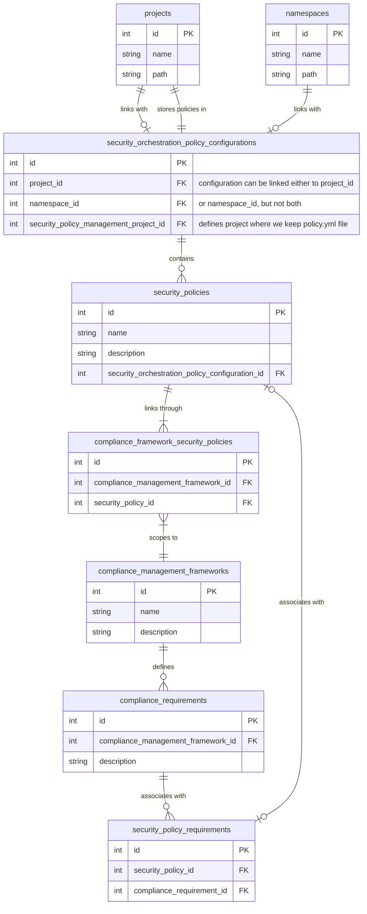

## Context

This documents the full relationship between Compliance Frameworks and Security Policies.

- Security Policy Project can be linked with either Project or Namespace (the record in `security_orchestration_policy_configurations` table is then created, with `security_policy_management_project_id` used to store information about selected Security Policy Project),
- Policies are defined in the Security Policy Project in the `policy.yml` file, and they are also represented in the security_policies table,
- A single policy can be scoped to multiple Compliance Frameworks (through the `compliance_framework_security_policies` join table), although you can leave the policy unscoped or scoped to a selected group or project; when the policy is unscoped, it affects all projects/namespaces linked to associated Security Policy Project.
  - For more details on Security Policy scoping refer the docs here https://docs.gitlab.com/ee/user/application_security/policies/#scope
- For a given Compliance Framework, you can define many Requirements (represented in the `compliance_requirements` table),
- A single Requirement can be associated with multiple Security Policies (through the `security_policy_requirements` join table), and a single Security Policy can be associated with multiple Requirements as well; the link between Requirement and Security Policy allows user to use selected Security Policy as the enforcement mechanism for selected Requirement

## Entity relationship diagram

