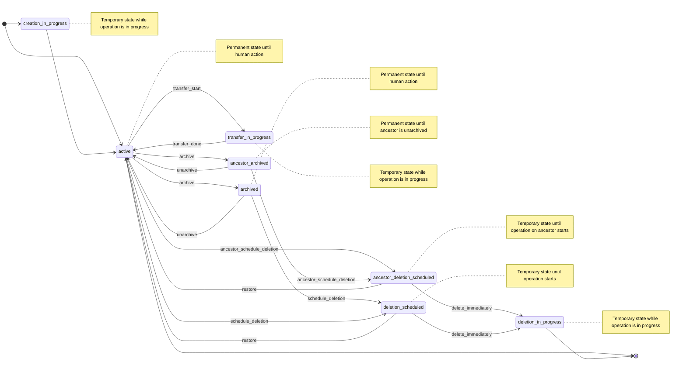

---
# This is the title of your design document. Keep it short, simple, and descriptive. A
# good title can help communicate what the design document is and should be considered
# as part of any review.
title: Group and project operations and state management
status: ongoing
creation-date: "2025-05-26"
authors: [ "@lohrc", "@rymai" ]
dris: [ "@lohrc", "@rymai" ]
owning-stage: "~devops::tenant scale"
participating-stages: []
# Hides this page in the left sidebar. Recommended so we don't pollute it.
toc_hide: true
---



## Summary

This blueprint proposes a unified state management and tracking system for GitLab namespaces (groups and projects), as well as guidelines on making state-related operations asynchronous.
Currently, groups and projects implement state management (deletion, archival, transfer) as separate features with inconsistent data representations and no historical tracking.
The proposed solution introduces a centralized state management system using `namespaces.state` and `namespace_details.state_metadata` to provide consistent state tracking, metadata storage, and historical records across all namespace types.

## Motivation

Groups and Projects currently have inconsistent state management implementations that create several problems:

**Current Issues:**

- No consistency in group state management
- No consistency in project state management
- No consistency between group and project state management
- State in descendants is sometimes inferred from ancestors inconsistently
- No state history tracking. For instance, it's impossible to know when a project was archived, then unarchived, or when a group was transferred from another namespace
- Different data models for similar operations (for example `group_deletion_schedules` vs `projects.marked_for_deletion_at` to track the "scheduled for deletion" state)
- Performance issues with long-running synchronous operations (99.95th percentile: group transfer 51s, project transfer 27s)

**Business Impact:**

- Poor user experience due to inconsistent behavior and bugs
- Poor user experience due to performance bottlenecks causing timeouts
- Increased load on the Support and Engineering teams to resolve operations that failed due to timeouts or bugs
- Difficulty in auditing and compliance
- Maintenance overhead from duplicated and inconsistent code

### Goals

- Establish a unified state management system for all namespace types
- Provide consistent APIs and behavior across groups and projects
- Enable state history tracking and audit capabilities
- Improve performance by making appropriate operations asynchronous
- Support metadata tracking (who initiated actions, error states, inheritance)
- Reduce code duplication and maintenance overhead
- Enable better observability and debugging capabilities

### Non-Goals

- Complete rewrite of existing functionality (iterative migration approach)
- Changes to user-facing APIs or UI in the initial implementation
- Migration of non-state related group/project consolidation work
- Performance optimizations unrelated to state management

## Proposal

Introduce a centralized namespace state management system and asynchronous operation guidelines.

### Core State Model

**New Attributes:**

- `namespaces.state` (SMALLINT) - State identifier
- `namespace_details.state_metadata` (JSONB) - Associated metadata

**State Metadata Structure:**

```json
{
  "last_updated_at": "2025-05-26T10:00:00Z",
  "last_changed_by_user_id": 12345,
  "inherited_from_namespace_id": 67890,
  "last_error": "Transfer failed: insufficient permissions"
}
```

### State definitions

| State Integer | State Name | Description |
|----------|------------|-------------|
| 0 | active | Normal operational state |
| 1 | archived | Archived but recoverable |
| 2 | ancestor_archived | An ancestor of this namespace is archived |
| 3 | deletion_scheduled | Marked for deletion with a grace period |
| 4 | ancestor_deletion_scheduled | An ancestor of this namespace is marked for deletion with a grace period |
| 5 | creation_in_progress | Currently being created |
| 6 | deletion_in_progress | Currently being deleted |
| 7 | transfer_in_progress | Currently being transferred |

### State transitions



### Asynchronous operation guidelines

Operations must be asynchronous if they meet any of the following criteria:

- P99.95 performance exceeds 10 seconds
- Operation involves cascading changes to descendants
- Operation requires external service calls or integrations
- Operation involves bulk database writes, deletes, or migrations
- Risk of creating database locks that affect concurrent operations
- Memory-intensive operations that could impact system resources

#### Implementation requirements

All asynchronous operations must provide:

- State transition to appropriate `_in_progress` state
- Immediate acknowledgment of the successful request and ongoing operation
- Progress indicators where technically feasible
- Completion notifications through appropriate channels (activity, notification center, email)
- Comprehensive error handling with user-facing error messages
- Rollback capabilities for failed operations

#### Current operations requiring async implementation

Based on current performance metrics:

- Group transfers (P99.95: 51s) - Priority 1
- Project transfers (P99.95: 27s) - Priority 1
- [Upcoming group archiving](https://gitlab.com/groups/gitlab-org/-/epics/15019)

## Design and implementation details

### Database layer

**Phase 1: Add new columns and indices**

```ruby
class AddStateToNamespaces < Gitlab::Database::Migration[2.3]
  milestone '18.1'
  disable_ddl_transaction!

  def change
    add_column :namespaces, :state, :smallint
  end
end

class AddStateMetadataToNamespaceDetails < Gitlab::Database::Migration[2.3]
  milestone '18.1'
  disable_ddl_transaction!

  CONSTRAINT_NAME = 'check_namespace_details_state_metadata_is_hash'

  def up
    with_lock_retries do
      add_column :namespace_details, :state_metadata, :jsonb, default: {}, null: false
    end

    add_check_constraint :namespace_details, "(jsonb_typeof(state_metadata) = 'object')", CONSTRAINT_NAME
  end

  def down
    remove_check_constraint :namespace_details, CONSTRAINT_NAME

    with_lock_retries do
      remove_column :namespace_details, :state_metadata
    end
  end
end

class AddIndexToStateOnNamespaces < Gitlab::Database::Migration[2.3]
  milestone '18.1'
  disable_ddl_transaction!

  INDEX_NAME = 'index_namespaces_on_state'

  def up
    add_concurrent_index :namespaces, :state, name: INDEX_NAME
  end

  def down
    remove_concurrent_index_by_name :namespaces, INDEX_NAME
  end
end
```

**Phase 2: Create namespace state updates table**

```ruby
class CreateNamespaceStateUpdates < Gitlab::Database::Migration[2.3]
  disable_ddl_transaction!
  milestone '18.1'

  CONSTRAINT_NAME = 'check_namespace_state_updates_metadata_is_hash'

  def up
    create_table :namespace_state_updates do |t|
      t.timestamps_with_timezone null: false
      t.smallint :from_state, null: false
      t.smallint :to_state, null: false
      t.references :namespace,
        null: false,
        foreign_key: { on_delete: :cascade },
        index: true
      t.jsonb :metadata, default: {}, null: false
    end

    add_check_constraint :namespace_state_updates, "(jsonb_typeof(metadata) = 'object')", CONSTRAINT_NAME
  end

  def down
    drop_table :namespace_state_updates
  end
end
```

### Model layer

**New Concern: `Namespaces::Stateful`**

```ruby
module Namespaces
  module Stateful
    extend ActiveSupport::Concern
    included do
      has_many :namespace_state_updates, dependent: :delete_all

      STATES = {
        active: 0,
        archived: 1,
        ancestor_archived: 2,
        deletion_scheduled: 3,
        ancestor_deletion_scheduled: 4,
        creation_in_progress: 5,
        deletion_in_progress: 6,
        transfer_in_progress: 7
      }.with_indifferent_access.freeze

      state_machine :state, initial: :active, initialize: false do
        event :creation_done do
          transition creation_in_progress: :active
        end

        event :archive do
          transition [:active] => :archived
        end

        event :ancestor_archive do
          transition [:active, :archived, :deletion_scheduled, :ancestor_deletion_scheduled] => :ancestor_archived
        end

        event :unarchive do
          transition [:archived, :ancestor_archived] => :active
        end

        event :schedule_deletion do
          transition [:active, :archived] => :deletion_scheduled
        end

        event :ancestor_schedule_deletion do
          transition [:active, :archived, :ancestor_archived] => :ancestor_deletion_scheduled
        end

        event :restore do
          transition [:deletion_scheduled, :ancestor_deletion_scheduled] => :active
        end

        event :deletion_start do
          transition [:deletion_scheduled, :ancestor_deletion_scheduled] => :deletion_in_progress
        end

        event :transfer_start do
          transition active: :transfer_in_progress
        end

        event :transfer_done do
          transition transfer_in_progress: :active
        end

        after_transition any => any do |namespace|
          namespace.run_after_commit do
            namespace_state_updates.create!(from_state: state_was, to_state: state, metadata: state_metadata)
          end
        end

        state :active, value: STATES[:active]
        state :archived, value: STATES[:archived]
        state :ancestor_archived, value: STATES[:ancestor_archived]
        state :deletion_scheduled, value: STATES[:deletion_scheduled]
        state :ancestor_deletion_scheduled, value: STATES[:ancestor_deletion_scheduled]
        state :creation_in_progress, value: STATES[:creation_in_progress]
        state :deletion_in_progress, value: STATES[:deletion_in_progress]
        state :transfer_in_progress, value: STATES[:transfer_in_progress]
      end
    end

    class_methods do
      def non_inheritable_state?(state)
        [:creation_in_progress, :deletion_in_progress, :transfer_in_progress].include?(state)
      end
    end

    def change_state!(new_state, changed_by_user:, inherited_from_namespace: nil)
      state = new_state

      namespace_details.state_metadata = {
        last_updated_at: Time.current
        last_changed_by_user_id: changed_by_user.id
        inherited_from_namespace_id: inherited_from_namespace&.id
      }.compact

      save!
    end

    def state_metadata
      namespace_details&.state_metadata || {}
    end
  end
end
```

**New model: `Namespaces::StateUpdate`**

Introduce `namespace_state_updates` table to track all state transitions:

```ruby
module Namespaces
  class StateUpdate < ApplicationRecord
    self.table_name = 'namespace_state_updates'

    belongs_to :namespace
  end
end
```

**State management service:**

```ruby
module Namespaces
  class StateManagementService
    def initialize(namespace, current_user, inherited_from_namespace: nil)
      @namespace = namespace
      @current_user = current_user
      @inherited_from_namespace = inherited_from_namespace
    end

    def execute!(new_state)
      final_state =
        case new_state
        when :archived
          @inherited_from_namespace ? :ancestor_archived : :archived
        when :deletion_scheduled
          @inherited_from_namespace ? :ancestor_deletion_scheduled : :deletion_scheduled
        when :deletion_in_progress, :transfer_in_progress
          new_state
        end
      end

      update_state!(final_state)
    end
  end

  private

  def update_state!(new_state)
    @namespace.change_state!(new_state, changed_by_user: @current_user, inherited_from_namespace: @inherited_from_namespace)

    return if Namespace.non_inheritable_state?(new_state)
    return unless @inherited_from_namespace

    update_descendants_state(new_state)
  end

  def update_descendants_state(state)
    NamespaceDescendantsStateUpdateWorker.perform_async(namespace_id: @namespace.id, current_user_id: @current_user.id, state: state)
  end
end
```

**State synchronization service:**

```ruby
module Namespaces
  class StateSynchronizationService
    def initialize(namespace, current_user)
      @namespace = namespace
      @current_user = current_user
    end

    def execute!(new_state)
      namespace.descendants.find_each(batch_size: 100) do |descendant|
        Namespaces::StateManagementService
          .new(descendant, current_user, inherited_from_namespace: namespace)
          .execute(new_state)
      end
    end
  end
end
```

### Worker layer

**State synchronization worker:**

```ruby
module Namespaces
  class NamespaceDescendantsStateUpdateWorker
    include ApplicationWorker

    data_consistency :always

    sidekiq_options retry: 3
    include ExceptionBacktrace

    INTERVAL = 2.seconds.to_i

    feature_category :groups_and_projects
    idempotent!

    def perform(namespace_id:, current_user_id:, state:)
      namespace = Namespace.find_by_id(namespace_id)
      return unless namespace

      # The namespace state has changed since the job was enqueued, the update will be done by another job.
      return unless state == namespace.state

      current_user = User.find_by_id(current_user_id)

      with_context(namespace: namespace) do
        Namespaces::StateSynchronizationService.new(namespace, current_user).execute(state)
      end
    end
  end
end
```

### Migration strategy

**Iteration 1: Infrastructure setup**

- Add `state` column to `namespaces`
- Create `namespace_state_updates` table
- Add `Namespaces::Stateful` concern

**Iteration 2: Make transfer async**

- Make group/project transfer async by taking advantage of the new `transfer_in_progress` state
- Show a "Transfer in progress" badge in the UI as an MVC

**Iteration 3: State synchronization**

- Ensure `state` updates with legacy state changes
- Implement bidirectional synchronization
- Add validation and consistency checks

**Iteration 4: Backfill historical data**

- Backfill `state` from legacy columns/tables, including inherited states, such as `ancestor_*`
- Data validation and cleanup

**Iteration 5: Feature migration**

- Replace legacy state checks with new system
- Update controllers and services
- Maintain backward compatibility

**Iteration 6: Legacy cleanup**

- Remove legacy state columns/tables
- Update documentation and tests
- Performance optimization

### Performance considerations

**Asynchronous operations:**

- Group transfers (P1 priority - currently 51s at 99.95th percentile)
- Project transfers (P1 priority - currently 27s at 99.95th percentile)
- Large group archival operations

**Optimization strategies:**

- Batch updates for descendant state changes
- Background job processing for heavy operations
- Caching for frequently accessed state information
- Database indexes on `state` and related columns

## Alternative solutions

The proposed solution balances complexity with benefits, providing immediate improvements while enabling future enhancements,
but the following alternative solutions were also considered.

### Alternative 1: Separate state tables per type

**Pros:**

- Clear separation of concerns
- Type-specific optimizations possible

**Cons:**

- Maintains current inconsistency
- Duplicated logic and maintenance overhead
- No unified querying capabilities

### Alternative 2: Event sourcing approach

**Pros:**

- Complete audit trail
- Time-travel capabilities
- Excellent for compliance

**Cons:**

- Significant complexity increase
- Performance overhead for simple state queries
- Steep learning curve for team

### Alternative 3: Do nothing

**Pros:**

- No development effort required
- No migration risks

**Cons:**

- Performance issues persist (P1 transfer operations)
- Inconsistency continues to create bugs
- Technical debt accumulates
- Poor user experience remains

## Metrics and success criteria

**Performance targets:**

- Reduce P99.95 group transfer time from 51s to <10s
- Reduce P99.95 project transfer time from 27s to <5s
- Maintain deletion operation performance (<2s for scheduling)

**Quality metrics:**

- Zero state inconsistency bugs after full migration
- 100% state history coverage for audit requirements
- Unified test coverage across all namespace types

**Developer experience:**

- Single API for all state management operations
- Consistent behavior documentation
- Reduced code duplication (target: 50% reduction in state-related code)

## Risks and mitigations

**Risk: Data migration complexity**

- *Mitigation:* Iterative approach with rollback capabilities, extensive testing

**Risk: Performance impact during migration**

- *Mitigation:* Background migrations, feature flags, monitoring

**Risk: API breaking changes**

- *Mitigation:* Maintain backward compatibility, versioned APIs

**Risk: State consistency issues**

- *Mitigation:* Bidirectional synchronization during transition, validation checks
