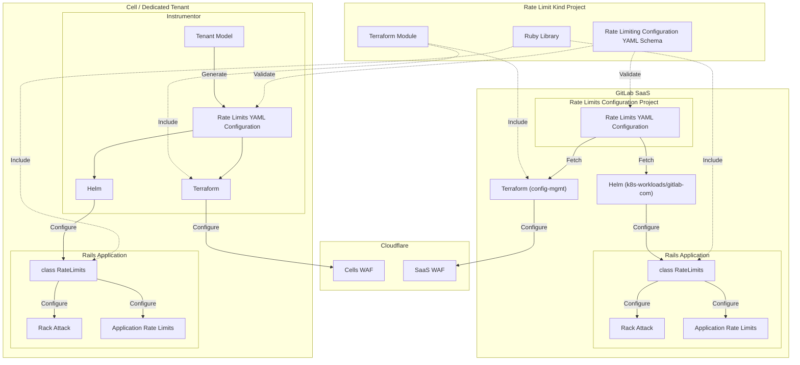

<!-- Design Documents often contain forward-looking statements -->
<!-- vale gitlab.FutureTense = NO -->

<!-- This renders the design document header on the detail page, so don't remove it-->


## Summary

This design document proposes a standardized YAML schema to serve as a single source of truth for rate limiting configuration across GitLab. Currently, rate limits are defined inconsistently across multiple systems including Cloudflare, HAProxy, RackAttack, and Application Rate Limiters, making them difficult to manage, document, and troubleshoot. The fragmented approach has led to confusion for users and support engineers, challenges in implementing new limits, and difficulty in maintaining an accurate inventory of applied limits.

The proposed schema will consolidate all rate limiting definitions into a version-controlled configuration format that can be used consistently across GitLab.com, Dedicated environments, and self-managed instances. This work is a critical component of Phase 2 of the ["Simplifying Rate Limiting Configuration" design document](../rate_limiting_simplification/) and supports the broader ["Next Rate Limiting Architecture" blueprint](../rate_limiting/) by providing a concrete implementation path for standardizing how rate limits are defined and enforced.

By centralizing rate limit configuration, we aim to improve transparency for users and support teams, simplify configuration management for production engineers, enable automated documentation generation, and ensure consistent enforcement of policies across all GitLab platforms while maintaining our defense-in-depth approach of limiting at multiple layers.

## Motivation

The GitLab application currently lacks a standardized way to define and maintain rate limiting configurations. This design document focuses specifically on creating a YAML schema that will serve as the foundation for consistent rate limit definitions across our systems.

Currently, there are several challenges that a standardized YAML schema would address:

- We lack a formal schema for defining rate limits, leading to inconsistent implementations across different parts of the application and infrastructure.
- Different rate limiting implementations (RackAttack, Application Rate Limiter, etc.) use different formats and approaches to configuration (file, API, ...), making it difficult to understand and manage limits holistically.
- Without a well-defined schema, it's challenging to extend our rate limiting capabilities or add new types of limits while maintaining consistency.
- There's no standardized way to validate that rate limit configurations are correct before deployment, increasing the risk of errors when making changes.
- The lack of a schema makes it difficult to automatically generate documentation, leading to discrepancies between actual configurations and what's documented.
  - This presents challenges during incidents, as can be hard to know if something is rate-limited, and how to change this rate limit if there is any.
  - This is also a pain point for customers for whom it can be very difficult to understand if they are being rate-limited, and why.

The YAML schema proposed in this document will provide a clear structure for defining rate limits that can be used across GitLab systems. It will establish conventions for critical attributes like limit thresholds, scope definitions, and enforcement actions (i.e. throttle, log, or disable).

This work directly supports the ["Next Rate Limiting Architecture" blueprint](../rate_limiting/)'s goal to "build a framework to define and enforce limits in GitLab Rails" by establishing the foundational schema upon which that framework will be built.

### Goals

- Define a comprehensive YAML schema for rate limiting configuration that can support all current and future rate limit types
- Create a format that is human-readable, easily maintainable, and properly version-controlled
- Enable validation of configurations before deployment to prevent errors
- Focus on supporting Rack Attack rate limits only initially
- Design the schema to be extensible for future rate limiting enhancements (e.g. Cloudflare WAF)
- Ensure the schema supports automatic documentation generation to keep user-facing documentation accurate

### Non-Goals

- Implementation of the code that consumes this schema
- Migration of existing rate limit configurations to use this schema
- Building a user interface for managing configurations defined in this schema ([phase 3](_index.md#phase-3-implement-a-rate-limit-interface))
- Defining specific rate limit values (the schema defines the structure, not the actual limit values)
- Creating a centralized rate limiting service ([phase 3](_index.md#phase-3-implement-a-rate-limit-interface))

## Proposal

We propose to create a standardized YAML schema that defines the rate limit parameters for GitLab's various rate limiting systems. This focused schema will serve as a single source of truth for rate limit values, without attempting to reimplement or reconfigure the underlying rate limiting mechanisms.

The schema will be organized as a list of all rate limits, with a simple structure that can be easily understood, maintained, and extended for new rate limiting systems.

### Project

We will create a new group `gitlab-com/kinds` that will serve as a global [`kind`](https://iximiuz.com/en/posts/kubernetes-api-structure-and-terminology/#kind) registry which represents all schemas, present or future, within GitLab.

Within this group, we will create a new `kind` project `gitlab-com/kinds/rate-limits` that will host:

- The YAML schema definition itself
- Example configurations
- Documentation
- Tooling for schema validation and configuration consumption (Ruby library, Jsonnet library, Terraform module...)

This project will be the canonical source of the rate limiting schema, making it easy for various GitLab components to reference a specific version of the schema.

It will be public, to allow self-managed customers to benefit from the improvements made to our rate limiting configuration, as they could then have the option to utilize the schema themselves.

The tooling for testing and releasing the schema will be based on the existing one from the [`tenant-model-schema`](https://gitlab.com/gitlab-com/gl-infra/gitlab-dedicated/tenant-model-schema) project and standardized in [`common-ci-tasks`](https://gitlab.com/gitlab-com/gl-infra/common-ci-tasks) so that it can be reused in any future `kind` projects.

### Semantic Versioning

The schema will follow strict [semantic versioning](https://semver.org/) principles:

- Major Version (X.y.z): Incremented for breaking changes that require consumers to update their implementation; these should be carefully considered and avoided as much as possible, and should be rolled out in multiple stages following the [Expand/Contract pattern](https://blog.thepete.net/blog/2023/12/05/expand/contract-making-a-breaking-change-without-a-big-bang/).
- Minor Version (x.Y.z): Incremented for backward-compatible additions to the schema.
- Patch Version (x.y.Z): Incremented for backward-compatible bug fixes or documentation updates.

Each release will be properly tagged in the repository, allowing consumers to pin to specific versions or version ranges.

### Publication

For each release, the schema and its documentation will be published to a static site via GitLab Pages to facilitate its consumption for schema validation.

### Schema Structure Example

```yaml
$schema: https://gitlab-com.gitlab.io/kinds/rate-limits/v1.0.0/rate-limits.yaml
rate_limits:
  git_basic_auth:  # Unique identifier for this rate limit
    description: Limits basic authentication requests per IP to prevent abuse
    actors:  # Actors (ip_address, user, group)
      - ip_address
    feature_category: system_access
    enabled: true
    action: block  # Action (block, log)
    limit:
      threshold: 600  # Number of requests
      period: "1m"  # Time period (s=seconds, m=minutes, h=hours, d=days)

  project_exports:  # Unique identifier for this rate limit
    description: Limits number of project exports a user can initiate
    actors:  # Actors (ip_address, user, group)
      - user
    feature_category: importers
    enabled: true
    action: log  # Action (block, log)
    limit:
      threshold: 5  # Number of requests
      period: "1d"  # Time period (s=seconds, m=minutes, h=hours, d=days)
```

### Rate Limits Configuration Flow


