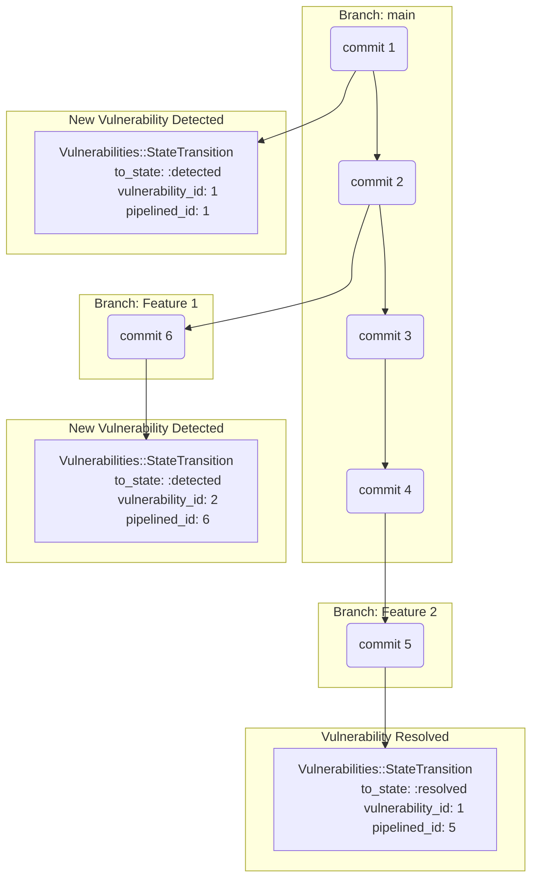
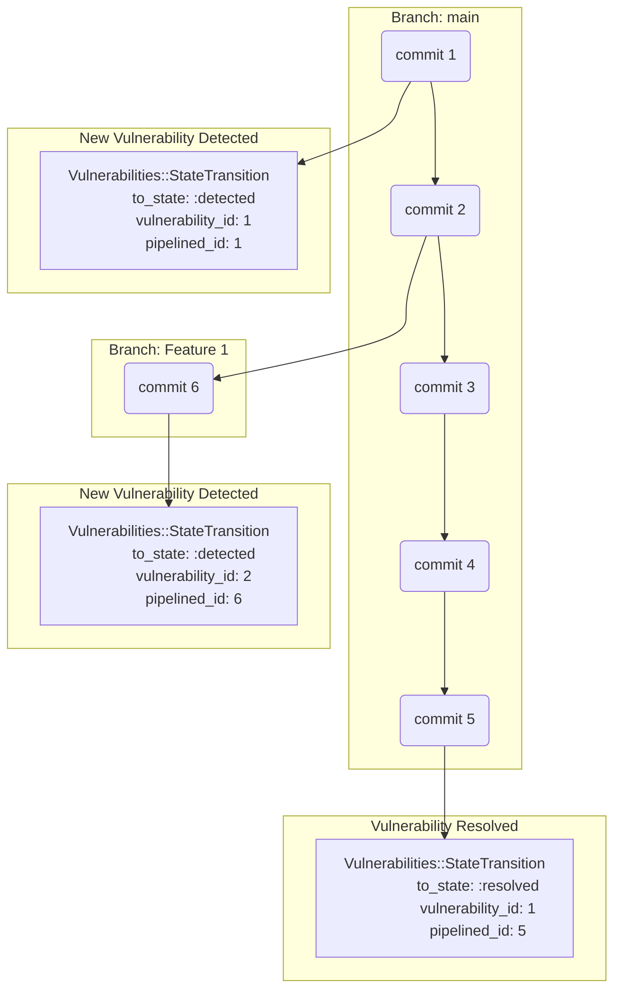



## Summary

Perhaps one of the most in demand Sec features for GitLab currently is the ability to [track vulnerabilities across multiple branches](https://gitlab.com/groups/gitlab-org/-/epics/3430). While the current implementation of vulnerability management features in GitLab offers a lot of power, the implementation is very inflexible. As a result, workflows which may involve running different versions of an application, be that old releases or modified versions are unable to track vulnerabilities without forking the code to seperate projects entirely.

Unfortunately, GitLab's current code is not built to facilitate this need, so we need to consider changes to make it possible without endangering the stability of the system.

## Motivation

One of the primary examples provided by users seeking tracking of vulnerabilities across multiple branches is that our users frequently deploy or provide multiple versions of a system or product at a time.

Under this model, an application which an organisation may continue to provide bug and security fixes for older versions is unable to easily manage vulnerabilities in multiple supported versions of code using GitLab's integrations. This can lead to users either being forced to use GitLab in unintended ways to facilitate their security scans, or opt to use other scanning tools to avoid this inconvenience.

### Goals

- Facilitate multi-branch vulnerability monitoring and historical tracking
- Provide this functionality in a simple, consistent and cohesive way
- Ensure this functionality is well designed and does not pose a risk to GitLab's stability now or in the long term

## Proposal

### Tracking

In order to facilitate tracking of vulnerabilities across multiple branches, the core of what we are attempting to track can be dissolved into a single sentence:

"What significant detail has occurred regarding this vulnerability at this point in the codebases's history?"

GitLab's vulnerability management system currently works by taking in a list of "Security Findings" which represent the full list of vulnerabilities identified by the scanner in the codebase at that current commit in the repository's history. When we ingest the findings, we reconcile this list of findings against the list of currently known vulnerabilities in the database in order to identify changes in the scan results for that scanner on that repository.
Fundamentally the list of things we are identifying when we do this can boiled down to the list of "states" that we track for vulnerabilities. This list is:

- Detected
- Confirmed
- Dismissed
- Resolved

These states are fundamentally representative of entry and exit points of vulnerability within a codebase. We currently use the `Vulnerabilities::StateTransition` model to track changes between these states for a respective vulnerability. Our current architecture is built with the assumption that a `Vulnerability` exists only on the default branch of a repostory, and so we create a `Vulnerabilities::StateTransition` only when the state of a vulnerability changes on the default branch.

The vast majority of feature branches do not make any changes to state of a vulnerability within a codebase. This means that we can avoid the most significant risk of database bloat by utilising the branching nature of the git repository to track only the points where these changes occur in a repository's history. We can simply do this by relating the `Vulnerability::StateTransition` to the `Ci::Pipeline` that was the source of the security report that was ingested.

Having the pipeline that was the source of the change in the vulnerability means we can trace a vulnerability's presence in the codebase by retrieving the commit sha associtate with the CI pipeline and querying Gitaly using  [ListBranchNamesContainingCommitRequest](https://gitlab-org.gitlab.io/gitaly/#gitaly.ListBranchNamesContainingCommitRequest). This operation will tell us which branches contain the commit sha queried for, allowing us to identify all branches a respective vulnerability exists in.

*A repository is created and committed to repeatedly. When a vulnerability is resolved in a feature branch we identify this by an appropriate `Vulnerability::StateTransition.` A vulnerability found in a new branch is defined with a new `Vulnerability::StateTransition`*

*The feature branch in which the vulnerability was resolved is merged into the main branch. Because it's commit now exists in the main branch, our data does not need to change to still correctly reflect the new state.*

All this should be achievable by simple adding a `pipeline_id` column to the `vulnerability_state_transitions` table.

### Querying

This information effectively serves as the source of truth regarding the presence and state of a vulnerability in a respective branch. However, in order to present this information to our users and allow them to query and filter it, we need to materialize the information into a state that can be effectively indexed and filtered. Due to a history of performance issues, the current Vulnerability Report works by virtue of a highly denormalized table called `vulnerability_reads` which contains all the information related to vulnerabilities in a single row, allowing for effective indexing and filtering.

To minimalise the amount of processing we will need to do on demand, we need to store vulnerability reports for different branches in a similar way, effectively "caching" the output for users to filter and query. This is achievable using the existing Vulnerability::Reads paradigm, however we have to acknowledge that we will need substantial storage of denormalised records to make this possible. Each additional branch we wish to track for a project would require us to duplicate their entire body of vulnerabilities, plus or minus the differences specific to the branch.

This should be possible to facilitate by making the following changes to our database structure:

- Partitioning of the Vulnerability Reads table.
  - Tables over a certain size begin to face a wide variety of performance problems. The current size of `vulnerability_reads` is already over the threshold which starts facing these problems, so to ensure stable performance going forward we would need to partition.
  - Additionally, per the restrictions at GitLab regarding the adding of columns and indices to tables over a certain size, `vulnerability_reads` contravenes both these conditions currently. So partitioning is not optional in that regard. Though we may have to seek approval to add the additional column.
- Addition of a `ref` column to the Vulnerability Reads table.
  - *By default a `ref` will simply be a branch name, but if users want to track vulnerabilities by `tag`, we can allow them to designate tracked tags which can be included in the `ref` column as well.
- Additional of a `partition_number` to the `vulnerability_reads` table.
  - This would allow us to use a sliding list partition strategy for `vulnerability_reads`, and can dynamically add new partitions as GitLab scales and users adopt our vulnerability management features to a greater extent.
  - A partition number should be allocated by project/namespace/organisation to minimise data fragmentation. A new partition number should be used when the last partition exceeds 75GB, as this will allow already allocated projects space to grow without exceeding 100GB.
  - Should it be necessary, it should be possible to do partition rebalancing if a particular allocation becomes too heavy.
- Add some kind of table that allows users to designate their desired tracked refs for the project.
  - We can make this include protected branches by default.

### Scalability, Storage and Performance

Tracking vulnerabilities across multiple branches will require N * more everything to facilitate. Materializing vulnerabilities for the vulnerability report so that they can be effectively index and filtered will require as much space again on the `vulnerability_reads` table as it took to track the default branch's vulnerabilities. (Plus a bit more for the new ref column and associated changes to indices that will be necessary)

Ingestion of vulnerabilities to update the reports will continue to be an iterative update process associated with the ingestion of security reports from pipelines, so the processing necessary should be nominal in that regard.

However, it is likely that we would not want to keep a materialization of the report at the ready for every branch on every project at all times due to cost reasons. To mitigate this, we can limit the amount of refs that are actively tracked, and then expand this based on our comfort with performance, scalability and cost.

As a mitigation to avoid holding redundant vulnerability report data forever when a user may need it only temporarily, we can probably use the vulnerability history to generate a ref's report on demand, with some UI/UX elements to ask the user to wait while we process and generate the necessary materialised rows. This may mitigate the need to hold too much data when it may only be needed for a short duration.

There are several ways we can tradeoff between branch coverage and the associated storage costs. This tradeoff is not currently in-scope for this design doc. We will chose a justifiable starting point for branch coverage and review our position at a later date.

Because `vulnerability_reads` are essentially just a materialzed view of information from our source of truth tables, there's no danger in destructing and rebuilding it (as long as we don't disrupt users). As such, should usage grow to such an extent that we need dedicated storage for this denormalized information, this table could be very easily decomposed to a dedicated database.

### Retention

A very important subject in GitLab currently is the correct application of retention policies to data to avoid eternal storage of unused information. We are already in the process of implementing a [retention policy for vulnerability](https://gitlab.com/groups/gitlab-org/-/epics/12229) information based on the age of the vulnerability.

Because of this new approach to handle vulnerability retention, there should not be any impact on our currently intended 12 month retention policy. Detecting a vulnerability's presence on any branch will refresh the vulnerabilities presence in the codebase and refresh it's retention lifetime.

### How to handle history for branch changes

If a branch is deleted, the commits associated with the branch will no longer have a ref tracking them and may be pruned. The associated state transition information may now be redundant, so we should consider pruning it as well.

If a branch is merged and the project is squashing commits with a merge commit, then we may need to consider the merge commit as the new detection/resolution point for the vulnerability and drop the state transition records that were generated for the separate branch. Alternatively, existing `Vulnerabilities::StateTransition` objects could have their `pipeline_id` updated to match the merge commit.

### SBOM dependency tracking for package advisories

In order to track vulnerabilities from package advisories on multiple branches, it becomes necessary to track the dependencies present on all branches as well. Currently there is no architectural consideration for this behaviour in Gitlab, but we may be able to minimally support this by tracking entry/exit points for dependencies in a similar way to how were proposing to use Vulnerability State Transitions to track the same for vulnerabilities. If we know what commits contain a dependency, we can determine what branches have that dependency and then apply the package advisory all applicable branches.
