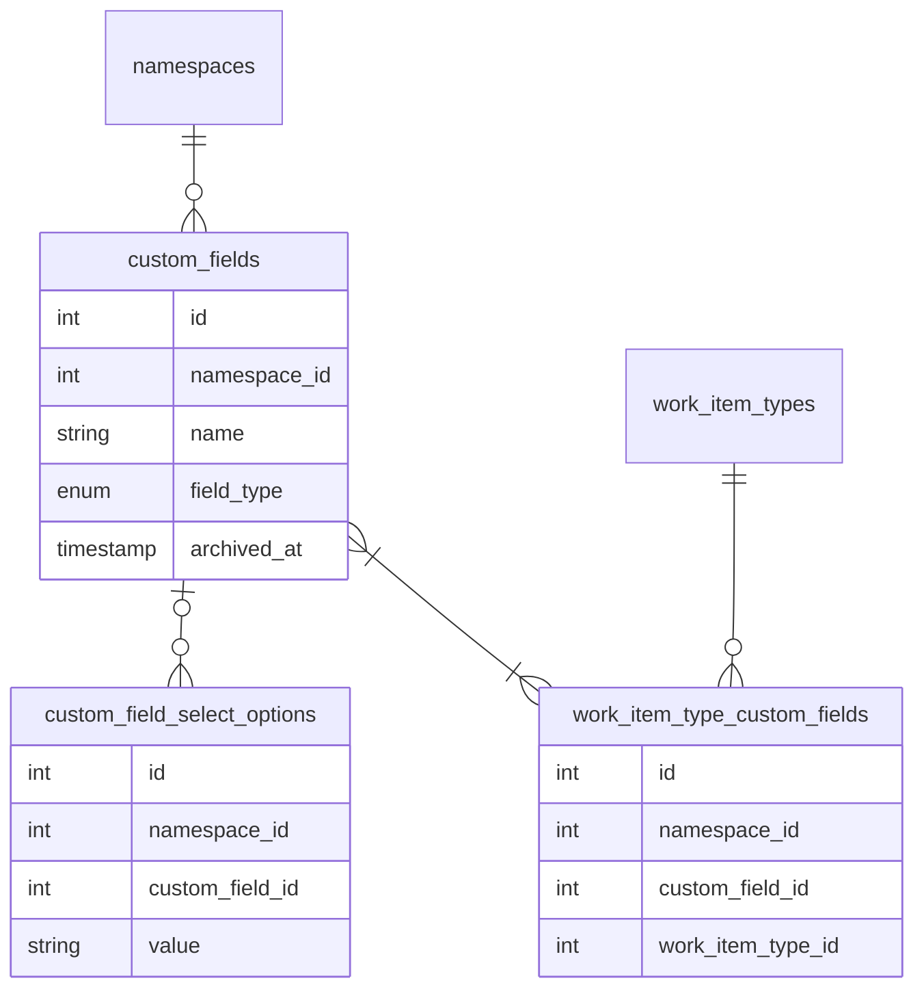
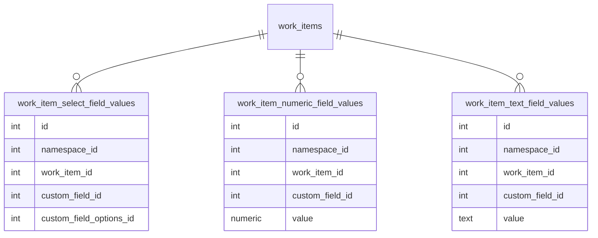

<!-- Design Documents often contain forward-looking statements -->
<!-- vale gitlab.FutureTense = NO -->

<!-- This renders the design document header on the detail page, so don't remove it-->



## Summary

This document outlines our approach to implementing a [flexible custom fields system](https://gitlab.com/groups/gitlab-org/-/epics/235) for work items in GitLab.
We're extending standard work item fields/widgets by introducing customizable fields that allow teams to capture specialized information unique to their workflows.

The solution introduces user created custom fields that can be configured at the **root** group level and applied to various work item types. Premium and Ultimate users can create, manage, and use these custom fields across their groups, subgroups, and projects.

This initiative enables users to standardize how they record and report information, creating consistency across projects and supporting more powerful filtering and reporting capabilities.

## Timeline & status updates

1. Custom Fields MVC1 was the Plan Stage's highest priority in FY26Q1 and it was introduced in GitLab 17.11 with the feature flag `custom_fields_feature`, which was enabled on GitLab.com, GitLab Self-Managed, and GitLab Dedicated.
2. The feature MVC1 became generally available in GitLab 18.0 with the feature flag removed.
3. MVC2 and MVC3 are pending prioritization and status updates can be found on the [custom fields epic](https://gitlab.com/groups/gitlab-org/-/epics/235).

## Glossary

### Existing concepts and terms

1. **Work Item Type:** A classification that determines a work item's available features and behaviors through its associated widgets.
2. **Widget:** A functional component that provides specific capabilities to a work item type (for example "assignees" and "labels").
3. **Namespace:** In GitLab, a namespace is a unique name for a user or group that hosts projects.

### New concepts and terms

1. **Custom Field:** A user-defined field that can be added to work items to capture specialized information beyond standard fields.
2. **Field Type:** The data type for a custom field, which determines its behavior and constraints (single-select, multi-select, number, text).
3. **Select Option:** A predefined value that can be selected in single-select or multi-select fields.
4. **Custom Fields Widget:** The component that displays custom fields and allows users to modify the values of a work item on the sidebar of the work item detail view.
5. **Field Value:** The data stored in a custom field for a specific work item.

## Motivation

GitLab's standard fields provide a solid foundation for work item management, but many teams require additional specialized fields to track information unique to their workflows. This has been a long-requested feature documented in epic [#235](https://gitlab.com/groups/gitlab-org/-/epics/235) and issues like [#8988](https://gitlab.com/gitlab-org/gitlab-foss/-/issues/8988) dating back several years. The ability to enhance work items with custom fields enables organizations to tailor GitLab to their specific planning needs and creates consistency across projects.

Before this implementation, users had to rely on less structured approaches like using labels or storing information in the description, which limited filtering, reporting, and standardization capabilities. Custom fields solve these issues by providing structured data storage with different field types that can be consistently applied across work items.

### Goals

1. Enable teams to add customized metadata to work items beyond standard fields
2. Provide different field types to accommodate various data requirements (text, number, single/multi-select)
3. Allow for consistent data collection and reporting across groups, subgroups, and projects
4. Improve filtering capabilities based on custom field values
5. Support standardization of workflows across teams
6. Use the work item architecture to extend custom field functionality to all supported work item types
7. Allow field configuration at the group level with inheritance to subgroups and projects

### Non-Goals

1. Complex validation rules or dependencies between fields
2. Custom fields for entities outside the work items framework

## Proposal

We propose developing a comprehensive custom fields system for work items in GitLab, centered on these key elements:

1. Custom fields are available for Premium and Ultimate customers.
2. Four field types are supported initially: single-select, multi-select, number, and text.
3. Fields are configured at the top-level group and are inherited by all subgroups and projects.
4. Fields can be assigned to specific work item types (issues, epics, etc.).
5. Field values live in the issues table.
6. Fields can be archived rather than deleted to preserve historical data.
7. The system uses the work item framework and widget concepts with the GraphQL API.

Note: This is an initial proposal, we plan to provide more configuration options and field types in the future.

## Design and implementation details

This section details the core concepts, implementation architecture, and release plan for the work item custom fields system in GitLab.

### Core Concepts

#### Custom Fields

Custom fields are defined at the top-level group and can be linked to multiple work item types.
Each field has a specific type that defines its behavior and constraints:

- **Single-select:** Users can select one option from a predefined list
- **Multi-select:** Users can select multiple options from a predefined list
- **Number:** Users can enter a numeric value
- **Text:** Users can enter free-form text (limited to 1024 characters)

Custom fields can be active or archived. Archived fields preserve historical data but are no longer availablefor new work items or edits.

There's a limit of `50` active custom fields per top-level group.

#### Select Options

For single-select and multi-select fields, select options define the available choices. Options have a name and position which determines their display order.

A single-select or multi-select field can have at most `50` select options.

#### Field Values

Field values store the actual data for each custom field on a work item. Different value types are used depending on the field type:

- `TextFieldValue:` Stores string values for text fields
- `NumberFieldValue:` Stores numeric values for number fields
- `SelectFieldValue:` Stores the selected option(s) for single-select and multi-select fields

#### Field Association with Work Item Types

Custom fields are associated with specific work item types through a many-to-many relationship. This allows for different work item types to have different sets of fields.

A work item type can have at most `10` custom fields assigned to it.

### Implementation Architecture

#### Database Schema

##### For custom field configuration



Notes:

- `field_type` can be select, multi-select, numeric, text, etc..
- `custom_field_select_options` is used to store the options for select / multi-select types
- This is decoupled from work item widget definitions so that it is easier to add to the default types and so it can be reused for MRs and custom objects in the future.

##### For storing work item custom field values



Notes:

- Each custom field type uses its own table so that we can have foreign keys to maintain referential integrity.

#### Models and Associations

The custom fields system is implemented with the following key models:

- `Issuables::CustomField`: Stores the field definition, including name and field type
- `Issuables::CustomFieldSelectOption`: Stores options for single-select and multi-select fields
- `WorkItems::TypeCustomField`: Links custom fields to work item types
- `WorkItems::TextFieldValue`, `WorkItems::NumberFieldValue`, `WorkItems::SelectFieldValue`: Store field values for specific work items

#### Custom Fields Widget

We use the `CUSTOM_FIELDS` widget to display and manage custom field values in work items.
This widget is added to all work item types that support custom fields.

The widget renders different input components based on the field type:

- Text fields use a text input component
- Number fields use a numeric input component
- Single-select and multi-select fields use a dropdown component

#### API Design

The feature uses the existing work items GraphQL API by extending the work item widget framework, and returns custom fields data from the `CUSTOM_FIELDS` widget.

To retrieve metadata about available fields, we can query the widget definitions endpoint, specifying both the work item type and namespace context.

Here's an example of the GraphQL query to fetch all the custom fields from a top-level group:

```graphql
query groupCustomFields($fullPath: ID!, $active: Boolean!) {
  group(fullPath: $fullPath) {
    id
    customFields(active: $active) {
    count
    nodes {
      id
      name
      fieldType
      active
      createdAt
      updatedAt
      selectOptions {
        id
        value
      }
      workItemTypes {
        id
        name
      }
    }
    }
  }
}
```

Variables example:

```graphql
{
  "fullPath": "gitlab-org",
  "active": true
}
```

Here is an example of the GraphQL query to fetch custom fields for a work item:

```graphql
query namespaceWorkItem($fullPath: ID!, $iid: String!) {
  workspace: namespace(fullPath: $fullPath) {
    id
    workItem(iid: $iid) {
    id
    widgets {
      type
      ... on WorkItemWidgetCustomFields {
        type
        customFieldValues {
        customField {
          id
          name
          fieldType
        }
        ... on WorkItemNumberFieldValue {
          value
        }
        ... on WorkItemTextFieldValue {
          value
        }
        ... on WorkItemSelectFieldValue {
          selectedOptions {
            id
            value
          }
        }
        }
      }
    }
    }
  }
}
```

Variables example:

```graphql
{
  "fullPath": "gitlab-org",
  "iid": "235"
}
```

#### Permissions

- To create, edit, archive and unarchive a custom field, you must have at least the Maintainer role for the group.
- To set custom field values for a work item, you must have at least the Planner role for the work item’s project or group. If you have the Guest role, you can set custom fields only when creating a work item.

#### Managing Custom Fields

On the top-level group settings page, users can configure custom fields to make them available for work items in that group, its subgroups, and projects.

On that page, you can also define for which work item type you want that custom field to be related. Once a custom field is created and linked to a work item type, it should be visible on that work item type page.

To learn how to manage a top-level group's custom fields, check the [guide](https://docs.gitlab.com/user/work_items/custom_fields/#configure-custom-fields-for-a-group).

##### Archiving Custom Fields

Rather than deleting custom fields, we support archiving them to preserve historical data. When a field is archived:

1. It is marked with an `archived_at` timestamp
2. It no longer appears in the field selection UI
3. It's no longer available for new work items
4. Existing field values are preserved for historical reference

Fields can be unarchived to make them available again. To learn how to archive or unarchive custom fields, check the [guide](https://docs.gitlab.com/user/work_items/custom_fields/#archive-a-custom-field).

#### Filtering by Custom Fields

Users can filter work items by custom field values on group and project list pages. This is implemented in some using the existing search and filter capabilities, with extensions for custom field types:

- Text fields: Search for work items with specific text content
- Number fields: Filter by numeric value
- Single-select fields: Filter by selected option
- Multi-select fields: Filter by one selected option (currently)

Filtering currently available on the following pages:

- Group/Issues list ([Example](https://gitlab.com/groups/gitlab-org/-/issues))
- Group/Issues boards ([Example](https://gitlab.com/groups/gitlab-org/-/boards))
- Project/Issues list ([Example](https://gitlab.com/gitlab-org/gitlab/-/issues))
- Project/Issues boards ([Example](https://gitlab.com/gitlab-org/gitlab/-/boards))

### Feature Flags and Licensed Feature

We used the feature flag `custom_fields_feature` throughout the development of this feature. The feature flag was removed in GitLab 18.0 when the feature became generally available.

Since the feature is only available in Premium and Ultimate tier, we consider it a licensed feature. The feature name is `custom_fields`.

### Implementation and release plan

We've identified these phases for this initiative:

#### MVC1: Core Functionality and basic fields (GitLab 17.11)

- Implement the database schema for custom fields
- Create the GraphQL API for managing custom fields
- Add work item type associations to control which work item types show which fields
- Build the UI for creating and managing custom fields at the group level
- Implement the custom fields widget for work item detail pages
- Implement the custom fields widget for work item create pages
- Support for all four field types (text, number, single-select, multi-select)
- Basic filtering capabilities for issues lists and boards
- Implement archiving and unarchiving of custom fields
- System notes for custom field changes
- Removal of the feature flag, making the feature generally available

#### Next iterations

- MVC1 enhancements
- MVC2 initial plan: Date custom fields, enable updating custom fields via quick action and other enhancements ([Epic](https://gitlab.com/groups/gitlab-org/-/epics/16332))
- MVC 3 initial plan: Smart fields based on existing GitLab objects as field values ([Epic](https://gitlab.com/groups/gitlab-org/-/epics/16333))

## Alternative Solutions

### Do nothing and continue to use labels

**Pros:**

- No development cost
- Labels are already familiar to users
- Labels can be color-coded

**Cons:**

- Labels are not structured data
- Labels are less powerful for filtering and reporting
- Labels don't support different data types (numbers, select lists, etc.)
- Labels don't allow for validation or formatting
- Labels are not organized by work item type

## Decision Registry

1. Use EAV data model to store custom field values. The main advantage is referential integrity and type validation.
2. Custom fields should not depend on custom work item types. We should be able to create custom fields on the existing default types.
3. Limit configuration to root namespaces. Configuration applies to all subgroups and descendant projects. Configuration of custom fields for subgroups is planned for future iterations.
4. Initial custom field types: Select field, number and text input
5. Rather than deleting custom fields, we decided to support archiving them to preserve historical data.
6. Custom fields filtering was not added to the epics board due to prioritization. It should work by default once the epics board is updated to use work items.

## Resources

1. [Top level epic for this initiative (#235)](https://gitlab.com/groups/gitlab-org/-/epics/235)
2. [Custom fields guide](https://docs.gitlab.com/ee/user/work_items/custom_fields.html)
3. [GitLab 17.11 release announcement](https://about.gitlab.com/releases/2025/04/17/gitlab-17-11-released/)

## Team

Please mention the current team in all MRs related to this document to keep everyone updated. We don't expect everyone to approve changes.

```text
@gweaver @donaldcook @nickleonard @fernanda.toledo @psimyn @engwan @stefanosxan
```
