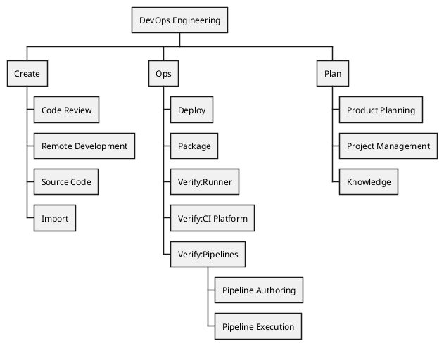

## Vision

 **Our goal is not merely to launch features, but to ensure they land successfully and provide real value to our customers.** We strive to develop a best-in-class product that exceeds expectations across all user groups by meeting high-quality standards while ensuring reliability and maintaining an ease of operation and scalability to meet diverse customer needs. All team members should remain mindful of our target customers and the multiple platforms we support in everything we do.

Ensure our product excels in all aspects especially for our primary customer [organization archetypes](/handbook/product/personas/organization-archetype/) of large enterprises. This includes scalability, adaptability, and seamless upgrade paths. When designing and implementing features, always keep in mind compatibility for all our deployment options: self-managed, dedicated and Software as a Service (SaaS).

Develop our technical, diverse and global team to drive results that support our product and customer growth, while maintaining [our values](/handbook/values/) and [unique way of working](/handbook/company/culture/all-remote/guide/).

## Mission

GitLab's unique way of working asynchronously, handbook first method, utilization of the product we develop and clear focus on our values enables very high productivity. We focus on constantly improving quality, usability and reliability of our product to reach maximum customer satisfaction. Community contributions and customer interactions rely on efficient and effective communication. We are a data-driven, customer experience first, open core organization delivering one secure, reliable, world leading DevSecOps platform. Join us in setting new standards, driving innovation, pushing the boundaries of DevSecOps, and consistently delivering exceptional results for our customers.

### Fostering High-Performing Teams for Efficient Execution

In today's competitive landscape, GitLab's success hinges on our ability to build and maintain high-performing teams capable of efficient and rapid execution.

#### Key Focus Areas

1. **Team Optimization**
   - Enhance communication and leadership within groups
   - Implement efficient processes
   - Develop situational awareness across teams
   - Promote continuous upskilling towards group needs and/or the wider engineering division

2. **Streamlined Delivery**
   - Identify and fix internal and external bottlenecks
   - Focus on the swift delivery of results meeting acceptance criteria and general quality bar
   - Look out for improvements in efficiency by enhancing the product and using all its capabilities

3. **Quad Execution**
   - Clarify responsibilities within quads
   - Encourage accountability amongst team members and counterparts
   - Empower quads to execute independently with a clear vision

4. **Innovation and Creativity**
   - Encourage research and ingenuity by defining clear paths for delivering promising ideas
   - Tap into the underutilized creative potential within teams

We aim to create an environment where high-performing teams can thrive, innovate and execute efficiently, ultimately driving GitLab's competitive edge in the market.

### Connect the Dots! In the Product and Between Teams

One of our product's greatest strengths and selling points is its unified platform approach. While we currently offer multiple functionalities within a single product, we should strive to further enhance this advantage by creating stronger connections between these different areas.

To fully leverage this strength, we need to:

1. Integrate features more seamlessly across the platform
2. Develop cross-functional capabilities that highlight the benefits of our unified approach
3. Ensure a consistent user experience throughout the product
4. Align and reuse foundational implementations across the whole platform

Additionally, it's crucial to improve collaboration at the team level especially to support this part of our mission.

We should:

1. Increase awareness of ongoing projects and initiatives across teams
2. Share knowledge about new technologies and innovations and how they are applied today
3. Promote understanding of functionalities in different product areas
4. Foster greater collaboration between teams throughout the entire engineering organization

### Product with a Customer Focus

We will continue our strong partnership with Product to make GitLab the best, most complete DevSecOps platform on the planet. This coordination and prioritization requires a lot of work and effort to provide the right data and make the right decisions. We will focus on a variety of factors, but top of mind will be our parent department's direction to be [customer focused](/handbook/engineering/#expand-customer-focus-through-depth-and-stability).

### Usability

Millions of customers use GitLab, so UX improvements can have a huge collective impact across all of these individuals. We support this effort both in the product development as well as in our architecture. This includes continued conversion of [Pajamas components](/handbook/product/ux/pajamas-design-system/) in order to continue to improve the performance experienced by users.

Development team members should also constantly suggest and investigate how to improve the overall user experience of the product. These can range from enhancing performance (actual and perceived), suggesting new technologies, solving user experience issues efficiently, etc.

## Organization



The DevOps department is comprised of:

- [Dev](/handbook/engineering/devops/dev/)
- [Ops](/handbook/engineering/devops/ops/)

To better fulfill our goals and vision, we are following [R&D interlock process](/handbook/product-development/r-and-d-interlock).

**Onboarding**

Welcome to GitLab! We are excited for you to join us.
Here are some curated resources to get you started:

- [Joining as an Engineer](/handbook/engineering/developer-onboarding/)
- [Joining as an Engineering Manager](/handbook/engineering/development/onboarding/manager/)
- [Core DevOps GitLab Project](https://gitlab.com/gitlab-org/core-devops)
- [Core DevOps Google Calendar](https://calendar.google.com/calendar/u/0?cid=Y19jYjBhZmU1Y2Y4MTZiYmI3Mzk4OTM0MTQ3MGIwMzFkZDY3NjNjYWQ3MTI3MGQ1MjllYTA3YjM3NzAyMGRjYzdkQGdyb3VwLmNhbGVuZGFyLmdvb2dsZS5jb20)

### Meetings

| **Meeting (Internal Only, limited access)** | **Frequency** | **DRI**  | **Topics**  |
|-------|--------|-------|----------|
| [SaaS Availability](/handbook/engineering/#saas-availability-weekly-standup)   | Weekly        | Infrastructure  | Incident corrective actions, Feature Change Lock status, Past Due Infradev, Error Budget, or Security updates    |
| Core DevOps Meeting     | Weekly      | Michelle Gill   | Standards discussions, questions, help needed, FYIs, process improvements, collaborating on engineering strategy, event planning, leadership communication dissemination, wider initiative brainstorming, OKRs |
|[Product Quality Standup](https://docs.google.com/document/d/18N4_OmA4JLG5wxZfq2irYk6FUVNXP-Arkk691lm35vo/edit?tab=t.0#heading=h.yoksgpvi6fh)       | Weekly        | Michelle Gill   | Coordination on shared quality objectives (bug burndown, instrumentation) across groups   |

### Performance Indicators

To better measure our goals and vision, we are tracking [Performance Indicators here](/handbook/engineering/devops/performance-indicators).

### People Processes

1. [Promotions](/handbook/people-group/promotions-transfers)
   - [Calibration preparation](/handbook/people-group/promotions-transfers/#calibration)
1. [Talent Assessments](/handbook/people-group/talent-assessment/)
1. [Hiring Contractors](/handbook/engineering/development/processes/hiring-contractors)
1. [Recognition and Awards](/handbook/engineering/recognition/)
1. [Learning and Development](/handbook/people-group/learning-and-development/)
   - [Mentoring at GitLab](/handbook/people-group/learning-and-development/mentor/)
   - [Security Awareness Training](/handbook/security/security-assurance/governance/sec-awareness-training/#what-will-be-covered-in-the-training)
   - [GitLab Performance Testing](/handbook/engineering/testing/performance-tools/)
   - [Getting started with the GraphQL API](https://docs.gitlab.com/ee/api/graphql/getting_started.html)
   - [Database Engineering](/handbook/engineering/development/database/)
   - [Reliability Training](/handbook/engineering/training/reliability)

## How We Work

### Incident Management

Team members in [some job families](/handbook/engineering/infrastructure/incident-management/incident-manager-onboarding) contribute to incident management directly through an on-call schedule for Incident Managers.
Team members should [complete onboarding](/handbook/engineering/infrastructure/incident-management/incident-manager-onboarding) so they can be added to the schedule when needed.
These [frequently asked questions](/handbook/engineering/infrastructure/incident-management/incident-manager-onboarding/#frequently-asked-questions) cover exemptions and changing shifts.

- [Incident Management](/handbook/engineering/infrastructure/incident-management/) process
- [Incident Manager On Call onboarding](/handbook/engineering/infrastructure/incident-management/incident-manager-onboarding/)

### Daily Duties for Engineering Directors

The following is a non exhaustive list of daily duties for engineering directors, while some items are only applicable at certain time, though.

1. Review engineering metrics
    1. DevOps Performance Indicators
    1. Stage Performance Indicators
1. Review hiring dashboards
1. Personal todo list
1. Personal GitLab board(s) if any
1. [Working groups](/handbook/company/working-groups/) that the director drives or participates in
    1. Action items in agenda documents
    1. Issue boards
    1. Slack channel
1. [Infradev triage](/handbook/engineering/workflow/#infradev)
    1. Follow up open questions and ensure appropriate handling of issues with regard to priority and severity
    1. [Agenda document](https://docs.google.com/document/d/1wMokFji42Jw4ImfoiQG6dSkHFIWmLVj5Kz6bO3mF948/edit)
    1. [Infradev board](https://gitlab.com/groups/gitlab-org/-/boards/1193197?label_name%5B%5D=infradev)
1. [Performance refinement](/handbook/engineering/workflow/#performance-refinement)
    1. Follow up open questions and ensure appropriate handling of issues with regard to priority and severity
    1. [Agenda document](https://docs.google.com/document/d/1icG6yrW2oebXz8iXvgfM5JjtMqpsDBCn1v3_VO2ghS0/edit#)
    1. [Performance board](https://gitlab.com/groups/gitlab-org/-/boards/1233204)
1. [Infrastructure Development Escalations](/handbook/engineering/workflow/#infradev)
    1. Triage new issues, enhance Issue details and ensure appropriate handling based on priority and severity
    1. Sync discussions for infradev Issues are part of the [GitLab SaaS Weekly Meeting](/handbook/engineering/infrastructure)
    1. [Agenda document](https://docs.google.com/document/d/1fLQQBKt0mShmTk_mJ-BmBM6OFjal63-AH7yKSbMg6_s/edit#)
    1. [Infradev board](https://gitlab.com/groups/gitlab-org/-/boards/1193197?label_name%5B%5D=infradev)
1. Holiday Emergency Contact Rotations
1. [Review and approve security approvals](https://gitlab.com/gitlab-com/www-gitlab-com/-/issues/12296) for the GitLab project when required and informing the security engineering team when a security risk is accepted rather than being resolved prior to approval.

### Cross-Functional Collaboration

Issues that impact code in another team's product stage should be approached collaboratively with the relevant Product, UX, and Engineering managers prior to work commencing, and reviewed by the engineers responsible for that stage.

We do this to ensure that the team responsible for that area of the code base is aware of the impact of any changes being made and can influence architecture, maintainability, and approach in a way that meets their stage's roadmap.

#### Architectural Collaboration

At times when cross-functional, or cross-departmental architectural collaboration is needed, the [GitLab Architecture Evolution Workflow](/handbook/engineering/architecture/) should be followed.

#### Follow the Sun Coverage

When cross-functional collaboration is required across global regions and time zones, it is recommended to adopt the [Follow the Sun Coverage](/handbook/engineering/development/processes/follow-the-sun-coverage/) approach to ensure seamless global collaboration.

#### Decisions requiring approvals

At GitLab we value [freedom and responsibility over rigidity](/handbook/values/#freedom-and-responsibility-over-rigidity). However, there are some technical decisions that will require approval before moving forward. Those scenarios are outlined in our [required approvals](/handbook/engineering/development/required-approvals/) section.

#### Security Vulnerability Handling

1. The development groups who introduce or consume the dependency of concern (e.g. gems, libs, base images, etc.) are responsible for resolving vulnerabilities detected against the dependency.
2. For business selected vendors that provide base images (RHEL's UBI8 for example), we need to wait for their patches, or need to log Deviation Request (DR) as viable resolutions. The [VulnMapper](https://gitlab.com/gitlab-com/gl-security/product-security/vulnerability-management/vulnerability-management-internal/vulnmapper/-/tree/main), an automation developed by the Threat Management team, can create vendor dependency DRs to a large extent, but there are still cases that DR needs to be reported manually.
3. The assigned development group can redirect issues if the initial assignment was inaccurate, following the processes for [shared responsibility issues](/handbook/engineering/infrastructure/engineering-productivity/issue-triage/#shared-responsibility-issues) and/or [Shared responsibility functionality](/handbook/product/categories/#shared-responsibility-functionality).

#### Ownership of Shared Services and Components

The GitLab application is built on top of many shared services and components, such as PostgreSQL database, Redis, Sidekiq, Prometheus and so on. These services are tightly woven into each feature's rails code base. Very often, there is need to identify the DRI when demand arises, be it feature request, incident escalation, technical debt, or bug fixes. Below is a guide to help people quickly locate the best parties who may assist on the subject matter.

##### Ownership Models

There are a few available models to choose from so that the flexibility is maximized to streamline what works best for a specific shared service and component.

1. Centralized with Specific Team
    1. A single group owns the backlog of a specific shared service including new feature requests, bug fixes, and technical debt. There may or may not be a counterpart Product Manager.
    1. The single group is a specific team, meaning there is an engineering manager and all domain owner individuals reside in this team. The DRI is the engineering manager.
    1. This single group is expected to collaborate closely and regularly in grooming and planning backlog.
    1. This model may require consensus from the Product Management counterpart.
    1. This model may fit a subject domain that experiences active development.
1. Centralized with Virtual Team
    1. A single group owns the backlog of a specific shared service including new feature requests, bug fixes, and technical debt. There may or may not be a counterpart Product Manager.
    1. The single group is a virtual team, meaning it consists of engineers from various engineering teams, for example maintainers or subject matter experts. Typically there isn't an engineering manager for this virtual team. The DRI is an appointed person in the group who may not necessarily be an engineering manager.
    1. This single group is expected to collaborate closely and regularly in refining and planning backlog.
    1. This model may fit a subject domain that's in maintenance mode.
1. Collectives
    1. Collectives consist of individuals from existing teams who voluntarily rally around a shared interest or responsibility, but unlike Working Groups may exist in perpetuity. The shared interest could be a specific technology or system. Collective members feel a collective responsibility to weakly own, improve upon or otherwise steer the subject they govern.
    1. This is a weaker form of the Virtual Team but introduces more structure than a fully decentralized model. It can be appropriate when some form of ownership is desirable where the subject has cross-cutting impact and wide reach and cannot clearly be allocated to any specific team.
    1. Collectives do not have product or engineering managers, they are fully self-governed.
    1. Members of the Collective sync regularly and keep each other informed about the shared interest. Problem areas are identified and formalized in the Collective, but are not logged into a Collective backlog. Instead a DRI is assigned who should put the task forward to the team with the greatest need for the problem to be resolved. This is to ensure that work is distributed fairly and that there are no two backlogs that compete with each other for priorities.
    1. Collectives work best when they consist of a diverse set of individuals from different areas of product and engineering. They double as knowledge sharing hubs where information is exchanged from across teams in the Collective first, and then carried back by the individuals to their specific teams.
1. Decentralized
    1. The team who implements specific functions or utilizes certain features of the shared services is responsible for their changes from local development environment to production deployment to continued maintenance post-deployment. There is not a development-wide single DRI who owns a portion or the entirety of a shared service.
    1. A specialty team may exist for specific subject domains, however their role is to enable scalability, availability, and performance by building a solid foundation and great tools for testing and troubleshooting for other engineering teams, while they are not responsible for gating every single change in the subject domain.

##### Shared Services and Components

The shared services and components below are extracted from the GitLab [product documentation](https://docs.gitlab.com/ee/development/architecture.html).

| Service or Component | Ownership Model | DRI and Group (Centralized Only) |  Additional Notes |
| -------------------- | --------------- | ---------------------- |  ---------------- |
| Alertmanager | Centralized with Specific Team | @twk3<br />[Distribution](/handbook/engineering/infrastructure-platforms/gitlab-delivery/distribution/) | Distribution team is responsible for packaging and upgrading versions. Functional issues can be directed to the vendor. |
| Certmanager |Centralized with Specific Team | @twk3<br />[Distribution](/handbook/engineering/infrastructure-platforms/gitlab-delivery/distribution/) | Distribution team is responsible for packaging and upgrading versions. Functional issues can be directed to the vendor. |
| Consul | |  | | 
| Container Registry  | Centralized with Specific Team | Package |  |
| Email - Inbound | |  | | 
| Email - Outbound | |  | | 
| Elasticsearch  | Centralized with Specific Team | @changzhengliu<br />Global Search | |
| GitLab K8S Agent  | Centralized with Specific Team | @nicholasklick<br />Configure |  |
| GitLab Pages | Centralized with Specific Team | @vshushlin<br />[Knowledge](/handbook/engineering/devops/dev/plan/knowledge/) |  |
| GitLab Rails  | Decentralized |  | DRI for each controller is determined by the feature category specified in the class. [app/controllers](https://gitlab.com/gitlab-org/gitlab/-/tree/master/app/controllers) and [ee/app/controllers](https://gitlab.com/gitlab-org/gitlab/-/tree/master/ee/app/controllers) |
| GitLab Shell | Centralized with Specific Team | @andr3<br />[Create:Source Code](/handbook/engineering/devops/dev/create/source-code/backend/) | [Reference](/handbook/product/categories/#source-code-group-1) |
| HAproxy  | Centralized with Specific Team |  [Infrastructure](/handbook/engineering/infrastructure-platforms/production-engineering/foundations/) |  |
| Jaeger  | Centralized with Specific Team | @dawsmith<br />Infrastructure:Observability | Observability team made the [initial implementation/deployment](https://gitlab.com/groups/gitlab-com/gl-infra/-/epics/210). | 
| LFS  | Centralized with Specific Team | @andr3<br />[Create:Source Code](/handbook/engineering/devops/dev/create/source-code/backend/) |  |
| Logrotate  | Centralized with Specific Team | @plu8<br />[Distribution](/handbook/engineering/infrastructure-platforms/gitlab-delivery/distribution/) | Distribution team is responsible for packaging and upgrading versions. Functional issues can be directed to the vendor. |
| Mattermost  | Centralized with Specific Team | @plu8<br />[Distribution](/handbook/engineering/infrastructure-platforms/gitlab-delivery/distribution/) | Distribution team is responsible for packaging and upgrading versions. Functional issues can be directed to the vendor. |
| MinIO  | Decentralized | | Some issues can be broken down into group-specific issues. Some issues may need more work identifying user or developer impact in order to find a DRI. |
| NGINX  | Centralized with Specific Team | @plu8<br />[Distribution](/handbook/engineering/infrastructure-platforms/gitlab-delivery/distribution/) |  |
| Object Storage  | Centralized with Specific Team |  @lmcandrew<br />[Scalability::Frameworks](/handbook/engineering/infrastructure/team/scalability/) |  |
| Patroni<br />General except Geo secondary clusters | Centralized with Specific Team | @plu8<br />[Distribution](/handbook/engineering/infrastructure-platforms/gitlab-delivery/distribution/) |  |
| Patroni<br />Geo secondary standby clusters | Centralized with Specific Team | @luciezhao<br />[Geo](/handbook/engineering/infrastructure-platforms/tenant-scale/geo/) |  |
| PgBouncer  | Centralized with Specific Team | @plu8<br />[Distribution](/handbook/engineering/infrastructure-platforms/gitlab-delivery/distribution/) |  |
| PostgreSQL<br />Framework and Tooling | Centralized with Specific Team | @alexives<br />[Database](/handbook/engineering/infrastructure-platforms/data-access/database-framework/) | Specific to the development portion of PostgreSQL, such as the fundamental architecture, testing utilities, and other productivity tooling |
| PostgreSQL<br />GitLab Product Features | Decentralized |   | Examples like feature specific schema changes and/or performance tuning, etc. |
| Prometheus  | Decentralized |    | Each group maintains their own metrics.  |
| Puma  | Centralized with Specific Team | @pjphillips<br />[Cloud Connector](/handbook/engineering/infrastructure/team/cloud-connector/) |  |
| Redis  | Decentralized |   | DRI is similar to Sidekiq which is determined by the feature category specified in the class. [app/workers](https://gitlab.com/gitlab-org/gitlab/-/tree/master/app/workers) and [ee/app/workers](https://gitlab.com/gitlab-org/gitlab/-/tree/master/ee/app/workers) |
| Sentry  | Decentralized |   | DRI is similar to GitLab Rails which is determined by the feature category specified in the class. [app/controllers](https://gitlab.com/gitlab-org/gitlab/-/tree/master/app/controllers) and [ee/app/controllers](https://gitlab.com/gitlab-org/gitlab/-/tree/master/ee/app/controllers) |
| Sidekiq  | Decentralized |   | DRI for each worker is determined by the feature category specified in the class. [app/workers](https://gitlab.com/gitlab-org/gitlab/-/tree/master/app/workers) and [ee/app/workers](https://gitlab.com/gitlab-org/gitlab/-/tree/master/ee/app/workers) |
| Workhorse  | Centralized with Specific Team | @andr3<br />[Create:Source Code](/handbook/engineering/devops/dev/create/source-code/backend/) |  |

## Supporting Customers

### Working with Support

When DevOps collaborates with Support it provides invaluable insight into how customers are using the product and the challenges they run into. A few tips to make the process efficient:

- Get [access to Zendesk](/handbook/support/internal-support/#requesting-a-zendesk-light-agent-account) so you view the question and communication from customers.
- Always write answers in a way that they can be "cut-and-pasted" and sent to a customer.
- Reference documentation in your responses and make updates to GitLab documentation when needed.
- Refer to existing issues and epics to reiterate our transparency value and to invite participation from the customer.
- If you are unclear about the support-development collaboration process or workflow then please refer to the handbook page [how to use gitlab.com to request help from the GitLab development team](/handbook/support/workflows/how-to-get-help#how-to-formally-request-help-from-the-gitlab-development-team)

### Customer Account Escalation coordination

If development is the DRI or actively participating in a [Customer Account Escalation](/handbook/customer-success/csm/escalations/), consider the following:

- Be careful to not make commitments to customers without first talking to product management and development leaders to confirm the impact that commitment may have on other commitments.
- The customer will want to know when they can see the benefits of a change. They may not be familiar with GitLab practices for tracking and predicting due dates and milestones. Also, they may not be familiar with our workflows and associated labels nor the predictability of code review timelines, different timelines on releases to GitLab.com compared with releases for self-hosted customers and our use of feature flags.

```markdown
* Customers often don't rely on asynchronous communication at the level that GitLab does. Educate the customer on our practices and adapt to find a combined asynchronous and synchronous communication method and cadence that works for everyone.
* Encourage customers to collaborate with us in epics, issues, and merge requests of interest. Keep in mind that they may not have access to ones that are confidential and/or may not be comfortable or able to collaborate with us in this public forum.
* Consider utilizing Google documents to collaborate with the customer as a backup for collaboration via epics, issues, and merge requests.
* Consider utilizing a shared Slack channel to collaborate, adding the customers to our slack via "one Slack channel access requests".  [Example](https://gitlab.com/gitlab-com/team-member-epics/access-requests/-/issues/16192)
* In meetings, tell customers why we like to record them and ask if they are OK with doing so. Consider using [Chorus](/handbook/sales/field-operations/sales-operations/go-to-market/chorus/) for scheduling the recordings to address legal requirements for recording meetings with customers.
* In meetings, tell customers why we take notes before, during, and after the meeting, as it may not be natural for them to collaborate in this way.
* Make sure the appropriate priority label is applied to all issues being tracked by the customer.
* In the agenda for recurring meetings, track the items tracked by the customer in priority order at the top and review the status, next steps, customer DRI, and GitLab DRI for each.  Discuss in the meeting periodically.
Remind GitLab team members in Slack to update the status of items they are the DRI for before recurring meetings.
* Post a link to the meeting notes and recording in a Slack channel for the customer escalation, so those who did not attend know that the notes and recording are available for review.
* When there is an action item for someone in a meeting (whether they are present or not), tag them in an issue or MR (or in Slack) so they will see it.
```

### Reducing the impact of far-reaching work

Because our teams are working in separate groups within a single application, there is a high potential for our changes to impact other groups or the application as a whole.  We have to be cautious not to inadvertently impact overall system quality but also availability, reliability, performance, and security.

An example would be a change to user authentication or login, which might impact seemingly unrelated services, such as project management or viewing an issue.

Far-reaching work is work that has wide-ranging, diffuse implications, and includes changes to areas which will:

1. be utilized by a high percentage of users
1. impact entire services
1. touch multiple areas of the application
1. potentially have legal, security, or compliance consequences
1. potentially impact revenue

If your group, product area, feature, or merge request fits within one of the descriptions above, you must seek to understand your impact and how to reduce it. When releasing far-reaching work, use a [rollout plan](/handbook/engineering/development/processes/rollout-plans). You might additionally need to consider creating a one-off process for those types of changes, such as:

- [Creating a rollout plan procedure](/handbook/engineering/development/processes/rollout-plans)
  - Consider how to reduce the risk in your rollout plan
  - Document how to monitor the rollout while in progress
  - Describe the metrics you will use to determine the success of the rollout
  - Account for different states of data during rollout, such as cached data or data that was in a previously valid state
- Requiring feature flag usage ([example](https://gitlab.com/gitlab-com/www-gitlab-com/-/merge_requests/88298))
- Changing a recommended process to a required process for this change, such as a domain expert review
- Requesting manual testing of the work before approval

#### Identified areas

Some areas have already been identified that meet the definition above, and may consider altered approaches in their work:

| Area             | Reason                      | Special workflows (if any)                                                                                            |
| ---------------- | --------------------------- |-----------------------------------------------------------------------------------------------------------------------|
| Database migrations, tooling, complex queries, metrics | impact to entire application<br/><br/>The database is a critical component where any severe degradation or outage leads to an S1 incident. | [Documentation](https://docs.gitlab.com/ee/development/database_review.html#general-process)                          |
| Sidekiq changes (adding or removing workers, renaming queues, changing arguments, changing profile of work required)  | impact to multiple services<br/><br/>Sidekiq shards run groups of workers based on their profile of work, eg memory-bound. If a worker fails poorly, it has the potential to halt all work on that shard. | [Documentation](https://docs.gitlab.com/ee/development/sidekiq/compatibility_across_updates.html) |
| Redis changes    | impact to multiple services<br/><br/>Redis instances are responsible for sets of data that are not grouped by feature category. If one set of data is misconfigured, that Redis instance may fail.  |                                                                                                                       |
| Package product areas            | high percentage of traffic share |                                                                                                                       |
| Gitaly product areas             | high percentage of traffic share |                                                                                                                       |
| [Create: Source Code product areas](/handbook/product/categories/features/#createsource-code-group) | high percentage of traffic share. Special attention should be paid to Protected Branches, CODEOWNERS, MR Approvals, Git LFS, Workhorse and the git over SSH / gitlab-sshd interfaces. Please contact the EM (@sean_carroll) or PM (@tlinz) if you are unsure. | |
| Pipeline Execution product areas | high percentage of traffic share  | [Documentation](https://docs.gitlab.com/ee/development/contributing/verify/)                                          |
| Authentication and Authorization product areas    | touch multiple areas of the application    | [Documentation](/handbook/engineering/development/sec/software-supply-chain-security/authorization/#code-review)            |
| Compliance product areas | potentially have legal, security, or compliance consequences | [Code Review Documentation](/handbook/engineering/development/sec/software-supply-chain-security/compliance/#code-review)                     |
| Workspace product areas    | touch multiple areas of the application    | [Documentation](/handbook/engineering/architecture/design-documents/workspaces/)                                   |
| [Specific fulfillment product areas](/handbook/engineering/development/fulfillment/#revenue-impacting-changes) | potentially impact revenue |                                                                                                                       |
| Runtime language updates | impacts to multiple services | [Ruby Upgrade Guidelines](https://docs.gitlab.com/ee/development/ruby_upgrade.html#ruby-upgrade-guidelines)           |
| Application framework updates | impacts to multiple services | [Rails Upgrade Guidelines](https://docs.gitlab.com/ee/development/rails_update.html)                                  |
| Navigation | impact to entire application | [Proposing a change that impacts navigation](/handbook/product/ux/navigation)                  |
