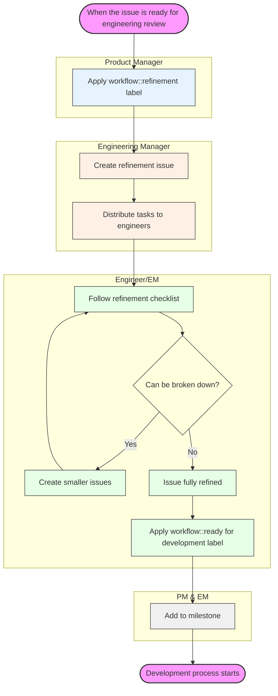

The Create:Source Code BE team focuses on GitLab's Source Code Management (SCM) tools and is responsible for all backend aspects of the [Source Code group's](/handbook/product/categories/#source-code-group) product categories in the [Create stage](/handbook/product/categories/#create-stage) of the [DevOps lifecycle](/handbook/product/categories/#devops-stages). For information on our product direction, visit the [Category Direction - Source Code Management](https://about.gitlab.com/direction/create/source_code_management/) page.

We interface with the Gitaly and Code Review teams, and work closely with the [Create:Source Code Frontend team](/handbook/engineering/devops/dev/create/source-code/frontend/). The features we work with are listed on the [Features by Group Page](/handbook/product/categories/features/#code-creation) and technical documentation is available on the [Create: Source Code Backend](https://docs.gitlab.com/ee/development/backend/create_source_code_be/index.html) page.

## About our team handbook page

This is our central document for finding everything important to our team. It is
our single source of truth for who is on the team, processes, practices,
meetings, links, channels, metrics and more. On this page, a team member should
be able to find everything they need to be fully engaged on this team.

### Updating this page

To be a DRI for updating our team handbook page, consider following these
steps:

- Navigate to our [handbook update epic](https://gitlab.com/groups/gitlab-org/-/epics/14740).
- Create a sub issue describing why a change to this page is needed.
- If it's quick and you have context, weight it as 1 and create an MR with the
  change.
- If it's going to require more effort, weight it higher and describe what's
  needed for a successful change. It can be considered during the next milestone
  planning.
- Once the MR is ready, mention `@gitlab-com/create-team/source-code/backend` in
  a comment asking for feedback. Mentioning the whole team ensures everyone on
  the team can contribute to how the team operates.
- If you think this might be an opportunity to share documentation cross
  functionally, consider pinging the frontend team to get their feedback.
- Assign the EM as the reviewer.
- Once a the team has had 2 business days to discuss, and any concerns are
  resolved, follow up and ask the EM if they can merge.

## Team members

The following people are permanent members of the Create:Source Code BE Team:



## Stable counterparts

The following people of other functional teams are our stable counterparts:



## Common Links

- GitLab Team Handle: `@gitlab-com/create-team/source-code/backend`
- Slack Channels: `#g_create_source-code-be`, `#g_create_source-code_stand-up`, `#g_create_source-code`, `#s_create`
- [Team error budget - Group Dashboard](https://dashboards.gitlab.net/goto/2YoyikIHR?orgId=1)
- [Team error budget - Detail Dashboard](https://dashboards.gitlab.net/goto/O6YJZodNR?orgId=1)

## Sisense and KPIs

To help us stay on track with [Development KPIs](/handbook/company/kpis/#development-department-kpis), we use a [metrics dashboard](https://app.periscopedata.com/app/gitlab/570334/Universal-Engineering-Team-Metrics-Dashboard). This dashboard includes security MRs from production, but doesn't include security MRs from `dev.gitlab.org`. For team-specific data and metrics, ensure you filter by our team.


  



  



  



  


## Workflow

We use the standard GitLab [engineering workflow](/handbook/engineering/workflow/). To create an issue for the Create:Source Code BE team, add these labels:

- ~backend
- ~"devops::create"
- ~"Category:Source Code Management"
- ~"group::source code"

For more urgent items, use the `#g_create_source_code` Slack channel.

[Take a look at the features we support per category here.](/handbook/product/categories/features/#code-creation)

### Working with the Product Team

Weekly calls between the Product Manager and Engineering Managers (frontend and backend) are listed in the "Source Code Group" calendar. Everyone is welcome to join and these calls are used to discuss any roadblocks, concerns, status updates, deliverables, or other thoughts that impact the group.

#### Issue refinement

1. Once we have validated the problem, product, UX, and engineering will collaborate to propose a solution and decide on what's technically feasible. The proposed solution may be shared with users to validate it solves the problem.
    1. Issues that require design work are marked with `UX` and `workflow::ready for design`.
    1. Issues in the design process are marked with `workflow::design`.
    1. Once designs are ready and the proposed solution is viable then the label `workflow::planning breakdown` will be applied.
1. Once we have confirmed the proposed solution is viable, we will move to break it down as much as possible. When issues are ready for this stage, PM will mark issues with `workflow::refinement` label to signal next step.
1. EM will create a refinement issue ([example](https://gitlab.com/gitlab-com/create-stage/source-code-be/-/issues/249)) and distribute tasks labeled `workflow::refinement` among engineers.
1. Engineers or EM will follow the checklist for assigned issues, work with PM, UX, and other engineering counterparts where necessary to address questions and concerns.
1. If the planned implementation of the issue can be further broken down, the engineer/EM will work with the PM to reduce scope and create new issues until this is the case (either PM or engineer/EM can create new work items).
1. Once an issue is fully refined, engineers or EM will add an appropriate [weight](/handbook/engineering/devops/dev/create/source-code/backend/#weight-categories) and label it as `workflow::ready for development`. These issues can then be added to the milestone.
1. When other teams depend on Source Code Backend issues planned for the current milestone, those issues will be labeled as `SCM::AwaitingBackend`

**Note**: if an issue receives a weight > 3 after this process, it may indicate the IC may not have a full idea of what is needed and further research is needed.

#### Diagram



### Issue Refinement Checklist

For issues that need refinement, the Engineer/EM should add a comment using this template and complete all checklist items.

If you cannot finish any of these steps, ping EM/PM.

```plaintext
# Issue Refinement Checklist

## Problem verification
- [ ] Issue label is ~"workflow::refinement"
- [ ] Issue title clearly describes the feature or change
- [ ] Issue description defines requirements and expectations
- [ ] Required permissions and access levels defined

## Implementation plan

- [ ] A comment with an implementation plan is created
- [ ] Issue is small and doesn't need to be broken down

## Final steps
- [ ] This issue has a weight
- [ ] There are no blockers
- [ ] Issue has ~"workflow::ready for development" label
```

### Bug Refinement Checklist

For bug reports that need refinement, the Engineer/EM should add a comment using this template and complete all checklist items.

```plaintext
# Bug Refinement Checklist

## Bug verification
- [ ] Issue label is ~"workflow::refinement"
- [ ] Issue label is ~"type::bug"
- [ ] Issue title clearly describes the bug
- [ ] Steps to reproduce are documented
- [ ] Issue is still reproducible
- [ ] Severity labels are defined
- [ ] Related logs or error messages are attached

## Technical analysis
- [ ] Root cause has been identified or hypothesized
- [ ] Affected components/services are identified
- [ ] Potential side effects of the fix are considered

## Implementation plan
- [ ] A comment with an implementation plan is created
- [ ] Fix scope is contained and doesn't require larger refactoring
- [ ] Test cases to verify the fix are defined

## Final steps
- [ ] This issue has a weight
- [ ] There are no blockers
- [ ] Issue has ~"workflow::ready for development" label
```

### Implementation plan

Add a comment to the issue under refinement using the provided template.

```plaintext
### Implementation Plan

**1. Approach**

<!-- Provide a high-level description of the implementation idea -->

**2. Dependencies**

- [ ] Requires ~backend
- [ ] Requires ~frontend
- [ ] Requires ~database
- [ ] Requires ~documentation
- [ ] Requires ~UX work
- [ ] External service dependencies identified
- [ ] Requires ~API changes

**3. Implementation Steps**

<!-- Provide step by step description of what needs to be done -->

- Task 1
- Task 2
- Task 3

**4. Edge Cases**

<!-- Does the implementation cover all scenarios (success, failure) -->

- Success scenarios:
  - Case 1
  - Case 2

- Error scenarios:
  - Case 1
  - Case 2

- Edge conditions:
  - Case 1
  - Case 2


@engineer_username please review this implementation plan.
<!--
Pick a peer engineer following this criteria:
1. is a subject matter expert.
2. might have some familiarity with the topic. or
3. ask on slack who'd be available to review this plan before the due date of the issue
-->
```

#### Epics, issues, and tasks

The Source Code team uses the following structure of planning objects to organize work:

1. **Epics:** are used to identify a larger set of work that aligns to a specific category/theme (most broad) or feature (most specific) that has multiple issues for delivery and spans multiple milestones worth of work.
1. **Issues:** are used for individual items that will be planned and can be delivered in a single milestone.
1. **Tasks:** can be created by the issue's DRI inside an issue to further define pieces that need to be delivered as part of completing the issue. Ex: For Pair Programming, For granular details on the progress, etc.

### Convention over configuration

As stated in our direction, we must place special emphasis on our [convention over configuration](https://about.gitlab.com/direction/create/source_code_management/#critical-product-principles) principle. As the feature set within Create:Source Code grows, it may feel natural to solve problems with configuration. To ensure this is not the case, we must intentionally challenge MVC and new feature issues to check for this. Let's consider the following steps for best results:

1. Once issues have been labeled as `workflow::needs issue review` PM will share the proposal with either a peer or their manager as well as engineering (EM or IC) and product designer.

1. Peers in product and engineering who review the issue should look for opportunities to eliminate configuration where possible. If opportunities are identified, the issue is moved back to `workflow::refinement`.

1. If PM and peers are satisfied with the proposal and it follows our convention over configuration principle as much as possible, those who reviewed the issue indicate their agreement with the proposal (with either 👍 or a comment in the issue). Finally, PM or EM will label issue `workflow:: ready for development`.

### Collaborating with counterparts

You are encouraged to work as closely as needed with stable counterparts outside of the PM. We specifically include quality engineering and application security counterparts prior to a release kickoff and as-needed during code reviews or issue concerns.

Quality engineering is included in our workflow via the [Quad Planning Process](https://gitlab.com/gitlab-com/www-gitlab-com/issues/6318).

Application Security will be involved in our workflow at the same time that kickoff emails are sent to the team, so that they are able to review the upcoming milestone work, and notate any concerns or potential risks that we should be aware of.

### Communication

As a team we strive to be responsive and accommodating when we communicate. When consuming information, we use the following emoji to definition table as a shorthand glossary:

| Emoji | Definition                                                                                                          |
|-------|---------------------------------------------------------------------------------------------------------------------|
| 👀    | I'm looking at this now                                                                                             |
| 🤔    | I need to think about this before responding                                                                        |
| 📍    | I don't have time, will come back later                                                                             |
| 🤷🏼    | I don't know                                                                                                        |
| 👌    | I understand                                                                                                        |
| 👍    | Agree (and often won't give additional comment)                                                                     |
| ✅    | Task is complete                                                                                                    |
| ⏭    | I've seen this but I don't think I'm the best person for the job. Ping me if no one else responds and you need help |

### Merge Request reviews

{}

#### Requesting a review

For an initial review, it's recommended to select a reviewer from the Source Code team.

For maintainer reviews, you can follow the recommendations from the Reviewer Roulette. For time-sensitive or complex reviews, it's preferable to choose a reviewer from the Source Code team.

### Triage process

The weekly Triage Report is generated automatically by the [GitLab bot](https://gitlab.com/gitlab-bot) and this report is reviewed by the EM. Here is [an example](https://gitlab.com/gitlab-org/quality/triage-reports/-/issues/2700) of a previous report.

The Triage Report can be quite long, and it important to deal with it efficiently. An effective way to approach it is:

- Open every issue in a separate browser tab and use "edit issue" to mark then as checked once review, then close the tab.
- Verify if the issue belongs to ~"group::source code" and change group label if needed. The [Features by Group](/handbook/product/categories/features/#code-creation) page is a good starting point for this assessment.
- Apply ~frontend if it is a frontend issue.
- Perform a brief search to assess if is a duplicate, close with a ~Duplicate label if this is the case.
- Is it a ~"support request" ? Does it ~"needs investigation" ? Apply labels if so.
- Apply ~regression label if it is one, consider bumping severity numbers if recent.
- Apply ~"severity::4", ~"priority::4", %Backlog if a smaller issue with no significant impact.
- If an uncontroversial problem with a clear solution, consider applying ~"Seeking community contributions"
- If also an easier issue which might interest a newer community contributor, consider applying ~"quick win".
- Apply ~"priority::3" ~"severity::3" if a bug with a workaround.
- Anything causing data loss, severe performance impact or security apply a ~"severity::1"  and ~"priority::1" or ~"priority::2" and assign to a team member.
- Unassign yourself from the Triage Report

### Engineering cycle

The engineering cycle is centered around the [GitLab Release Date every month](/handbook/engineering/releases/#timelines). This is the only fixed date in the month, and the table below indicates how the other dates can be determined in a given month.

#### Iteration documents

These documents comprise everything that is documented during the release planning and execution.

##### Issue boards

Create Source Code BE planning takes inputs from the following sources:

- [Performance Board](https://gitlab.com/gitlab-org/gitlab/-/boards/706619?scope=all&utf8=%E2%9C%93&state=opened&label_name[]=group%3A%3Asource%20code&label_name[]=performance-refinement)
- [Infradev Board](https://gitlab.com/gitlab-org/gitlab/-/boards/706619?scope=all&utf8=%E2%9C%93&state=opened&label_name[]=group%3A%3Asource%20code&label_name[]=infradev)
- [Application Limits Board](https://gitlab.com/gitlab-org/gitlab/-/boards/706619?scope=all&utf8=%E2%9C%93&state=opened&label_name[]=group%3A%3Asource%20code&label_name[]=Application%20Limits)
- [Security Board](https://gitlab.com/gitlab-org/gitlab/-/boards/2716576?label_name[]=group%3A%3Asource%20code&label_name[]=security)
- [Missed SLO Board](https://gitlab.com/gitlab-org/gitlab/-/issues?scope=all&utf8=%E2%9C%93&state=opened&label_name[]=group%3A%3Asource%20code&label_name[]=missed-SLO&label_name[]=backend)
- Bugs
- New features

Create Source Code UX planning takes inputs from the following sources:

- [SCM UX Planning Board](https://gitlab.com/groups/gitlab-org/-/boards/5092292?label_name[]=UX&label_name[]=group%3A%3Asource%20code)
- [SCM UX Build Board](https://gitlab.com/groups/gitlab-org/-/boards/5092276?label_name[]=UX&label_name[]=group%3A%3Asource%20code)

##### Planning issue

Each month a planning issue is created by one of the EMs, using [automated tools](https://gitlab.com/gitlab-com/create-stage/source-code-be/-/blob/main/doc/planning/index.md) based on the [Source Code issue template](https://gitlab.com/gitlab-org/create-stage/-/blob/master/.gitlab/issue_templates/source-code-planning.md).

##### Planning board

The [Planning Board](https://gitlab.com/groups/gitlab-org/-/boards/2822491?milestone_title=14.1&label_name%5B%5D=group%3A%3Asource%20code) is created for each release by the PM, and is a curated list of issues by category. The EM requests engineers to assist in refining issues and allocate weights via the [refinement](/handbook/engineering/devops/dev/create/source-code/backend/#issue-refinement) process.

##### Capacity planning spreadsheet

The EM maintains a [Google Sheet](https://docs.google.com/spreadsheets/d/1A7Xgz4IrksKYbTbSVgvRPEV8CQgUe9hQC2A9tS-SEa8/edit#gid=1568889265) for calculating team capacity, and the same Spreadsheet is also used to perform the process of assigning issues to the release based on weight and priority.

##### Build board

The EM selects issues from the [Planning Board](#planning-board) based on:

- slipped issues
- weight
- priority
- PM preference

The EM then applies the ~Deliverable label to each issue in the Release and assigns then to an engineer. The issues are tracked through the release via the Build Board.

#### Candidate issues

Urgent issues are tentatively assigned to a release to ensure other teams have visibility.

At this point the issues are *Candidate* issues, and the milestone does not confirm that they will be definitely scheduled. Issues move from *Candidate* status to confirmed during the [Issue selection](#issue-selection) process.

#### Key dates

| Date | Event |
| ------ | ------ | ------ |
| The Monday of the week the milestone ends |**PM** creates planning board and pings EMs in the Planning Issue for review & weighting.<br><br> **EMs** calculate capacity, add to Planning Issue.<br><br>**PM** submits RPIs for reviews.|
| Monday to Friday of the week the milestone ends |**EMs** & **ICs** add weights to issues in the planning board|
| The Friday the milestone ends | **EMs** add ~Deliverable labels to issues so that they appear on the Build board *as a draft*<br><br>Release Post: **EMs**, **PMs**, and **PDs** contribute to MRs for Usability, Performance Improvements, and Bug Fixes|
| The Friday the milestone ends | **EMs** adjust ~Deliverable labels for slippage and make final assignments<br><br>**PMs** review final plan for milestone on Build board<br><br>**EMs** merge RPI MRs for features that have been merged.|
| The third Thursday of the month | Release |

#### Weighting issues

We use a system of weights to assist in forecasting the capacity each issue will require to be completed.

These are either assigned by the EM or by engineers ad-hoc or following the [refinement](/handbook/engineering/devops/dev/create/source-code/backend/#issue-refinement) process.

##### Weight categories

The weights we use are:

{}

A weight of 5 generally indicates the problem is not clear or a solution should be instead converted to an Epic with sub-issues.

###### If the issue should be broken down

If the problem is well-defined but too large (weight 5 or greater), either:

- Promote the issue to an Epic and break the work into sub-issues. Weight the individual issues if possible.
- Ping the EM and PM and outline the reason the issue needed to be promoted to an Epic.

###### If the issue SSOT is not clear

- Don't assign a weight, instead add a comment indicating what needs clarification and ping the EM and PM.

###### If the issue needs a spike

- Don't assign a weight, instead add a comment about the need for a spike (and possibly what would be investigated) and ping the EM or PM.
- Spikes are scheduled with a weight of 2.
- Spikes are scheduled with a weight of 2 (timeboxed).

See the [spike issues](#spike-issues) section for more details about these issues.

##### Security issues

Security issues are typically weighted one level higher than they would normally
appear from the table above. This is to account for additional work and backports in the
[patch release process](https://gitlab.com/gitlab-org/release/docs/blob/master/general/security/engineer.md).

#### Planning issue review

The Source Code stable counterparts (BE, FE, PM, UX) meet and propose issues to be worked on in the upcoming release. Using the [Mural](https://www.mural.co/) visual collaboration tool, candidate issues are voted on by the group.

#### Capacity planning

Capacity planning is a collaborative effort involving all Source Code team members and stable counterparts from Frontend, UX and Product. An initial list of issues is tracked in the Source Code Group Planning issue [example](https://gitlab.com/gitlab-org/create-stage/-/issues/12783) for each month.

##### Team availability

Approximately 5-10 business days before the start of a new release, the EM will begin determining how "available" the team will be. Some of the things that will be taken into account when determining availability are:

- Upcoming training
- Upcoming time off / holidays
- Upcoming on-call slots
- Potential time spent on another teams deliverables

Availability is a percentage calculated by *(work days available / work days in release) * 100*.

All individual contributors start with a "weight budget" of 10, meaning they are capable (based on historical data) of completing a maximum number of issues worth 10 weight points total (IE: 2 issues which are weighted at 5 and 5, or 10 issues weighted at 1 each, etc.) Then, based on their availability percentage, weight budgets are reduced individually. For example, if you are 80% available, your weight budget becomes 8.

Product will prioritize issues based on the teams total weight budget. Our [planning rotation](#capacity-planning) will help assign weights to issues that product intends on prioritizing, to help gauge the amount of work prioritized versus the amount we can handle prior to a kickoff.

##### Source Code issue pipeline

The Source Code issue pipeline is broad, and the PM and EM work together throughout the planning process and the final list is chosen during the Issue Selection meeting. The issue pipeline includes:

- Features
- Bugs
- Security issues
- [Infradev board issues](https://gitlab.com/gitlab-org/gitlab/-/boards/706619?scope=all&utf8=%E2%9C%93&state=opened&label_name[]=group%3A%3Asource%20code&label_name[]=infradev)
- [Performance board issues](https://gitlab.com/gitlab-org/gitlab/-/boards/706619?scope=all&utf8=%E2%9C%93&state=opened&label_name[]=group%3A%3Asource%20code&label_name[]=performance-refinement)
- [Application limit board issues](https://gitlab.com/gitlab-org/gitlab/-/boards/706619?scope=all&utf8=%E2%9C%93&state=opened&label_name[]=group%3A%3Asource%20code&label_name[]=Application%20Limits)

#### Issue selection

On or around the 16th, the PM and EM meet once more to finalize the list of issues in the release. The issue board for that release is then updated, and any issues with an candidate milestone that are not selected will be moved to Backlog or added as a candidate for a future release.

Issues scheduled for the release are then marked ~"workflow::ready for development".

#### Issue assignments

Issue assignments are done collaboratively during the monthly Backlog Refinement meeting and Milestone Planning meetings.
If any priority issues emerge after these meetings, or if assignments can't be done during these meetings, the EM will assign the issues directly, before the milestone starts.

#### Follow up issues

You will begin to collect follow-up issues when you've worked on something in a release but have tasks leftover, such as technical debt, feature flag rollouts or removals, or non-blocking work for the issue. For these, you can address them in at least 2 ways:

- Add an appropriate future milestone to the follow-up issue(s) with a weight and good description on the importance of working this issue
- If a parent issue is fixed but pending activation via a Feature Flag, update the parent issue description to: “This change has been merged. Rollout will be managed in this rollout issue. Once the Rollout issue is closed then this change will be live.”. Also, link the related Feature Flag issue to the parent issue.
- Add the issue(s) to the relevant [planning issue](https://gitlab.com/gitlab-org/create-stage/-/issues?scope=all&utf8=%E2%9C%93&state=opened&search=source+code+group+planning)

You should generally take on follow-up work that is part of our [definition of done](https://docs.gitlab.com/ee/development/contributing/merge_request_workflow.html#definition-of-done), preferably in the same milestone as the original work, or the one immediately following. If this represents a substantial amount of work, bring it to your manager's attention, as it may affect scheduling decisions.

If there are many follow-up issues, consider creating an epic.

#### Spike issues

{}

##### Double-assign for overly-complex or time-sensitive issues

As discussed in a [previous retrospective](https://gitlab.com/gl-retrospectives/create-stage/source-code/-/issues/74#note_1914857307), in addition to breaking down issues, we should assign two engineers to each task instead of just one for overly-complex or time-sensitive issues. This co-ownership will help parallelize efforts in multiple-MR tasks, speed up immediate code reviews, and ultimately lead to faster delivery of results.

#### Backend and Frontend issues

Many issues require work on both the backend and frontend, but the weight of that work may not be the same. Since an issue can only have a single weight set on it, we use scoped labels instead when this is the case: `~backend-weight::<number>` and `~frontend-weight::<number>`.

### Workflow labels

{}

### Retrospectives

We have 1 regularly scheduled "Per Milestone" retrospective, and can have ad-hoc "Per Project" retrospectives.

#### Per Milestone

{}

#### Per Project

If a particular issue, feature, or other sort of project turns into a particularly useful learning experience, we may hold a synchronous or asynchronous retrospective to learn from it. If you feel like something you're working on deserves a retrospective:

1. [Create an issue](https://gitlab.com/gl-retrospectives/create-stage/source-code/issues) explaining why you want to have a retrospective and indicate whether this should be synchronous or asynchronous
1. Include your EM and anyone else who should be involved (PM, counterparts, etc)
1. Coordinate a synchronous meeting if applicable

All feedback from the retrospective should ultimately end up in the issue for reference purposes.

### Deep dives

{}

### Career development

{}

### Performance monitoring

The Create:Source Code BE team is responsible for keeping some API endpoints and
controller actions performant (e.g. below our target speed index).

Here are some Kibana visualizations that give a quick overview on how they perform:

- [Create::Source Code: Controller Actions](https://log.gprd.gitlab.net/app/kibana#/visualize/edit/32698f60-b145-11ea-bfe2-25f984e253f8?_g=(filters%3A!()%2CrefreshInterval%3A(pause%3A!t%2Cvalue%3A0)%2Ctime%3A(from%3Anow-7d%2Cto%3Anow)))
- [Create::Source Code: Endpoints](https://log.gprd.gitlab.net/app/kibana#/visualize/edit/104d4bf0-a0d9-11ea-8cfd-8dcd98a55a1d?_g=(filters%3A!()%2CrefreshInterval%3A(pause%3A!t%2Cvalue%3A0)%2Ctime%3A(from%3Anow-7d%2Cto%3Anow)))

These tables are filtered by the endpoints and controller actions that the group
handles and sorted by P90 (slowest first) for the last 7 days by default.
