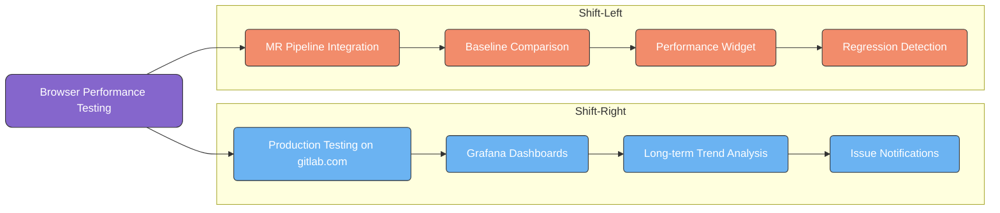
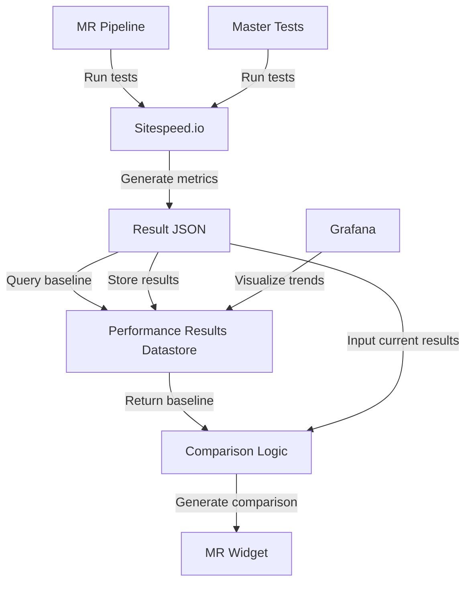
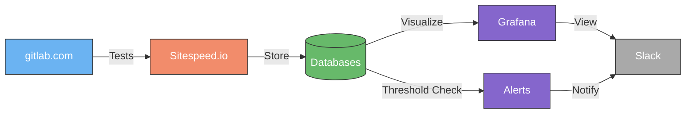



[[_TOC_]]

## Executive Summary

This blueprint outlines a comprehensive approach to implementing browser performance testing at GitLab with a dual focus: "shift-left" testing at the Merge Request (MR) level to detect performance issues early and "shift-right" testing against production environments to validate performance in real-world conditions. The approach leverages Sitespeed.io as the core technology while addressing challenges around test environment consistency, data seeding, and meaningful metrics.

## Background

The Frontend team previously utilized a Sitespeed setup (GitLab.org/frontend/sitespeed-measurement-setup) for performance testing, but this system became obsolete. The Performance Enablement team has been tasked with reviving and improving this capability as part of ongoing efforts to enhance application performance across GitLab.

In parallel, the DevEx team has been running the GitLab Browser Performance Testing (GBPT) solution (gitlab-org/quality/performance-sitespeed) against 1k self-managed instances and staging environments. This existing solution provides valuable performance data but is primarily focused on controlled self-managed environments rather than testing against production or at the MR level.

Both server-side performance issues (detected by GitLab Performance Tool - GPT) and client-side performance issues (detected by GBPT) are currently identified primarily through nightly runs. This means that issues are often caught after they've been merged but before they're released to self-managed instances. However, for gitlab.com, these issues may persist for some time until fixed. A more proactive approach is needed to catch these issues earlier in the development lifecycle.

This blueprint aligns with broader performance engineering initiatives at GitLab, including the proposed Performance Results Datastore that will centralize all performance test results for advanced analytics and trend analysis. The browser performance testing capabilities outlined here will feed data into this central repository, enabling more sophisticated analysis and visualization of client-side performance metrics across environments and GitLab versions.

## Current Challenges

1. **Late Detection**: Performance issues are often discovered only after reaching production
2. **Environment Inconsistency**: Results vary across different environments, making baseline comparisons difficult
3. **Test Data Variability**: Performance metrics are sensitive to test data volume and complexity
4. **Delayed Feedback**: The team often has to review hundreds of MRs to identify performance regressions
5. **Resource Constraints**: Spinning up dedicated test environments for each MR is resource-intensive
6. **Cells Architecture**: Future transitions to a Cells architecture will complicate performance testing approaches
7. **Fragmented Solutions**: Current solutions (obsolete Frontend Sitespeed and GBPT for 1k instances) operate independently, limiting cross-environment comparison and insight sharing
8. **Limited MR-Level Testing**: Existing solutions focus on environment-level testing rather than providing immediate feedback at the code change level
9. **Authentication Requirements**: Some endpoints require user authentication, necessitating framework capabilities to handle login flows and maintain selectors
10. **Page Interaction Complexity**: Certain tests require complex interactions with the page, requiring teams to build and maintain custom test scripts

## Strategic Approach

We propose a dual-track implementation strategy leveraging GitLab's Runway platform for infrastructure:

### Track 1: Shift-Left (MR-Level Testing)

Implement browser performance testing at the MR level to catch performance regressions before they reach production. This approach provides developers with immediate feedback on how their changes impact client-side performance.

### Data Flow Architecture for MR Integration

### Track 2: Shift-Right (Production Monitoring)

Deploy the Sitespeed.io Online setup via Runway on GCP VMs to enable regular performance testing against production environments (gitlab.com and staging.gitlab.com). This establishes performance baselines and monitors long-term trends, satisfying the Frontend team's requirements while providing valuable comparative data.

### Data Flow Architecture for Production Monitoring

### Integration with Existing Solutions

Leverage and integrate with the existing GitLab Browser Performance Testing (GBPT) solution (gitlab-org/quality/performance-sitespeed) that currently runs against 1k self-managed instances and staging environments. This integration will:

1. Provide comparative baselines between controlled self-managed environments and production
2. Allow correlation of performance trends across different environment types
3. Create a more comprehensive picture of browser performance across GitLab's deployment models
4. Reduce duplication of effort while maximizing the value of existing investments

**Note**: After Phase 1 implementation, we will reassess whether maintaining separate GBPT testing alongside the new implementation is necessary or if consolidation would be more efficient.

## Implementation Plan

### Phase 1: Core Infrastructure & Production Monitoring Setup

1. **Deploy Sitespeed.io using Runway Architecture**
   * Leverage Runway (GitLab's internal platform) for deploying the Sitespeed.io infrastructure
   * Configure the Sitespeed Online components on GCP VMs (as mentioned in the original issue)
   * Set up the following components as defined in the Runway architecture:
     * KeyDB for caching and job queuing
     * PostgreSQL for test metadata and configuration storage
     * Minio (or equivalent S3 storage) for result storage
     * Sitespeed.io test runners (version 36.4.1)
     * Online GUI and API components
   * Implement security best practices:
     * Change all default passwords
     * Configure Basic Auth for administration
     * Set secret keys for API access
     * Implement domain regex restrictions
2. **Define Key Performance Metrics**
   * First Contentful Paint (FCP)
   * Largest Contentful Paint (LCP)
   * Total Blocking Time (TBT)
   * Speed Index (SI)
   * Layout Volatility (LVC)
   * Transfer Size (TFR SIZE)
   * Performance Score
   * Accessibility (AXE integration)
3. **Set Up Monitoring and Visualization**
   * Configure Grafana dashboards for viewing performance metrics
   * Integrate with the Performance Results Datastore for centralized analytics
   * Configure InfluxDB storage bucket for time-series performance data
   * Set up alert thresholds for critical performance degradations
4. **Production Test Configuration**
   * Configure tests for gitlab.com environments
   * Set up competitor comparison tests
   * Implement login capabilities for authenticated page testing
   * Configure data retention policies for test results
   * Integrate with existing GBPT (gitlab-org/quality/performance-sitespeed) data pipelines
   * Establish correlation between 1k self-managed instance results and production metrics
5. **Results Visualization & Reporting**
   * Set up Grafana dashboards for production metrics
   * Create comparison views between environments
   * Implement trend analysis for long-term monitoring
   * Configure webhooks for notifications to issues/slack channels
   * Create regular performance reports
   * Enable cross-reference visualization between GBPT results and the new Sitespeed setup

### Phase 2: MR-Level Integration

1. **Leverage Existing CI/CD Resources**
   * Utilize existing CI/CD review apps or CNG instances rather than spinning up new environments
   * Execute Sitespeed tests after E2E tests complete on the same environment
   * Consider building dedicated environments with CNG orchestrator if sharing with E2E tests introduces result variability
2. **Baseline Establishment**
   * Create master branch baselines for each key page/workflow
   * Document baseline performance in a central location for reference
   * Implement automatic baseline updates on a regular cadence
3. **MR Integration**
   * Create a CI job that executes browser performance tests
   * Implement comparison logic between MR results and baseline
   * Generate browser-performance.json for MR widget display
   * Add support for selective test execution to run only relevant tests based on changed files
4. **Alerting System**
   * Define threshold values for performance degradation
   * Create MR comments for performance issues
   * Implement Slack notifications for significant regressions

### Phase 3: Refinement & Expansion

1. **User Journey Support**
   * Implement framework for defining custom user journeys
   * Support feature flag testing via URL parameters
   * Allow teams to create specialized workflows
2. **Documentation & Self-Service**
   * Create operational guides for teams
   * Provide documentation on adding custom tests
   * Establish support channels for questions
3. **Future Architecture Support**
   * Plan for Cells architecture compatibility
   * Develop Cell-specific testing strategies
   * Create a strategy for Cells-aware production monitoring including:
     * Cell-specific test configurations and baselines
     * Inter-Cell interaction testing
     * Cell-attribution for performance metrics

## Technical Implementation Details

### Environment Strategy

1. **MR Testing**:
   * Use existing review apps or CNG instances after E2E tests complete
   * Test against a controlled, consistently seeded environment
   * Compare directly against master branch baseline on the same environment type
   * Leverage dynamic baselines from the Performance Results Datastore
2. **Production Testing**:
   * Run against specific endpoints on gitlab.com and staging.gitlab.com
   * Use a 1K reference architecture for comparative baseline (aligning with existing GBPT approach)
   * Schedule at regular intervals to identify long-term trends
   * Be mindful of future Cells architecture considerations when testing against production
3. **Existing GBPT Integration**:
   * Correlate results with existing GBPT 1k self-managed instance tests
   * Use GBPT results as reference points for controlled environment performance
   * Share test definitions and page scenarios where applicable
   * Allow cross-comparison between controlled environments and production/MR results

### Performance Data Storage

1. **Time-Series Data**:
   * Store browser performance metrics in InfluxDB as part of the Performance Results Datastore
   * Tag data with relevant metadata (GitLab version, environment, test type, etc.)
   * Set appropriate retention policies for historical analysis
2. **Baseline Management**:
   * Store baselines in both InfluxDB (for trend analysis) and JSON files (for CI access)
   * Update baselines automatically based on statistical analysis of recent results
   * Support version-specific baselines for different GitLab releases

### Data Seeding Approach

1. **Consistent Test Data**:
   * Implement a data seeding strategy based on identified requirements:
     * Quick seeding process to minimize test setup time
     * Stable and consistent data across test runs
     * Developer-extensible for adding specialized test data
   * Evaluate options referenced in the [GitLab Seeding Options Runbook](https://gitlab.com/gitlab-org/quality/runbooks/-/blob/main/gitlab_seeding_options/index.md?ref_type=heads)
   * Pre-load test data into the environment
   * Consider pre-built Docker images with consistent data
2. **Test Pages Selection**:
   * Identify high-impact pages for testing (MR with loaded content, issue pages, etc.)
   * Include pages with complex UI components
   * Test both logged-out and logged-in views

### Threshold Management

* Implement dynamic thresholds based on baseline + percentage variance
* Start with industry standards:
  * LCP: \< 2.5s (good), \< 4s (needs improvement), \> 4s (poor)
  * TBT: \< 200ms (good), \< 600ms (needs improvement), \> 600ms (poor)
* Allow team-specific threshold customization

## Rollout Strategy

1. **Pilot with Frontend Team**:
   * Start with the Source Code Management team who requested the revival
   * Focus on a small set of critical pages
   * Gather feedback and refine approach
2. **Expand to Other Teams**:
   * Onboard additional teams with similar needs
   * Provide documentation and support
   * Collect use cases and implementation feedback
3. **Organization-wide Deployment**:
   * Make available to all development teams
   * Incorporate into developer workflow documentation
   * Track adoption and effectiveness

## Success Metrics

The success of this implementation will be measured by:

1. **Early Detection**: Number of performance issues caught at MR level vs. production
2. **Response Time**: Reduction in time to identify and fix performance regressions
3. **Developer Adoption**: Number of teams actively using browser performance testing
4. **Performance Trends**: Improvement in key performance metrics over time
5. **Reliability**: Consistency of test results across environments
6. **Data Accessibility**: Adoption of performance data visualizations by engineering teams
7. **Integration Effectiveness**: Successful integration with the Performance Results Datastore
8. **Decision Impact**: Number of data-driven decisions made using performance insights

## Maintenance Model

To ensure long-term success of this initiative, the following maintenance model will be implemented:

1. **Performance Enablement Team Responsibilities**:
   * Maintain the core framework and infrastructure
   * Ensure integration with CI/CD pipeline
   * Provide support for the baseline comparison logic
   * Maintain integration with the Performance Results Datastore
   * Update core components as needed
2. **Frontend Teams Responsibilities**:
   * Create and maintain specific tests for their areas
   * Monitor alerts for their components
   * Address performance regressions in their code
   * Adjust thresholds as needed for their components
   * Contribute to test coverage expansion
3. **Shared Responsibilities**:
   * Documentation updates
   * Onboarding new teams
   * Performance metrics definition
   * Test data management

This clear division of responsibilities ensures the sustainability of the solution while maximizing team ownership of performance outcomes.

## Conclusion

This browser performance testing blueprint outlines a comprehensive approach to addressing both immediate needs for client-side performance testing and long-term strategic goals for early detection of issues. By implementing both shift-left and shift-right testing, we can provide developers with immediate feedback while maintaining visibility into production performance.

The phased implementation approach allows for incremental delivery of value, starting with the most critical components and gradually expanding capabilities. This blueprint addresses the key challenges identified by stakeholders while providing a scalable foundation for future performance testing needs.

## References

* [Sitespeed.io Documentation](https://www.sitespeed.io/documentation/)
* [GitLab Browser Performance Testing Documentation](https://docs.gitlab.com/ee/ci/testing/browser_performance_testing.html)
* [Web Vitals Initiative](https://web.dev/vitals/)
* [GitLab Issue #17: Revive the Sitespeed setup](https://gitlab.com/gitlab-org/frontend/sitespeed-measurement-setup/-/issues/17)
* [GitLab Epic #146: Enable GitLab Browser Performance Tool to be used in MRs](https://gitlab.com/groups/gitlab-org/quality/-/epics/146)
* [GitLab Epic #134: Production Monitoring for Browser Performance using Sitespeed](https://gitlab.com/groups/gitlab-org/quality/-/epics/134)
* [Performance Results Datastore Blueprint](../performance_datastore/)
* [Shift Left and Right Performance Testing](../shift_left_right_performance/)
* [GitLab Performance Tool (GPT)](https://gitlab.com/gitlab-org/quality/performance)
* [GitLab Browser Performance Testing (GBPT)](https://gitlab.com/gitlab-org/quality/performance-sitespeed)
* [Reference Architecture Test Environment Details](https://gitlab.com/gitlab-org/quality/gitlab-environment-toolkit-configs/quality/-/wikis/Performance-environments-setup)
* [Runway Documentation](https://runway-docs-4jdf82.runway.gitlab.net/welcome/onboarding/)
* [GitLab Seeding Options Runbook](https://gitlab.com/gitlab-org/quality/runbooks/-/blob/main/gitlab_seeding_options/index.md?ref_type=heads)
