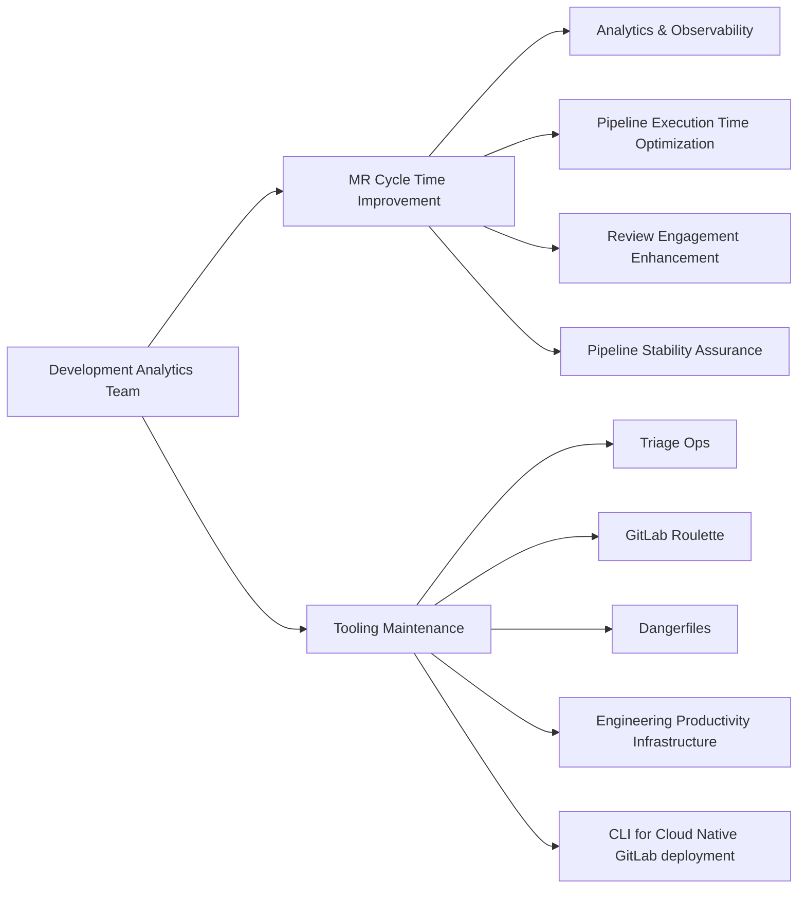

## Common Links

| **Category**            | **Handle**                                                                                                                 |
|-------------------------|----------------------------------------------------------------------------------------------------------------------------|
| **GitLab Group Handle** | [`@gl-dx/development-analytics`](https://gitlab.com/gl-dx/development-analytics)                                           |
| **Slack Channel**       | [`#g_development_analytics`](https://gitlab.enterprise.slack.com/archives/C064M4D2V37)                                     |
| **Slack Handle**        | `@dx-development-analytics`                                                                                                |
| **Team Boards**         | [`Team Issues Board`](https://gitlab.com/groups/gitlab-org/-/boards/8966549?label_name%5B%5D=group::development%20analytics), [`Team Epics Board`](https://gitlab.com/groups/gitlab-org/-/epic_boards/2068920?label_name[]=group%3A%3Adevelopment%20analytics), [`Support Requests`](https://gitlab.com/groups/gitlab-org/-/boards/9098093?label_name%5B%5D=development-analytics::support-request)                                           |
| **Issue Tracker**       | [`tracker`](https://gitlab.com/groups/gitlab-org/quality/dx/analytics/-/issues)                                            |
| **Team Repositories** | [development-analytics](https://gitlab.com/gitlab-org/quality/analytics)                                                   |

## Mission

Our mission is to enhance developer efficiency by delivering actionable insights, optimizing pipeline performance, and building scalable productivity tools that measurably improve the software development lifecycle.

## Vision

We envision a future where GitLab’s development workflows are seamless, insightful, and empowered by data. The Development Analytics team will:

- Establish GitLab as the industry benchmark for measurable developer productivity
- Improve cycle time to industry-leading standards through tooling and practices
- Create intuitive, powerful analytics dashboards that drive informed development decisions
- Deploy AI-powered systems that optimize pipeline performance and resource utilization

## Team members



## Core Responsibilities

## Roadmap

As part of our commitment to aligning with GitLab's company goals, our team conducts a thorough review of company-level Roadmap and [Objectives and Key Results (OKRs)](/handbook/company/okrs/) at the beginning of each quarter. This process ensures that our efforts are strategically focused on delivering high-impact results that contribute to the broader organizational objectives. View the [Development Analytics Roadmap for FY26](https://gitlab.com/groups/gitlab-org/-/epics/16026) for detailed insights and upcoming priorities

## Dashboards

### Pipeline Duration Analytics

- [Pipeline Duration Analytics](https://app.snowflake.com/ys68254/gitlab/#/dx-pipeline-durations-d4NWA2TAT)
- [Job Execution Analytics](https://app.snowflake.com/ys68254/gitlab/#/dx-job-durations-dPkG7M61u)
- [Pipeline Tier Analysis](https://app.snowflake.com/ys68254/gitlab/#/dx-pipeline-tiers-dS2zNDPHP)
- [Long-Running Test Analysis](https://app.snowflake.com/ys68254/gitlab/#/dx-weekly-long-running-qa-jobs-d8JKf0WUW)

### Pipeline Stability Analytics

- [Main Branch Incident Analytics](https://app.snowflake.com/ys68254/gitlab/#/dx-master-broken-incident-overview-dVcWBjizf)
- [E2E Test Analytics](https://dashboards.quality.gitlab.net/)

*Note: Access to these dashboards requires appropriate permissions. Contact team leads for access requests.*

## How we work

### Philosophy

- We prioritize asynchronous communication and a handbook-first approach, in line with GitLab's all-remote, timezone-distributed structure.
- We emphasize the [Maker's Schedule](https://www.paulgraham.com/makersschedule.html), focusing on productive, uninterrupted work.
- Most critical recurring meetings are scheduled on Tuesdays and Thursdays.
- We dedicate 3–4 hours weekly for focused learning and innovation. This protected time enables the team to explore emerging technologies, conduct proof-of-concepts, and stay current with industry trends. Meeting requests during these blocks require advance notice.
- All meeting agendas can be found in the [Team Shared Drive](https://drive.google.com/drive/folders/1uZg0J5hYsOUu3WMNR-PoAcmrhhmDxxoA?usp=drive_link) as well as in the meeting invite.

### Meetings/Events

| Event                        | Cadence                                     | Agenda                                                                                                                                                          |
|------------------------------|---------------------------------------------|-----------------------------------------------------------------------------------------------------------------------------------------------------------------|
| End-of-Week progress update  | Once a week (Wednesday)                     | Summarize status, progress, ETA, and areas needing support in the weekly update in issues and Epics. We leverage [epic-issue-summaries bot](https://gitlab.com/gitlab-com/gl-infra/epic-issue-summaries) for automated status checks |
| Team meeting                 | Twice a month on Tuesday 4:00 pm UTC        | [Agenda](https://docs.google.com/document/d/1gtghZCYeg42cMbQ8mWnjBcsu4maMO4OFA0xcQ8MfRHE/edit?usp=sharing)                                                      |
| Monthly Social Time          | Monthly on last Thursday 4:00 pm UTC        | No agenda, fun gathering. Choose one of the slots based on your timezone alignment. Read [Virtual team building](/handbook/finance/expenses/#team-building)     |
| Quarterly Business Report    | Quarterly                                   | Contribute to [team's success, learnings, innovations and improvement opportunities for each business quarter](https://gitlab.com/groups/gitlab-org/quality/quality-engineering/-/epics/61) |
| 1:1 with Engineering Manager | Weekly                                      | Discuss development goals (see the [1:1 guidelines](/handbook/leadership/1-1/))                                                                                |
| Team member's coffee chats   | Once/twice a month                          | Optional meetings for team members to regularly connect                                                                                                        |

### Yearly Roadmap Planning

- Each financial year, we create a roadmap to ensure visibility and alignment.
- We conduct an intensive month-long exercise (usually in Q4) to gather input from stakeholders.
- DRIs take the lead drafting the roadmap using the [roadmap prep-work template](https://gitlab.com/gitlab-org/quality/analytics/work-log/-/blob/main/templates/roadmap-pre-work-template.md?ref_type=heads)).
- Once the roadmap is approved, during our bi‑weekly team meetings, we review progress, address blockers, and gather feedback on the planned roadmap work.

### Iterations

Once the yearly roadmap is defined, we structure our work using [GitLab Iterations](https://docs.gitlab.com/ee/user/group/iterations/) within a twice-a-month iteration model. This approach ensures consistent progress tracking, clear priorities, and iterative improvements. Here are our [current iteration board](https://gitlab.com/groups/gitlab-org/-/boards/9114071?label_name%5B%5D=group::development%20analytics&iteration_id=Current) and [previous iterations](https://gitlab.com/groups/gitlab-org/-/boards/9114585?label_name%5B%5D=group::development%20analytics) for reference. As a team, we make sure:

1. Each issue is assigned to a [Development Analytics Iteration](https://gitlab.com/groups/gitlab-org/-/cadences/).
2. Issues that are not worked on within the iteration automatically roll over to the next iteration.
3. In every twice-a-month team meeting, we review the iteration boards and track velocity using burndown charts.

### Internal Rotation & Support Requests

#### Internal Rotation

We use [an internal rotation](https://gitlab.com/gitlab-org/quality/analytics/internal-rotation#process) for support requests and other team maintenance tasks. This frees up time for other Engineers in the team to work on planned work.

#### Support Requests

- If one finds a bug, needs assistance, or identifies an improvement opportunity then raise support requests using the `~"group::Development Analytics"` and `~"development-analytics::support-request"` labels. If the issue is urgent, escalate to the designated Slack channel - [`#g_development_analytics`](https://gitlab.enterprise.slack.com/archives/C064M4D2V37).
- If a request first comes through Slack, either the requester or a `group::Development Analytics` member should open an issue with the correct labels to ensure proper tracking and triage.
- The team reviews the [support request board](https://gitlab.com/groups/gitlab-org/-/boards/9098093?label_name%5B%5D=development-analytics%3A%3Asupport-request) and prioritizes accordingly. Generally, the team reserves ~20% of weekly time for support tasks, though this may vary based on current priorities.

### Tools/Repository Maintenance

- Team does not automatically watch every new issue created in each group-owned repository—use the group labels or escalate in Slack to ensure visibility.
- We highly promote self-served Merge Requests. If one already identified a fix or improvement, we request opening an MR for faster turnaround. The `~group::development analytics` maintainers will review and merge as appropriate.
- Feature work and bug fixes follow the team’s current priorities.
- Find the version management rituals for `~group::development analytics` owned repositories:

| Repository                             | Release Process                                                                                 |
|----------------------------------------|-------------------------------------------------------------------------------------------------|
| **gitlab-roulette**                    | Version updates are not scheduled on a set cadence. A release can be cut whenever a version-update MR is submitted. |
| **gitlab-dangerfiles**                 | Same as above—no regular cadence; release triggered by a version-update MR.                     |
| **triage-ops**                         | A new release is initiated after merging a new commit into `master`.                            |
| **engineering-productivity-infrastructure** | Dependency update MRs are generated by Renovate bot.                                            |

### Automated Label Migration

For details on label migration, see the [Handbook entry for creating label migration triage policy with GitLab Duo Workflow](https://handbook/engineering/infrastructure-platforms/developer-experience/development-analytics/create-triage-policy-with-gitlab-duo-workflow-guide).
