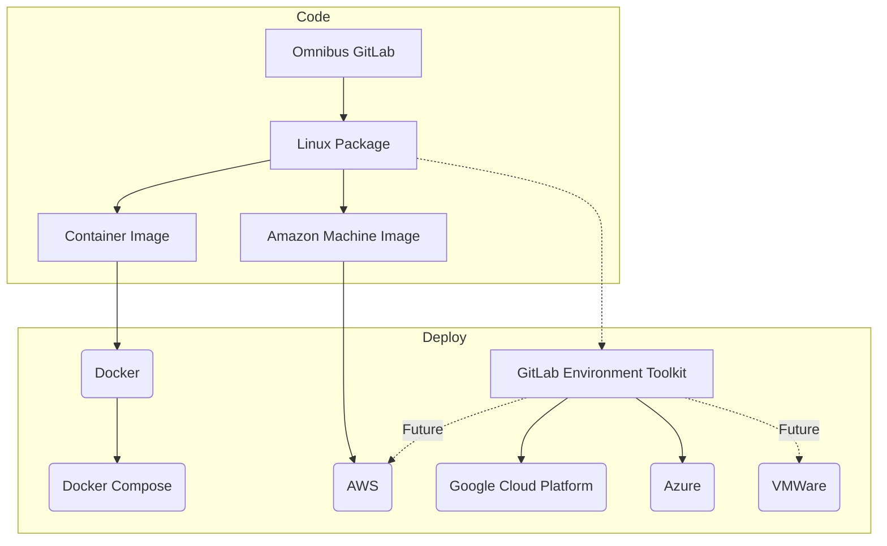
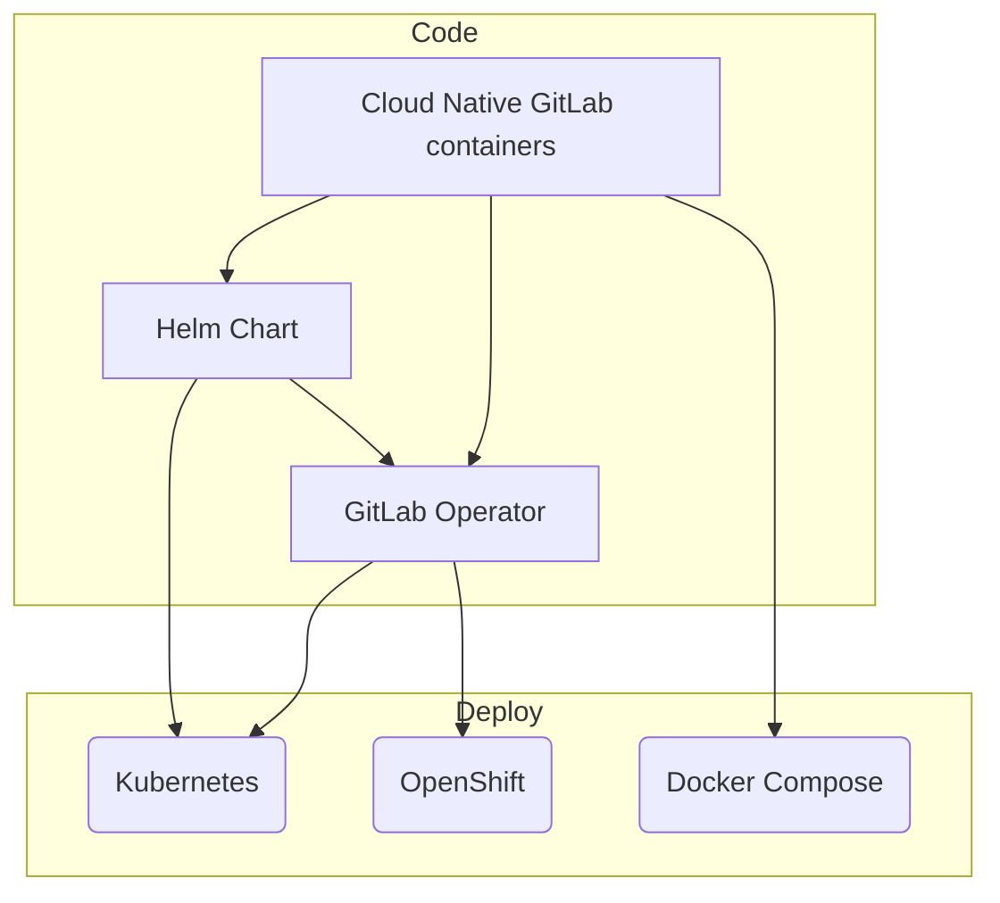

## Overview

The Build team focuses on artifacts our customers use to deploy GitLab. This includes system packages, container images, and packages on cloud provider marketplaces. Build team members serve as the bridge between development teams and the end users. Build engineers provide tools and expertise that enable efficient component builds and deliver a simple, secure, and dependable installation experience.

The Build team also reviews a large number of externally authored merge requests. Bundled components such as PostgreSQL, Consul, and Patroni require regular dependency and security updates. Community members may also request changes to compile flags that enable specific optimizations.

## Our Customers

### Internal Customers - Development Teams

We partner with GitLab's development teams to:

- Integrate their components into cohesive installation packages
- Provide reliable build tools and automation
- Ensure secure dependency management and vulnerability mitigation
- Streamline the path from code to packaged software

### External Customers - GitLab Users

We deliver exceptional installation experiences with:

- Reliable and well-tested installation methods across supported platforms
- Secure and up-to-date packages, containers, and cloud provider marketplace images
- Clear documentation and upgrade paths
- Compatibility across diverse customer environments

## Mission

The Build Team ensures GitLab components are seamlessly integrated, securely packaged, and reliably delivered to our customers. We serve as the bridge between development teams and end users, providing tooling and expertise that enables efficient component building while delivering installation experiences that are simple, secure, and dependable.

## Vision

Our vision and direction aligns with the [direction of the broader Delivery Group](https://about.gitlab.com/direction/gitlab_delivery/).

### For Internal Customers (Development Teams)

- Every development team has access to reliable, efficient build tools that accelerate their workflow
- Component integration is automated, secure, and requires minimal manual intervention
- Security vulnerabilities are proactively identified and mitigated across all dependencies
- Build processes are consistent, well-documented, and self-service where possible

### For External Customers (GitLab Users)

- GitLab installs effortlessly across all supported platforms and architectures
- Ship production-ready and thoroughly tested packages.
- Customer deployments upgrade reliably with minimal intervention
- Security patches release rapidly and transparently

### Technology Vision

- GitLab has an official installation method on all supported platforms and architectures
- GitLab offers official one click installation method on all supported cloud platforms
- GitLab is able to automatically upgrade itself safely and reliably
- GitLab runs equally well on both high and low resource systems (such as Raspberry Pi)
- GitLab.com is running using the official installation methods
- Any GitLab installation is able to report installation/upgrade errors automatically
- Setting up GitLab in HA configuration is automated and simple
- All installation methods are automatically tested before release

### Team Vision

- Each team member can work on all team projects in addition to their domain expertise
- Each team member strives to identify candidates that strengthen the team and raise the quality of our work.
- Team creates and improves documentation to facilitate knowledge transfer and enable self-service
- Based on GitLab's [leadership principles](/handbook/leadership/#managers-of-one), our team is able to reach a conclusion independently all the time, consensus most of the time
- Team members are [supported in pursuing certifications](/handbook/people-group/learning-and-development/growth-and-development/#professional-developmentcertificationscourses) for frequently used technologies and platforms, fostering continuous professional development
- On-boarding and off-boarding is efficient
- Clear career development paths

## Quick Start Guide

### For Development Teams

- **Need a new dependency?** Create a [Deliverables Request](https://gitlab.com/gitlab-org/distribution/team-tasks/-/issues/new?issuable_template=Architectural-Deliverables-Request)
- **Packaging question?** Ping `@gitlab-build` in your issue
- **Security concern?** Follow our [vulnerability management process](/handbook/security/product-security/application-security/vulnerability-management/)
- **General guidance?** Review our [workflow documentation](workflow.html)

**Important:** Reach out to the Build team **early** if your change requires:

- New or updated gems with native extensions
- New or updated external software dependencies
- If you need to do `install`, `update`, `make`, `mkdir`, `mv`, `cp`, `chown`,
`chmod`, or do compilation in any part of GitLab stack

If a change is reported late in the release cycle or not reported at all, your feature/change might not be shipped within the release.

### For New Team Members

- Complete your [team onboarding issue](https://gitlab.com/gitlab-org/distribution/team-tasks) using the `Team-onboarding` template
- Review our [workflow documentation](workflow.html)
- Set up access to build infrastructure as outlined in your onboarding issue

### For Customers and Community

- **Installation Issues:** [Community Forum](https://forum.gitlab.com)
- **Bug Reports:** [GitLab Issues](https://gitlab.com/gitlab-org/omnibus-gitlab/-/issues) with `group::build` label
- **Installation Documentation:** [Install](https://about.gitlab.com/install/), [Update](https://about.gitlab.com/update/), and [Upgrade](https://about.gitlab.com/upgrade/) pages
- **Contributing:** See our [Community Code of Conduct](https://about.gitlab.com/community/contribute/code-of-conduct/) and contribution guidelines

## Communication Channels

- **Urgent Issues:** Slack `#g_distribution` channel
- **Feature Requests:** [Deliverables Request](https://gitlab.com/gitlab-org/distribution/team-tasks/-/issues/new?issuable_template=Architectural-Deliverables-Request) issue
- **General Questions:** Ping `@gitlab-build` in relevant issues
- **Merge Request Reviews:** Use our [merge request workflow](merge_requests.html#workflow) for Build team projects

### For Support Requests

For complex issues that may require expertise from multiple teams or when it's unclear which team should handle a customer request, use GitLab's unified Request for Help (RFH) process. This process ensures we have a single source of truth and enables better cross-functional collaboration, as many requests actually require expertise from multiple areas of the product.

To open an RFH, refer to the procedures in our [how to get help](/handbook/support/workflows/how-to-get-help.md) handbook page. This process allows us to track time involved and ensure that the right parties are involved at the correct time.

## Responsibilities

### Internal Customer Support

- **Build Tooling & Infrastructure:** Develop and maintain tools that enable efficient component building
- **Integration Services:** Ensure development team components integrate seamlessly into GitLab packages
- **Security Partnership:** Collaborate with Security teams to identify and mitigate vulnerabilities
- **Dependency Management:** Maintain up-to-date, secure dependencies across all components
- **Documentation & Self-Service:** Create guides enabling development teams to work independently

### External Customer Delivery

- **Multi-Platform Packages:** Build and maintain packages for all supported Linux distributions and architectures
- **Container Images:** Develop and maintain official GitLab container images
- **Cloud Marketplace:** Manage listings and integrations with major cloud providers
- **Installation Experience:** Maintain install, update, and upgrade documentation and processes
- **Quality Assurance:** Ensure all installation methods are thoroughly tested before release
- **License Management:** Ensure compliance across all bundled dependencies
- **Partner Certifications:** Submit to partners for validations and certifications

## Team members

The following people are members of the GitLab:Build Team:



## Primary Projects

[omnibus-gitlab](https://gitlab.com/gitlab-org/omnibus-gitlab) - This project creates platform-specific, self-contained GitLab packages and images for self-managed consumption in cloud environments and on-premises hosting.

[Cloud Native GitLab](https://gitlab.com/gitlab-org/build/CNG) provides cloud native containers to deploy GitLab. These containers may be deployed and managed with Helm using [GitLab Charts](https://gitlab.com/gitlab-org/charts/gitlab) or [GitLab Operator](https://gitlab.com/gitlab-org/cloud-native/gitlab-operator) on Kubernetes, OpenShift, and Kubernetes compatible container platforms.

### Omnibus GitLab project's product outputs

### Cloud Native GitLab project's product outputs

## All Projects

| Name | Location | Description |
| -------- | -------- | -------- |
| Omnibus GitLab | [gitlab-org/omnibus-gitlab](https://gitlab.com/gitlab-org/omnibus-gitlab) | Build Omnibus packages with HA support for LTS versions of all supported Linux operating systems such as Ubuntu, Debian, CentOS/RHEL, OpenSUSE, SLES |
| Docker All in one GitLab image | [gitlab-org/omnibus-gitlab/docker](https://gitlab.com/gitlab-org/omnibus-gitlab/tree/master/docker) | Build Docker images for GitLab CE/EE based on the omnibus-gitlab package |
| Cloud Native GitLab Containers | [gitlab-org/build/CNG](https://gitlab.com/gitlab-org/build/CNG) | Individual images used by GitLab Helm Charts |
| AWS images | [AWS marketplace](https://aws.amazon.com/marketplace/pp/B071RFCJZK?qid=1493819387811&sr=0-1&ref_=srh_res_product_title) | AWS image based on the omnibus-gitlab package |
| Omnibus GitLab Builder | [GitLab Omnibus Builder](https://gitlab.com/gitlab-org/gitlab-omnibus-builder) | Create environment containing build dependencies for the omnibus-gitlab package |
| Licenses of bundled dependencies | [Licenses page on GL Pages](https://gitlab-org.gitlab.io/omnibus-gitlab/licenses.html)  | Webpage listing the bundled dependencies in each package along with their license. |

## Working with the community

The install and upgrade process is one of the first features that systems administrators experience when working with GitLab.
As a result, the projects managed by the Build team have a high level of engagement by the user-base. The GitLab
community is made up of more than just code contributors; users logging issues and feature requests are constantly pushing
us forward and helping create a better experience.

We strive for the following in our public projects:

1. Uphold our [Community Code of Conduct](https://about.gitlab.com/community/contribute/code-of-conduct/).
1. Enable [GitLab's mission that everyone can contribute.](/handbook/company/mission/#mission).
1. Show our work in [public](#public-by-default).
1. [Recognize and thank](/handbook/marketing/developer-relations/contributor-success/community-contributors-workflows/#recognition-for-contributors) contributors for their work.
1. Respect contributors donated time by providing [a timely review turnaround time](/handbook/engineering/workflow/code-review/#review-turnaround-time).

### Working with Open Source communities

The [open core of GitLab](/handbook/company/stewardship) is built on top of thousands of open source
dependencies. These dependencies and their communities are important to the [GitLab strategy](/handbook/company/strategy/#flywheel-with-two-turbos),
and working with these dependencies is an essential part of the projects the Build team maintains.

We strive to:

1. Consider the impact of our work on the open source communities that we benefit from.
1. Promote the importance of these open source communities within GitLab.
1. Raise issue with any decision that goes against our [stewardship promises](/handbook/company/stewardship/#promises).
1. Find opportunities to [contribute back the changes we make](/handbook/engineering/open-source/#using-forks-in-your-code).

## Public by default

All work carried out by the Build team is public. Some exceptions apply:

- Work has possible security implications - If during the course of work security concerns are no longer valid, it is expected for this work to become public.
- Work is done with a third party - Only when a third party requests that the work is not public.
- Work has financial implications - Unless financial details can be omitted from the work.
- Work has legal implications - Unless legal details can be omitted from the work.

Some of the team work is carried out on our development server at `dev.gitlab.org`.
[Infrastructure overview document](https://docs.gitlab.com/omnibus/release/#infrastructure) lists the reasons.

Unless your work is related to the security, all other work is carried out in projects on `GitLab.com`.
If you need to submit a sensitive issue, please use confidential issues.

If you are unsure whether something needs to remain private, check with the team's Engineering Manager.

## Onboarding and offboarding

In addition to general company on-boarding and off-boarding, the Build team
has its own process to get new team members up to speed more quickly.

If you are starting with your onboarding, open an issue in [Build team issue tracker](https://gitlab.com/gitlab-org/distribution/team-tasks), select `Team-onboarding` template and assign the issue to yourself.

Going through the steps noted in the issue should be your top priority, higher
than the general company on-boarding issue. This is because items in team on-boarding are specific to your role and it will allow you to get up-to-speed quicker.

Off-boarding should be carried out by the Engineering Manager of the team,
using the appropriate issue template in the same issue tracker.

## Infrastructure and maintenance

As part of the team responsibilities, the team owns the maintenance of infrastructure used for day to day work.
For list of nodes and description of the maintenance tasks, see the
[infrastructure and maintenance](maintenance/) page.

## Team workflows

General [engineering workflow](/handbook/engineering/workflow/) applies
to the Build team. Since we are working across multiple projects, our team workflow
is further explained and summarized on the [Build workflow page](workflow.html).

### Further reading

The following important areas of the GitLab Handbook impact how we work and are worth reading.

- [General engineering workflow page](/handbook/engineering/workflow/)
- [How to reinforce our values](/handbook/values/#how-do-we-reinforce-our-values)
- [Continue to serve smaller users](https://internal.gitlab.com/handbook/leadership/mitigating-concerns/#serve-smaller-users) (internal only)
- [Promises to our Open Source community](/handbook/company/stewardship/#promises)
- [How to follow our Product Principles](/handbook/product/product-principles/#how-we-follow-our-principles)
- [Principles of our company strategy](/handbook/company/strategy/#principles)
- [Effective & Responsible Communication Guidelines](/handbook/communication/#effective--responsible-communication-guidelines)
- [Test Platform in Distribution group](/handbook/engineering/testing/distribution/)

## Work/life harmony

Working [all-remote](/handbook/company/culture/all-remote/) and [asynchronous first](/handbook/company/culture/all-remote/asynchronous/)
offer flexibility in how team members approach their workday. Team members must make choices on how best to balance work time with other areas of life.

For new team members, the following resources provide examples on how to focus their time:

- [How team members approach their day](https://gitlab.com/gitlab-org/distribution/team-tasks/-/issues/907)
- Blog post: [A day in life of a remote worker](https://about.gitlab.com/blog/2019/06/18/day-in-the-life-remote-worker/)
- The option of a [non-linear workday](/handbook/company/culture/all-remote/non-linear-workday/)
- GitLab handbook: [Work/life Harmony](/handbook/company/culture/all-remote/people/#worklife-harmony)

The following GitLab Handbook areas are key in maintaining a healthy work/life balance.

- [Family and Friends First, work second](/handbook/values/#family-and-friends-first-work-second)
- [Combating burnout, isolation, and anxiety in the remote workplace](/handbook/company/culture/all-remote/mental-health/)
- [Recognizing Burnout](/handbook/people-group/paid-time-off/#recognizing-burnout)
