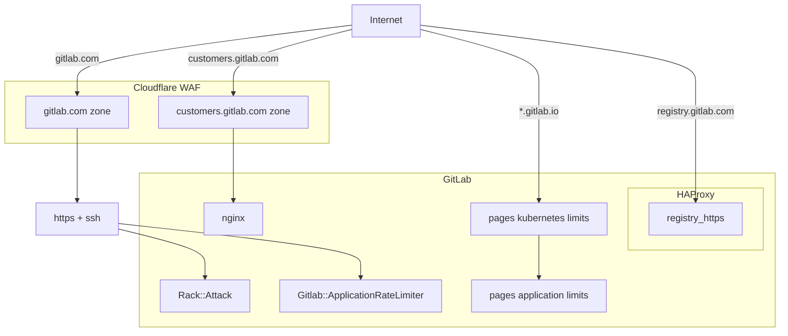
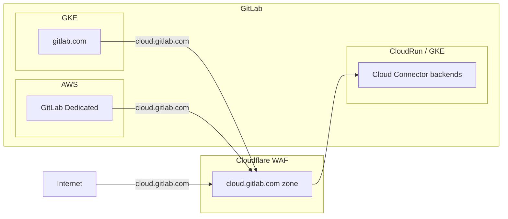

## Overview

Rate limiting is a critical feature in GitLab that enhances security and performance by restricting the number of requests users or IP addresses can make within a set timeframe. GitLab's approach to rate limiting helps prevent abuse, ensures fair resource allocation, and maintains system stability, effectively safeguarding against potential attacks and ensuring a reliable user experience.

Rate limited requests will return a `429 - Too Many Requests` response.

## Processes

- Changes to rate limits require a [Change Request](change-management.md/#change-request-workflows).
- Request assistance for a user's rate limiting settings with [this issue template](https://gitlab.com/gitlab-com/gl-infra/production-engineering/-/issues/new?issuable_template=request-rate-limiting).
- For internal teams seeking a bypass, please refer to the [Rate Limit Bypass Policy](/handbook/engineering/infrastructure/rate-limiting/bypass-policy/).

## GitLab Rate Limit Architecture

### GitLab.com

### Cloud Connector

Rate limits exist in multiple layers for GitLab.com, each boxed area above represents a place where rate limits are implemented.

### Limits

To minimise duplication, please see the following sources to determine the current active rate limits:

<table>
<tr>
<th>
Cloudflare
</th>
<td>

- GitLab.com:
  - [Cloudflare Dashboard](https://dash.cloudflare.com/852e9d53d0f8adbd9205389356f2303d/gitlab.com/security/waf/rate-limiting-rules)
  - [Base Cloudflare Rules Terraform](https://gitlab.com/gitlab-com/gl-infra/terraform-modules/cloudflare/cloudflare-waf-rules) shared with Dedicated.
  - [GitLab.com Cloudflare Rules Terraform](https://ops.gitlab.net/gitlab-com/gl-infra/config-mgmt/-/blob/main/environments/gprd/cloudflare-custom-rules.tf)
- Cloud Connector:
  - [Cloudflare Dashboard](https://dash.cloudflare.com/852e9d53d0f8adbd9205389356f2303d/cloud.gitlab.com/security/waf/rate-limiting-rules)
  - [Runbook + TF links](https://gitlab.com/gitlab-com/runbooks/-/blob/master/docs/cloud_connector/README.md#rate-limiting)

</td>
</tr>

<tr>
<th>
Application
</th>
<td>

- [Application Settings](https://gitlab.com/admin/application_settings/network) (admin access only)
  - See `User and IP Rate Limits` and `Protected Paths`
- [GitLab.com Docs](https://docs.gitlab.com/user/gitlab_com/#rate-limits-on-gitlabcom) (published manually)

</td>
</tr>

</table>

### Bypasses

[Published rate limits](https://docs.gitlab.com/user/gitlab_com/#rate-limits-on-gitlabcom) apply to all customers and users with no exceptions.

Customers or internal teams seeking a bypass should refer to the [Rate Limit Bypass Policy](/handbook/engineering/infrastructure/rate-limiting/bypass-policy/).

## Traffic management Rate Limits

### Cloudflare

Cloudflare serves as our "outer-most" layer of protection, sitting at the network edge on inbound traffic. We use Cloudflare's standard DDoS (Distributed Denial of Service) protection plus [Spectrum](https://www.cloudflare.com/en-us/application-services/products/cloudflare-spectrum/) to protect git over ssh.

How rate limits are applied in Cloudflare:

<table>
<tr>
<th>
Gitlab.com Page Rules
</th>
<td>

- Configured by Terraform in [config-mgmt](https://ops.gitlab.net/gitlab-com/gl-infra/config-mgmt/-/blob/main/environments/gprd/cloudflare-pagerules.tf).
- URL pattern matching.
- Control Cloudflare's DDoS interventions and caching (e.g. bypasses, security levels etc).
- No rate limits configured by default, but they can be enabled when under an attack

</td>
</tr>
<tr>

<th>
Gitlab.com Rate Limiting
</th>
<td>

- Configured by Terraform in `config-mgmt` with [base limits shared with Dedicated](https://gitlab.com/gitlab-com/gl-infra/terraform-modules/cloudflare/cloudflare-waf-rules/-/blob/main/cloudflare-rate-limits.tf) and [GitLab.com specific ones](https://ops.gitlab.net/gitlab-com/gl-infra/config-mgmt/-/blob/main/environments/gprd/cloudflare-custom-rules.tf) rules.
- Covers a wide range of cases:
  - Global limits per `IP`
  - Global limits per `session` (cookies) or `tokens` (headers) can be used as rate counters to avoid IP scope false positives, e.g. many users behind a single IP, VPN.
- Endpoint-specific limits.
- Independent of application rate limits.

</td>
</tr>

<th>
Cloud Connector Rate Limiting
</th>
<td>

- Configured by Terraform (see [runbook links](https://gitlab.com/gitlab-com/runbooks/-/blob/master/docs/cloud_connector/README.md#cloudflare)).
- Throttles requests from both end-user clients such as IDEs as well as GitLab Rails instances (GL.com, SM and Dedicated.)
- Limits are counted against any GitLab user's anonymous global user ID, regardless of where the request originates from.
- Primarily used to throttle consumption of non-horizontally scalable resources such as AI vendor limits.
- Can be configured for each Cloud Connector backend individually.

</td>
</tr>

</table>

**Note:** Cloudflare is _not_ application aware and does not know how to map to our users and groups.

Cloudflare is also responsible for applying the `X-GitLab-Rate-Limit-Bypass` header to a subset of requests from:

- Legacy customer IP rate limit bypasses
- Third party vendors with whom we have integrations
- Internal infrastructure

For a full list of conditions where the header will be applied, see [this configuration](https://ops.gitlab.net/gitlab-com/gl-infra/config-mgmt/-/blob/main/environments/gprd/cloudflare-transform-rules.tf).

Our [Cloudflare runbook](https://gitlab.com/gitlab-com/runbooks/-/blob/master/docs/cloudflare/) contains more detail on configuring this layer of our infrastructure.

Changes to Cloudflare rate limits require a [Change Request](change-management.md/#change-request-workflows), and should
be discussed with the [Production Engineering::Foundations](https://gitlab.com/gitlab-com/gl-infra/production-engineering/-/issues/new?issuable_template=request-rate-limiting) SRE team before implementing.

### HAProxy

The majority of GitLab's traffic management rate limits have been moved out of HAProxy and into Cloudflare (see this [confidential issue](https://gitlab.com/gitlab-com/gl-infra/production-engineering/-/issues/24699) for more details).

However, HAProxy is still responsible for Registry rate limits, as that component is not fronted by Cloudflare. See [Registry](#registry) for more details.

Currently HAProxy also handles applying the `X-GitLab-Rate-Limit-Bypass` for a limited number of special paths. The list can be found [here](https://gitlab.com/gitlab-cookbooks/gitlab-haproxy/-/blob/master/templates/default/frontends/https.erb?ref_type=heads#L40-43), but there is [work underway](https://gitlab.com/gitlab-com/gl-infra/production-engineering/-/issues/26205) to move this logic out into Cloudflare as well.

## Application Rate Limits

There are multiple application rate limiting mechanisms in place that can often be referred to interchangeably. These allow for more informed traffic management compared to that implemented by Cloudflare as the application has access to user information:

- [Rack Attack](https://gitlab.com/gitlab-org/gitlab/blob/master/lib/gitlab/rack_attack.rb)
- [Application Rate Limiter](https://gitlab.com/gitlab-org/gitlab/-/blob/master/lib/gitlab/application_rate_limiter.rb)
- [Plan Limits](https://gitlab.com/gitlab-org/gitlab/-/blob/master/app/helpers/plan_limits_helper.rb)

Please see [Application Limits Development](https://docs.gitlab.com/ee/development/application_limits.html) to contribute application limits to GitLab.

### Overview

The rate limit period is 1 minute (60 seconds).

<table>
<tr>
<th>

Category

</th>
<th>

Identifier

</th>
</tr>

<tr>
<th>

Unauthenticated

</th>
<td>

IP address

</td>
</tr>

<tr>
<th>

Authenticated

</th>
<td>

User information (user, project, etc)

</td>
</tr>

<tr>
<th>

Protected Paths

</th>
<td>

Configurable list of paths e.g. `/user/sign_in`

</td>
</tr>

</table>

### RackAttack

GitLab utilises [RackAttack](https://docs.gitlab.com/ee/development/application_limits.html#implement-rate-limits-using-rackattack) as middleware to throttle Rack requests. These can be configured by extending `Gitlab::RackAttack` and `Gitlab::RackAttack::Request`.

For more information about configuring rate limits for a GitLab instance, see the [User and IP rate limits](https://docs.gitlab.com/ee/administration/settings/user_and_ip_rate_limits.html) doc.

You can read more information about [rate limits specific to GitLab.com](https://docs.gitlab.com/user/gitlab_com/#rate-limits-on-gitlabcom), alongside RackAttack configuration documentation in [runbooks](https://gitlab.com/gitlab-com/runbooks/-/tree/master/docs/rate-limiting#application-rackattack).

### ApplicationRateLimiter

The GitLab application has simple rate limit logic that can be used to throttle certain actions which is used when we need more
flexibility than what Rack Attack can provide, since it can throttle at the controller or API level. These rate limits are configured in [application_rate_limiter.rb](https://gitlab.com/gitlab-org/gitlab/-/blob/master/lib/gitlab/application_rate_limiter.rb). The scope is up to the individual limit implementation and can be any ActiveRecord object or combination of multiple. It is commonly per-user or per-project (or both), but it can be anything, e.g. the RawController limits by project and path.

There is no way to bypass these rate limits (e.g. for select users/groups/projects); when the rate limit is reached a plain response with a 429 status code is issued without rate limiting headers.

Instructions for configuring these rate limits can be found in the [GitLab docs](https://docs.gitlab.com/ee/development/application_limits.html#implement-rate-limits-using-gitlabapplicationratelimiter).

For more information about introducing new Rate Limits for GitLab, see the [Product Processes Handbook](product/product-processes/#introducing-application-limits) page.

## Other Rate Limits

### GitLab Pages

Because GitLab Pages is not behind CloudFlare and doesn't have CDN support, rate limits are set in several places:

1. Within the [Kubernetes settings](https://gitlab.com/gitlab-com/gl-infra/k8s-workloads/gitlab-com/-/blob/1c12c9ac84921893ac774e95e1087f144dd3b04a/releases/gitlab/values/values.yaml.gotmpl#L492) for GitLab.com.
2. In the [Go ratelimiter module](https://gitlab.com/gitlab-org/gitlab-pages/-/blob/master/internal/ratelimiter/ratelimiter.go?ref_type=heads) for Pages.

For more information, see the [Pages Rate Limit documentation](https://docs.gitlab.com/ee/administration/pages/index.html#rate-limits).

### Registry

Registry is not fronted by Cloudflare (see this [confidential issue](https://gitlab.com/gitlab-com/gl-infra/production-engineering/-/issues/16468) for full details around why). There is no application-level setting for it either (though there is an [open feature request](https://gitlab.com/gitlab-org/gitlab/-/issues/438690) to add that), so the only place where there is rate limiting in place for Registry is [in HAProxy](https://gitlab.com/gitlab-cookbooks/gitlab-haproxy/-/blob/master/templates/default/frontends/registry_https.erb).

There are no rate limit exceptions available for Registry.

## Headers

The list of semi-standard rate limiting response headers can be found [here](https://docs.gitlab.com/ee/administration/settings/user_and_ip_rate_limits.html#response-headers).

- `Cloudflare` does not return rate limit response headers on any request.
- `RackAttack` returns rate limit response headers on throttled requests only.
- `ApplicationRateLimiter` does not return rate limit response headers.
- `GraphQL` endpoints currently do not return rate limit response headers.

See [this issue](https://gitlab.com/gitlab-com/gl-infra/production-engineering/-/issues/25372) for improvements to returning rate limiting response headers.

## Client-Side Best Practices

To minimize the risk of hitting rate limits, you can try the following:

1. Implement Retry Logic
    - Configure [exponential back off and retry](https://docs.aws.amazon.com/prescriptive-guidance/latest/cloud-design-patterns/retry-backoff.html) for failed attempts.
    - Respect the `429` response status and `Retry-After` headers.
    - Implement circuit breakers for persistent failures.
1. Stagger Automated Pipelines
    - Reduce the volume of requests being made at any one time.
1. Request Batching
    - Combine multiple operations into single requests where possible.
    - Implement client-side queue management.
1. Implement Caching
    - Cache responses where possible to reduce request frequency.
    - Implement conditional requests, utlizing `If-Modified-Since` for example.
1. Monitor for Rate Limited Responses
    - Log and alert on unexpected increases in rate limited requests.
    - Track rate limit responses and headers where applicable.

## Troubleshooting

Please see [Rate Limiting Troubleshooting](/handbook/engineering/infrastructure/rate-limiting/troubleshooting/).

## Important Links

- [docs: GitLab.com](https://docs.gitlab.com/user/gitlab_com/#rate-limits-on-gitlabcom)
- [docs: Self Managed (and Dedicated)](https://docs.gitlab.com/ee/security/rate_limits.html)
- [runbook: GitLab.com rate limiting](https://gitlab.com/gitlab-com/runbooks/-/tree/master/docs/rate-limiting)
- [handbook: Identifying the cause of IP Blocks on GitLab.com](/handbook/support/workflows/ip-blocks/)
