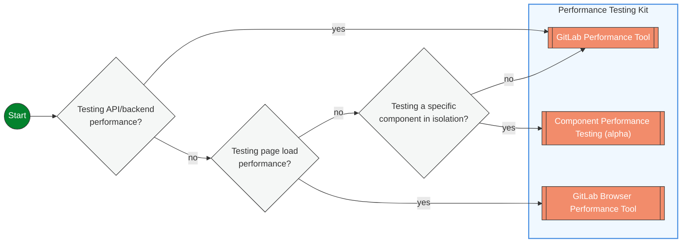

## Overview

Performance Testing is a broad discipline that includes various approaches to evaluate a system's performance characteristics. Load Testing, while often considered synonymous with Performance Testing is one of many approaches to Performance Testing. There are other approaches that enable testing performance throughout the development lifecycle, from early development to production monitoring.

Use the decision tree below to find the right performance testing approach for your needs.



### Testing API or Backend Performance

Use [GitLab Performance Tool](https://gitlab.com/gitlab-org/quality/performance) when you want to test how your APIs, database queries, or backend services perform under load. This includes testing response times, throughput, and system behavior under various load conditions.

**When to use:**

- Testing REST API endpoints
- Validating database query performance
- Load testing backend services
- Reference architecture validation

### Testing Components in Isolation

Use [Component Performance Testing Tool](https://gitlab.com/gitlab-org/quality/component-performance-testing) to run automated load tests on individual services or components at the Merge Request level, providing early feedback on performance changes before they reach production. It does this by running tests against internal API endpoints rather than end-user API endpoints.

**When to use:**

- Testing containerized services that can be deployed independently (like Gitaly, AI Gateway, Registry)
- Detecting performance regressions in MRs before merge
- Validating that component changes don't introduce throughput bottlenecks
- Getting fast feedback on API response times and resource utilization
- Testing component-specific caching strategies and configuration changes

**What it tests:**

- Component throughput and response times
- Resource utilization (CPU, memory, network I/O)
- Error handling performance
- Configuration-related performance impacts

**What it doesn't test:**

- Integration bottlenecks between components
- Production-scale data volume issues
- End-to-end system performance

> **⚠️ Alpha Status:** Component Performance Testing is currently in alpha trials. If you want to use it, please reach out in Slack to [#g_performance_enablement](https://gitlab.slack.com/channels/g_performance_enablement).

**Prerequisites for adoption:**

- Component must be containerized and deployable in isolation
- Must expose testable interfaces (HTTP APIs, gRPC, etc.)
- Should support testing with mocked dependencies

### Testing Page Load Performance

Use [GitLab Browser Performance Tool](https://gitlab.com/gitlab-org/quality/performance-sitespeed) to measure how fast your pages load for users, including metrics like Time to First Byte, Largest Contentful Paint, and other Core Web Vitals.

**When to use:**

- Testing frontend performance
- Measuring page load times
- Validating user experience metrics
- Browser-based performance testing

## Future improvements

These tools have not been implemented and will complement the Performance Testing Kit and enhance our ability to detect performance problems early.

```mermaid
flowchart LR
  START((Start))
  UNIT[[Performance checks in Unit Tests]]
  PROFILE[[Profiling tools]]
  OBSERVE_TEST[[Observability based Performance Testing]]

  SPECS{Testing with\nnew unit tests?}
  BUILT{Testing during\ndevelopment?}
  OBSERVABILITY{Analyzing live\nperformance data?}

  START --> BUILT
  BUILT -- no --> OBSERVABILITY
  BUILT -- yes --> SPECS
  SPECS -- yes --> UNIT
  SPECS -- no --> PROFILE


  OBSERVABILITY -- yes --> OBSERVE_TEST


  %% Class definition
  classDef decision fill:#f5f7f6,stroke:#333,stroke-width:1px,rx:5px;
  classDef tool fill:#F28C6B,stroke:#333,stroke-width:1px,color:white,rx:5px;
  classDef start fill:#03822d,stroke:#333,stroke-width:1px,color:white,rx:10px;

  class BUILT,SPECS,OBSERVABILITY decision;
  class PROFILE,UNIT,OBSERVE_TEST tool;
  class START start;

  %% Tool tooltips with links
  click PROFILE "#profiling-tools"
  click OBSERVE_TEST "https://handbook.gitlab.com/handbook/engineering/testing/observability_performance/"
  click UNIT "#performance-unit-testing" "Add performance assertions and benchmarks directly within your unit test suite for fast feedback"

  %% Decision node tooltips
  click OBSERVABILITY "Analyzing-live-performance-data"
  click BUILT "Testing-during-development"
  click SPECS "Testing-with-new-unit-tests"
 ```

### Testing with new unit tests

Add performance assertions directly to your unit tests to catch performance regressions early in development. This provides fast feedback on code changes without requiring separate performance test suites.

**When to use:**

- Writing new unit tests and want to include performance validation
- Adding performance checks to existing test coverage
- Ensuring critical methods maintain acceptable performance thresholds
- Catching performance regressions during code review

**Example approaches:**

- Execution time assertions (method completes under X milliseconds)
- Memory allocation limits (method allocates fewer than Y objects)
- Database query count validation

### Testing during development

Use lightweight profiling tools while actively developing to understand performance characteristics of your code before it reaches production.

**When to use:**

- Optimizing algorithm performance during development
- Understanding memory usage patterns in new features
- Identifying performance bottlenecks in work-in-progress code
- Getting quick feedback on code changes without full test suites

**Example tools:**

- Code profilers for CPU and memory analysis
- Database query analyzers
- Benchmarking utilities for comparing implementations

### Analyzing live performance data

Leverage existing monitoring and observability data to identify performance issues and validate improvements using real production metrics.

**When to use:**

- Investigating performance issues reported by users
- Validating that performance improvements are effective in production
- Understanding real-world performance patterns
- Correlating code changes with production performance metrics

**Example approaches:**

- Dashboard analysis of key performance indicators
- Log-based performance trend analysis
- Correlation of deployment events with performance changes

### Performance Unit Testing

Performance unit testing allows developers to evaluate and enforce the performance characteristics of their code at the unit level. This approach provides fast feedback on performance during development, helping catch performance regressions early in the development lifecycle.

#### Using rspec-benchmark

We have [rspec-benchmark](https://github.com/piotrmurach/rspec-benchmark) included in our Gemfile. It is a gem that provides RSpec matchers for performance testing. It offers various matchers to assert on different performance aspects such as execution time, iterations per second, allocation counts, and memory usage.

<details>

<summary>Example Test Case</summary>

Here's a complete example of using rspec-benchmark to test the performance of a method:

```ruby
require 'spec_helper'

RSpec.describe UserFinder do
  describe '#find_active' do
    it 'performs query under 50ms' do
      users = create_list(:user, 100, status: :active)

      expect {
        UserFinder.new.find_active
      }.to perform_under(50).ms
    end

    it 'allocates less than 20 objects' do
      users = create_list(:user, 100, status: :active)

      expect {
        UserFinder.new.find_active
      }.to perform_allocation(count: 1..20)
    end

    it 'scales linearly with number of users' do
      expect do |n, i|
        users = create_list(:user, n, status: :active)
        UserFinder.new.find_active
      end.to perform_linear.in_range(10..100).sample(5)
    end
  end
end
```

</details>

### Profiling Tools

We already use profiling tools (i.e. rubocop) in our pipelines to ensure that we meet coding guidelines and avoid common problematic patterns. Several performance focused ones that are in our codebase:

1. [ruby-prof](https://ruby-prof.github.io/): A comprehensive profiling solution that supports both flat and graph profiles. ruby-prof can measure CPU time, memory allocation, and object creation.
2. [stackprof](https://github.com/tmm1/stackprof): A sampling call-stack profiler. It's designed to be a faster and more memory-efficient alternative to ruby-prof for certain use cases.
3. [memory_profiler](https://github.com/SamSaffron/memory_profiler): A memory profiler that provides detailed information about memory usage, including object allocation and retention. [documentation](https://gitlab.com/gitlab-org/gitlab/-/blob/master/doc/development/performance.md?ref_type=heads#using-memory-profiler) in our performance guidelines.
4. [rbspy](https://rbspy.github.io): A sampling profiler for Ruby, [documentation](https://gitlab.com/gitlab-org/gitlab/-/blob/master/doc/administration/sidekiq/sidekiq_troubleshooting.md?ref_type=heads#ruby-profiling-with-rbspy) in our sidekiq troubleshooting docs
5. [derailed_benchmarks](https://github.com/zombocom/derailed_benchmarks): A set of benchmarks that measure various aspects of Rails application performance, including memory usage and load time. [documentation](https://gitlab.com/gitlab-org/gitlab/-/blob/master/doc/development/performance.md?ref_type=heads#derailed-benchmarks) in our performance guidelines.
6. [benchmark-ips](https://github.com/evanphx/benchmark-ips): benchmarks a blocks iterations/second
7. [rspec_profiling](https://github.com/foraker/rspec_profiling): collects data on spec execution times, [documentation](https://gitlab.com/gitlab-org/gitlab/-/blob/master/doc/development/performance.md?ref_type=heads#rspec-profiling) from our performance guidelines.

Some approaches to using these tools are detailed on the [profiling page](https://gitlab.com/gitlab-org/gitlab/-/blob/master/doc/development/profiling.md?ref_type=heads)

## References

### External References

| Page | Description |
| ---- | ----------- |
| [Netflix performance testing](https://netflixtechblog.com/fixing-performance-regressions-before-they-happen-eab2602b86fe) | Blog post about performance testing at Netflix |
| [Automation Pyramid Model for Performance Testing Process](https://abstracta.us/blog/test-automation/performance-testing-automation-pyramid-model-process/) | Blog post looking into the test pyramid for performance testing |
| [Continuous Performance Testing: A Comprehensive Guide](https://abstracta.us/blog/performance-testing/continuous-performance-testing-a-comprehensive-guide/) | Blog post on Continuous Performance Testing |
| [3 Challenges to Effective Performance Testing in Continuous Integration](https://abstracta.us/blog/performance-testing/3-challenges-effective-performance-testing-continuous-integration/) | Blog post on challenges implementing performance testing in CI |
| [When is the Best Time to Start Performance Testing?](https://abstracta.us/blog/performance-testing/best-time-start-performance-testing/) | Blog post on when to do performance testing |

### Internal References

#### Projects

| Project | Description |
| ---- | ----------- |
| [GPT](https://gitlab.com/gitlab-org/quality/performance) | The GitLab Performance Tool (GPT) provides load testing for GitLab instances |
| [GBPT](https://gitlab.com/gitlab-org/quality/performance-sitespeed) | SiteSpeed CI pipelines for browser performance testing |
| [CPT (Alpha)](https://gitlab.com/gitlab-org/quality/component-performance-testing) | Component-level performance testing for individual services (currently in alpha trials) |
| [sitespeed-measurement-setup](https://gitlab.com/gitlab-org/frontend/sitespeed-measurement-setup) | Setup to measure performance on GitLab websites through sitespeed.io |

#### Documentation pages

| Page | Description |
| ---- | ----------- |
| [Performance Strategy & Measurement](/handbook/engineering/performance.md) | GitLab's overall performance strategy, targets, and measurement approach |
| [Profiling page](https://gitlab.com/gitlab-org/gitlab/-/blob/master/doc/development/profiling.md) | Documentation on profiling approaches for GitLab |
| [Observability for stage groups](https://docs.gitlab.com/ee/development/stage_group_observability/index.html) | Documentation on Observability focused at Stage Groups |
| [Performance Bar](https://docs.gitlab.com/ee/administration/monitoring/performance/performance_bar.html) | Performance Bar for analyzing performance in running GitLab instances |
| [Dev Performance Guidelines](https://docs.gitlab.com/ee/development/performance.html) | Developer-focused Performance Guidelines |
| [Merge Request Performance Guidelines](https://docs.gitlab.com/ee/development/merge_request_concepts/performance.html) | Performance guidelines specific to Merge Requests |
| [Platform Triage Dashboard](https://dashboards.gitlab.net/d/general-triage/general3a-platform-triage) | Starting point dashboard for investigating performance issues |
