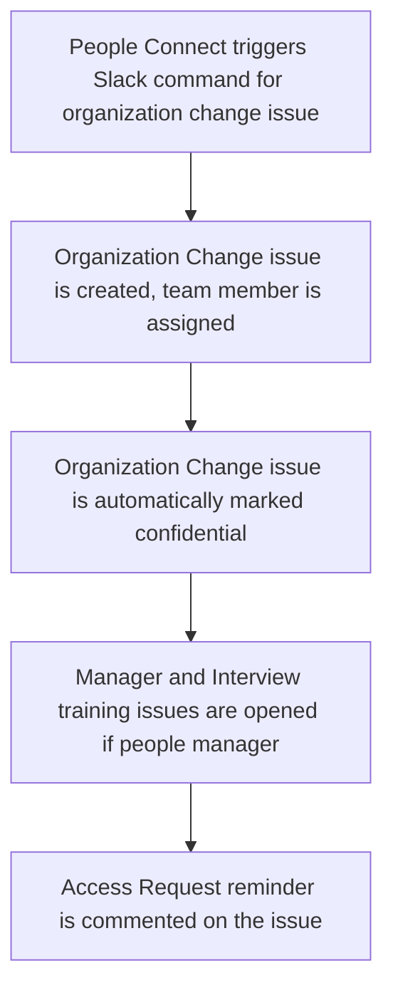

The People Group Engineering team aims to reduce as much manual work as possible. One of the areas we have done this, is everything related to the employment automation flow.

## Organization Change

Note: this section only discusses items in the offboarding where People Engineering was involved. You can read more about promotions and transfers at GitLab on [this handbook page](/handbook/people-group/promotions-transfers/)

## Timeline Flow



## Organization Change Checklist issue creation

Once a People Connect Team member runs the organization checklist command through Slack, this triggers a pipeline in the `employment` project, which will run the job `transition`, and reply with a link to the newly createdorganization change issue.

The issue will be automatically assigned to the following people:

- People Connect Team member who ran the command
- the team member
- the previous manager of the team member
- the new manager of the team member
- the People Business Partner for the team member's department or division

This issue is then added to the [team member's epic](/handbook/people-group/engineering/employment-issues#epics).

## Make confidential

Sometimes, issues are created by humans instead of a bot, in this case they can forget to mark the issue as confidential. We run a daily pipeline to mark issues as confidential in the `training` project. This includes manager and interview training issues as the `employment` project is internal to GitLab team members anyway.

## Manager and Interview training issues

This is the same as the manager an interview training issues we create for onboarding. Except that for onboarding we only create it after day 7 and fororganization change we create it at the same time as theorganization change issue.

Read [here](/handbook/people-group/engineering/onboarding#manager-and-interview-training-issues)

## Baseline Entitlements / Access Request

Once per day we run a job to open any baseline entitlment access requests for the team members new role. This is handled by the `dailyorganizationchecklists` job in the employment automation project. This job can also be ran utilize `/pops` to run adhoc.

## Access request reminders

A job is scheduled to run once per day to look for organizaton change issues that have been opened for 5 days. If the team member for whom a organization change issue was opened has not been mentioned in any access requests since theirorganization change issue was opened, an note is created on theorganization change issue to remind the participants to create the necessary access requests.

## Template Placeholders

Organization Change templates can make use of the following placeholders to be replaced with different tags of content. See the table below.

| Placeholder | Description |
| --- | --- |
| `__NAME__` | Team members display name |
| `__TEAM_MEMBER_HANDLE__` | Team members GitLab username |
| `__MANAGER_HANDLE__` | New manager GitLab username |
| `__MANAGER_NAME__` |  New manager display name |
| `__PREVIOUS_MANAGER_HANDLE__` | Previous manger GitLab username |
| `__PEOPLE_EXPERIENCE_HANDLE__` | People Connect Specialist GitLab username |
| `__NEW_ROLE_NAME__` | Job title of the new role. |
| `__PREVIOUS_ROLE_NAME__` | Job title of the previous role. |
| `__TRANSITION_DATE__` | The date of the transition into the new role. Format: YYYY-MM-DD |

<details><summary>Example how to use</summary>

```mrkdwn
### This is my template for `__NEW_ROLE_NAME__`

#### `__MANAGER_HANDLE__` To Do
- [ ] 123
- [ ] abc

#### `__PREVIOUS_MANAGER_HANDLE__` To Do

- [ ] 123
- [ ] abc
```

</details>
