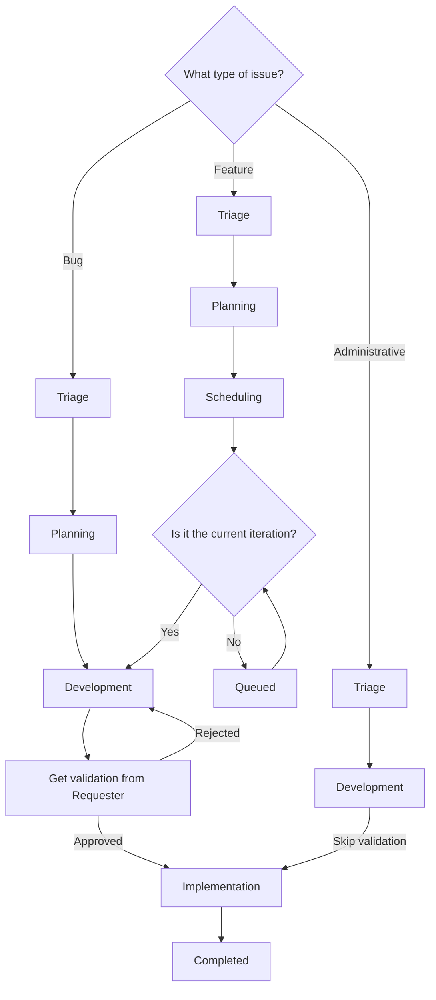

{}

This does not apply for `Incident` type issues. Please see our [incident workflow](../incidents) for more information on those.

{}

## Working Issues

Following _Scheduling_, issues will scheduled into iterations and assigned out. So long as you're the assignee, you're the DRI for:

- Making progress through the stages
- Coordinating with others when you're blocked or unsure of what to do next
- Making weekly updates to issues assigned to you

### Weekly updates

Every week, on your last work day (for example, Friday) review your assigned issues and:

- post a brief update
- update the health status of the issue.
- update the stage, if appropriate. For example, if the issue is "Blocked" make sure that's the current stage.

For convenience, there is a [Customer Support Ops Team group comment template](https://gitlab.com/groups/gitlab-com/gl-security/corp/cust-support-ops/-/comment_templates) called "Issue Status Update" that has all of the components.

Generally, your comment should outline:

- The current progress you've made: include tasks completed, what you're working on, or even the % of the work you've completed.
- Your plan going forward: what next steps you'll take (and when), and when you estimate to finish.
- If there is any support you need, for example if you are blocked and need something from another team.

These will are reviewed each week and used to generate the required [weekly slack updates for teams in Security](/handbook/security/#division-department-and-team-updates).

## Stages

The work to be done on an issue largely depends on the _stage_ the issue is in. Please note the _assignee_ on an issue will change _frequently_ as it moves from stage to stage.

A standard progression for an issue, will look like this:

### Triage

- Stage DRI: Dylan
- Purpose:
  - to determine non-technical validity/feasibility of request
  - to determine if more information is needed before it can move to next stage
  - to determine if needed approvals are present
  - to add labels indicating customer type, system impacted, priority, if it is a roadmap item
- Required artifacts:
  - Labels
  - Approval (if required)

Here the DRI will gather the needed information from the request (if required) and determine if we can move forward on the issue. The DRI should also determine if all needed approvals are present. The general logic used is:

- If the request aligns with something on the support roadmap and seems congruent with the intention, then no approval required
- If the request aligns with something on the support roadmap but is not congruent with the intention, then the DRI needs to ask for one of the following:
  - The support roadmap be updated
  - Support leadership approval be documented on the request
- If the request does not align with something on the support roadmap, then the DRI needs to ask for an appropriate level of approval from support leadership based on:
  - the amount of work
  - any danger to planned work
  - effect on customer or support workflows

If any labels are missing from the issue, the DRI should add them at this time.

If we cannot proceed, the DRI will state why on the issue via a comment and close the issue.

If every is good to go, the DRI will move the stage to `Planning`.

### Planning

{}

This stage is skipped if it is a `Administrative` type issue

{}

- Stage DRI: Jason
- Purpose:
  - to determine technical validity/feasibility of request
  - to determine if more information is needed before it can move to next stage
  - to generate a gameplan
- Required artifacts:
  - Gameplan
  - RICE score

Here, the DRI will write up a gameplan for the issue (and post it on the issue as a comment). If any labels are missing from the issue, the DRI should add them at this time.

A gameplan should include the following information:

- RICE score
- notes giving the `Development` DRI of the request enough informationto get started
- rough breakdown of timelines
- rough breakdown of steps needed to complete
- any other useful information

If we cannot proceed, the DRI will work with the requester to remedy the blockers from proceeding.

If everything is good to go, the DRI will move the stage to `Scheduling`.

### Scheduling

{}

This stage is skipped if it is a `Bug` or `Administrative` type issue

{}

- Stage DRI: Lyle, Dylan, and Jason
- Purpose:
  - to determine bandwidth validity/feasibility of request
  - to determine iteration(s) and milestone(s) it will be worked in
  - to determine who will work the request in subsequent stages
- Required artifacts:
  - Iteration and milestone this will start work in
  - Who will work the request in subsequent stages

Here the DRIs will discuss development timelines for the changes. This is done on a weekly cadence.

Once determined, an iteration and milestone will be added to the issue stating the deployment period.

If the iteration set is the _current_ iteration, then the DRIs will move the request to the `Development` stage (assigning it to the `Development` DRI). Otherwise, the request will be moved to the `Queued` stage (to wait for its iteration to occur).

## Queued

- Stage DRI: Lyle, Dylan, and Jason
- Purpose:
  - Indicate the request is ready to be worked but is waiting on its iteration to begin
- Required artifacts: None

Issues will sit here until their iteration has begun. Once the iteration has begun, the DRIs should assign the request to the `Development` DRI for the issue and change its stage to `Development`.

### Development

- Stage DRI: Assigned during `Scheduling` or `Queued` stage
- Purpose:
  - to implement into staging/sandbox and perform testing
  - to ready staging/sandbox environments for validation
  - to provide notes on what was done
  - to get validation from the requester
- Required artifacts:
  - information on changes made in staging/sandbox environments
  - validation

It is here you will work on implementing the changes into the correct place for testing. This is normally the sandbox. As you perform changes, please indicate what was changed (and where) as comments on the issue (ideally in one thread).

Once you have gotten everything setup and done your testing, you will need to have it all validated by the requester of the issue. See [Validation](#validation) for more information.

#### Validation

{}

Validation is not done for `Administrative` type issues. Instead, use the label `Validation::Skipped` to indicate validation was not needed.

{}

Here, the requester of the issue validates the changes we have made will resolve their request. This is traditonally done in a sandbox environment.

To begin this, add the label `Validation::Requested` on the issue. From there, you need to ping the requester of the issue to ask them to validate the changes in the sandbox/testing environment. Make sure to include any information they might need, such as a link to the credentials to use or specific steps they need to use in their validaiton process.

If the issue requester states it has problems, add the label `Validation::Rejected` to the issue. You will then work on rectifying the problems. Once you are ready to re-validate, restart the process from the beginning.

If the issue requester validates the changes, add the label `Validation::Received` to the issue, then change the stage to `Implementation`.

## Implementation

- Stage DRI: Assigned during `Scheduling` or `Queued` stage
- Purpose:
  - generate a technical blueprint
  - implement changes into production environments
  - confirming on what goes live at what dates (if applicable)
- Required artifacts:
  - Technical blueprint
  - Implementation of changes into production environments

Here you will generate a technical blueprint and implement the changes into production.

A technical blueprint should go over, in detail, everything that was changed. Anyone looking at the blueprint should be able to _perfectly_ reproduce what you did. This means linking to all created MRs, detailing any non-MR changes made, etc.

The actual implementation is usally done via MRs, but can vary from change to change.

Once all implementation tasks are completed (for items using deployments, merging the MR is sufficient), change the stage to `Completed`.

### Completed

- Stage DRI: Assigned during `Scheduling` or `Queued` stage
- Purpose: State everything is done
- Required artifacts: N/A

This indicates the work is done. An issue is moved to this stage by us when all changes are made in production (or queued up for the next deployment).

The only work left to be done in this stage is to close the issue

### Blocked

- Stage DRI: The person who moved it to this stage
- Purpose:
  - to indicate an issue is blocked in some way
  - to indicate what is blocking the issue
  - to indicate the stage where it became blocked
- Required artifacts:
  - information indicating at what stage it was previously before being blocked
  - information indicating what is blocking it
  - weekly checkins on the status of the block

This is a special stage that is used when something has blocked all movement on an issue. This could be related to missing approvals, waiting on a tool to be procurred, etc.

In this stage, your task is to check on what is blocking it to determine if it is ready to be unblocked.

If it is ready to be unblocked, move it back to the last stage it was in prior to being moved to the `Blocked` Stage.

### Backlogged

- Stage DRI: The person who moved it to this stage
- Purpose:
  - to indicate an issue is backlogged
- Required artifacts:
  - information indicating at what stage it was previously before being backlogged

This is a special stage that is used when an issue is backlogged. This normally means that while there is a desire to work it, it is to be handled in the far future (beyond the next 10 iterations) or at an unknown future date.

If it is ready to be unbacklogged, move it back to the last stage it was in prior to being moved to the `Backlogged` Stage.
