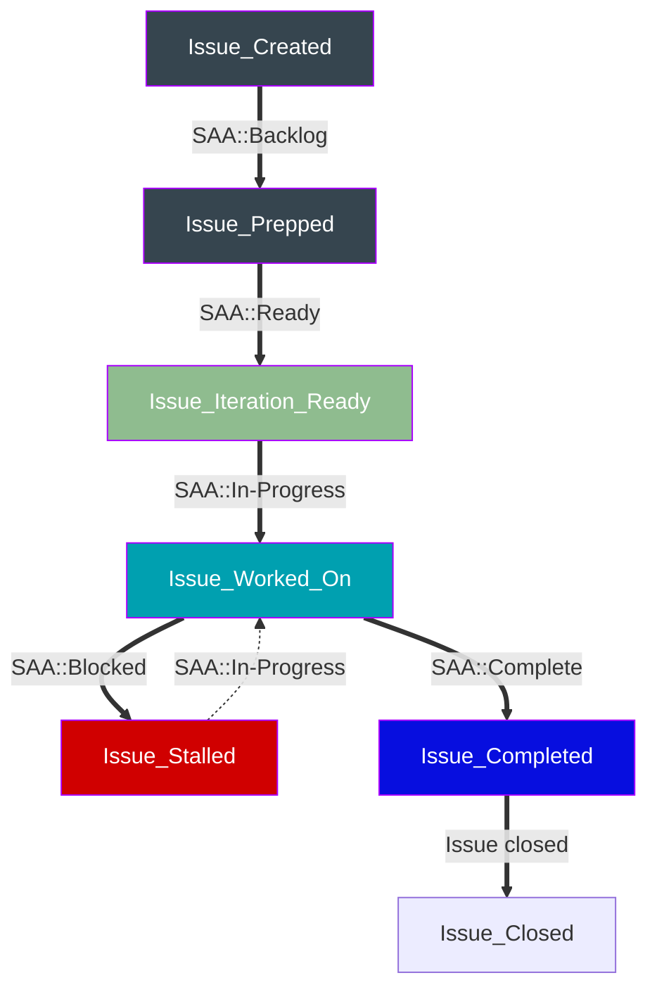

## A team supporting Security Assurance's growth

The Security Assurance program is expanding constantly, be it in breadth, headcount, complexity and scope. The Assurance department is composed of numerous teams with different processes, data sets and objectives. Having a single team focused on creating efficiencies through software allows the Department to scale faster and support the growth and impact of individual programs.

We provide to the Security Assurance department an ability to automate processes through developing scripts, building solutions and implementing fixes. Dedicated resources ensures custom solutions can be built and maintained in the future to provide continuous value-add.

## How does Security Assurance Automation team operate?

### Intake process

To work with the Security Assurance Automation team, please create an issue following your team's relevant link below:

| [Risk](https://gitlab.com/gitlab-com/gl-security/security-assurance/governance-and-field-security/governance/security-assurance-automation-subgroup/issue-landing/-/issues/new?issuable_template=risk_request)| [Compliance](https://gitlab.com/gitlab-com/gl-security/security-assurance/governance-and-field-security/governance/security-assurance-automation-subgroup/issue-landing/-/issues/new?issuable_template=compliance_request)| [Field Security](https://gitlab.com/gitlab-com/gl-security/security-assurance/governance-and-field-security/governance/security-assurance-automation-subgroup/issue-landing/-/issues/new?issuable_template=field_security_request)| [Governance](https://gitlab.com/gitlab-com/gl-security/security-assurance/governance-and-field-security/governance/security-assurance-automation-subgroup/issue-landing/-/issues/new?issuable_template=governance_request)| [Any other team](https://gitlab.com/gitlab-com/gl-security/security-assurance/governance-and-field-security/governance/security-assurance-automation-subgroup/issue-landing/-/issues/new?issuable_template=ad-hoc_request) |
|-|-|-|-|-|

Work related to the request will be performed within the dedicated issue. If an Epic is needed to track the work (maybe too big for an issue, which are often scoped to be completed within an iteration ie. 2 weeks), the issue will be promoted to an Epic, and the stakeholders will be able to track the work from there.

### Labels

GitLab has native features that allow team members to track their work, report on current status and view dashboard of velocity among other things.

The current limitation is that outside of GitLab, the way data is visible on our BI tool (Tableau) is through labels. Even if GitLab has native weight and stage features, using labels facilitate reporting.

These Tableau dashboards will showcase the work completed by the team, where the requests originated from and our velocity. More advanced metrics will also be created based on that data.

Labels also help organize our issue boards in a way that ensures all issues fit into a category so no valuable work from team members isn't tracked.

#### In every issue

`team::SAA` will be added on all issues handled by the Security Assurance Automation team.

#### Stages

Used to track current status of issues as part of the [project lifecycle](https://gitlab.com/groups/gitlab-com/gl-security/security-assurance/governance-and-field-security/governance/security-assurance-automation-subgroup/-/boards/7578600?iteration_id=Current). These labels also help track velocity in conjunction with Weight as they are the main inputs in our Tableau dashboard.

All `SAA::Ready` work should have a weight assigned to it as part of the triage/grooming process.

Don't forget to add the `SAA::Complete` once the work in done. Issues will be closed at the end of the iteration by closing all `SAA::Complete` issues still opened.

Any Issue that was added to an iteration after it started should have the `Unplanned` label added to it. It will help track unplanned work and how it impacts velocity and capacity.

| Label name | Meaning |
| --- | --- |
| `SAA::Backlog` | All new issues start with this label |
| `SAA::Ready` | Once groomed and reviewed, these issues can be picked up during an iteration |
| `SAA::In-Progress` | Issues are actively worked on |
| `SAA::Blocked` | Work has started but dependencies prevent further progress |
| `SAA::Complete` | All work has been completed |
| `Unplanned` | These issues weren't planned for the iteration but were picked up |

#### Type

We use Type labels to determine what the work is about. Categories are as distinctive as possible to allow team members to quickly understand the nature of the work being done.

These categories can be changed or expanded upon depending on work items, the goal always being of accurately capturing what the SAA team member is working on.

| Label name | Meaning |
| --- | --- |
| `SAA-Type::Planning` | Project Management activities |
| `SAA-Type::Documentation` | Writing, revamping, improving documentation |
| `SAA-Type::Maintenance` | Issues related to maintenance of current automations |
| `SAA-Type::Metrics` | Work related to dashboards, reporting and metrics |
| `SAA-Type::Testing` | QA, writing tests and reviewing code |
| `SAA-Type::API-Integration` | Integration between systems |
| `SAA-Type::Process-Automation` | Automating manual team processes |
| `SAA-Type::Control-Automation` | Specific automation of control testing |

#### Source

We use Source labels to determine where the work item came from. Any additional issues stemming from that external team will always have the same source, even if the first issue came directly from.

`SAA-Source::Assurance-Automation` is reserved for internal work where no direct external stakeholders/dependencies exist. This label can also be used once v1 of any work has been delivered already.

| Label name | Meaning |
| --- | --- |
| `SAA-Source::Risk` | Request from Risk |
| `SAA-Source::Governance` | Request from Governance |
| `SAA-Source::Compliance` | Request from Compliance |
| `SAA-Source::Field-Security` | Request from Field Security |
| `SAA-Source::Assurance-Automation` | Internal work |
| `SAA-Source::Ad-Hoc` | Request from teams not mentioned (leadership, etc.)|

### What does Security Assurance Automation own?

The Security Assurance Automation team is continuously engineering new automated solutions to manual processes. Below are a few projects that the team maintains.

#### Feedback Bot

[The Feedback Bot](https://gitlab.com/gitlab-com/gl-security/security-assurance/feedback-bot) - A bot that enables team members to send private feedback to other team members through Slack.

#### Escalation Engine

[The Escalation engine](https://gitlab.com/gitlab-com/gl-security/engineering-and-research/automation-team/escalator) - An engine that allows users to take automated actions on issues based on a predetermined set of criteria. The engine runs in a scheduled CI pipeline.

#### Dashboarding

[Tableau Dashboarding](https://10az.online.tableau.com/#/site/gitlab/views/DRAFTZenGRCObservations/ZenGRCObservationsDashboard) - Custom dashboards using our analytic tool that integrates with data sources across GitLab.

[Insight Dashboarding](https://docs.gitlab.com/ee/user/project/insights/index.html#configure-your-insights) - Custom issue analytic dashboards native to GitLab.

#### Compliance control monitoring and evidence gathering automation

Conversion of manual compliance control monitoring and evidence gathering processes to partially or fully automated processes. This will save time and reduce the opportunity for human error or oversight as our control framework expands.

[User Access Review Automations](https://gitlab.com/gitlab-com/gl-security/security-assurance/governance-and-field-security/governance/security-assurance-automation-subgroup/user-access-review-pipelines) - Automations around UAR evidence requests (non-direct sync) and automations around access request auto creation upon change request receipt.

[GitLab Project Testing and Populations](https://gitlab.com/gitlab-com/gl-security/security-assurance/governance-and-field-security/governance/security-assurance-automation-subgroup/gitlab-testing-and-populations) - Automations around GitLab.com for gathering evidence and performing automated tests.

## Software Development Lifecycle

### Planning

The planning stage occurs during 1:1s, bi-weekly sprint planning meetings, Slack conversations, epic/issue comments and other channels of communication. During this stage, we gather and record the following information in the corresponding issue or epic as appropriate:

- Who is requesting the automation project?
- What are they requesting?
- Why are they requesting this project?
  - What efficiencies will be gained?
  - How much time will be saved?
- When is this project expected to be completed by?
- How is the automation expected to function?
- What is the expected time savings? (If applicable)

As a result of the planning stage, we determine the feasibility of a particular project and attempt to draw out a rough roadmap to completion.

### Analysis

During the analysis stage, we continue to gather details to support accepted projects. Projects are broken down into individual components to support an agile approach to development. Those individual components are represented as child issues under the project Epic or associated tasks/issues for smaller bodies of work.

The agreed upon scale is one weight equals one business day. This means for each iteration, team members can't have assigned more than 10 points of work.

This allows us to track unplanned work and rolled over issues for effectively and account for opportunities to better split big chunks of work into smaller manageable issues.

This approach is flexible enough to ensure the team doesn't spend valuable engineering time gauging the relevant weight to assign an issue.

If work takes less than a full business day, weight of 1 will still be used for simplicity purposes.

| Weight | Level of Effort |
| -------- | ---------- |
| 1 | Basic - Simple, typically sub-issues that can be resolved with minimal effort and have straightforward solutions. They usually don't involve dependencies. |
| 2 | Intermediate - Issues of moderate complexity that might have a few dependencies (ARs, specialized knowledge, API connections) or require some coordination amongst team members. |
| 3 | Advanced - More complex issues that have many dependencies and require coordination across teams to complete. These issues will take more time to reach a solution. |
| 5 | Challenging - Larger issue with some complexity that require specialized knowledge or substantial problem-solving. They might involve architectural designs and decisions. These issues will typically be broken down into smaller sub-issues. |
| 8 | Complex - Larger, more complex, issues that will require architectural designs and decisions. These issues are intricate, involve complex APIs, or require extensive changes. These issues will be broken down into smaller sub-issues. |

### Design

During the design stage, we aim to accomplish the following:

- Produce a design for the minimum viable product (MVP) solution that will satisfy the automation project's requirements.
- Design components that are modular
- Design components that can be reused to accelerate future development projects

### Development and Testing

During the this stage, code is written to satisfy the requirements of a particular project. Development is accomplished in an iterative manner through many small changes. Project stakeholders may be consulted to ensure continued alignment with project expectations as code is being written.

Security Assurance Automation Engineers run tests on their code to identify bugs, vulnerabilities, and usability conflicts.

#### Coding Standards

When developing software, our high level objective is to follow [The Zen of Python](https://en.wikipedia.org/wiki/Zen_of_Python), which is a part of core Python and can be accessed by simply importing the `this` module. For example, at the CLI execute: `python -c "import this"`.

Based upon technical requirements, scope, and customer deadlines, our standards can be grouped into two categories: `Scripts` and `Modules`. From a high level, a `script` is a `.py` file which is intended to be executed directly while a `module` is a `.py` file (or set of files) which is published to a PyPi registry & imported into `scripts` to provide more in-depth functionality.

The general philosophy is to solve new requests via scripts, which live in the [scripts repository](https://gitlab.com/gitlab-com/gl-security/security-assurance/governance-and-field-security/governance/security-assurance-automation-subgroup/scripts) and once enough commonality is seen across multiple scripts, the functionality can be converted to a module, in an independent repository.

Templates for each of these will be found under the [SAA Project Templates](https://gitlab.com/gitlab-com/gl-security/security-assurance/governance-and-field-security/governance/security-assurance-automation-subgroup/project-templates) subgroup.

The `.gitlab-ci.yml` of module repositories will be used to test and package the code then publish it to GitLab's [PyPi Registry](https://docs.gitlab.com/ee/user/packages/pypi_repository/). Meanwhile, in the scripts repo, LINT and security scanning will be the focus. Finally, scheduled / periodic executions should be managed in projects created under the SAA [schedules](https://gitlab.com/gitlab-com/gl-security/security-assurance/governance-and-field-security/governance/security-assurance-automation-subgroup/schedules) subgroup.

Below is a list of libraries we use to assist with standardization:

  1) All Projects
     - GitLab REST API Connection: [python-gitlab](https://python-gitlab.readthedocs.io/en/stable/)
     - Logging: [loguru](https://loguru.readthedocs.io/en/stable/)
     - Test Framework: [pytest](https://docs.pytest.org/en/stable/)
     - Test Coverage: [coverage](https://coverage.readthedocs.io/en/coverage-5.3/)
        - Test Coverage (Badge): [coverage-badge](https://pypi.org/project/coverage-badge/)
     - LINT & Code Format: [ruff](https://docs.astral.sh/ruff/configuration/#pyprojecttoml-discovery)
     - [Pre-Commit Hooks](https://gitlab.com/groups/gitlab-com/gl-security/security-assurance/governance-and-field-security/governance/security-assurance-automation-subgroup/-/wikis/Pre-Commit-Hooks)
  2) Scripts
     - Dependency Management: [Pipenv](https://pipenv.pypa.io/en/latest/)
     - CLI: [argparse](https://docs.python.org/3/library/argparse.html)
  3) Modules
     - Dependency Management: [PDM](https://pdm-project.org/en/latest/)
        - [PDM](https://pdm-project.org/latest/) has been selected over [Poetry](https://python-poetry.org/) due to PDM's direct support of [PEP 621](https://peps.python.org/pep-0621/), [PEP631](https://peps.python.org/pep-0631/), and [PEP 517](https://peps.python.org/pep-0517/)
     - CLI: [click](https://click.palletsprojects.com/en/stable/)

As `Simple is better than complex.`, this standard definition will remain minimal.

### Implementation

During this stage, code is moved from the Sec Auto Dev pipeline into the Sec Auto Live pipeline. If an automation request requires web hosting or a server, the automation will live in the Sec Auto Live private GCP instance.

Once the code is ready for final review, a team member from Security Assurance will review the code and merge the branch. The project is moved to a "Done" state when the solution is operating in an automated private pipeline.

### Maintenance

Routine and break-fix maintenance of automated controls and processes is performed by Security Assurance Automation Engineers for automation related to the sub-department. Pro-active requests for maintenance can submitted through the [Security Assurance Automation project](https://gitlab.com/gitlab-com/gl-security/security-assurance/governance/security-assurance-automation/-/issues/new?issuable_template=new_automation_issue).

Maintenance tasks will be tracked via GitLab Issues similar to all other automation tasks.

## Maturity Model - (Non-control automation)

Maturity Model 1: At this stage, the primary objective is to establish the foundational aspects of automation functionality. The process involves a combination of both manual and automated steps. Data acquisition typically relies on manual pulling from sources, often utilizing .csv files. Basic scripts and tools are employed to execute tasks.

Maturity Model 2: In this phase, the emphasis is on advancing workflow automation by integrating more sophisticated components. Limited manual data extraction may persist, though the focus shifts towards leveraging enhanced scripting and tools. This stage is characterized by semi-automated processes that are not yet self-service and may require manual initiation.

Maturity Model 3: In this advanced stage, the primary objective is achieving a high level of automation while reducing reliance on manual data extraction. Integration with APIs is pivotal to eliminate manual intervention. The solution becomes self-service, with processes executed seamlessly within pipelines on scheduled intervals.

## Control Automation Maturity

Assessing control automation maturity in a `current state` and also a `potential state` can be helpful when considering where we'd like to move control tests and monitoring to state-wise and what the estimated benefit is from a strictly time-saving standpoint. To assess this, a general qualitative and quantitative definition can be used.

When considering `current` vs. `potential`, it's important to bear in mind that control processes and/or control-test processes may require adjustment to enable automation. For example, if a current process has high variability in how it operates with inconsistent workflows and record keeping, this may be something that we are able to account for when manually assessing the design and operation of the control. But, it's a barrier to automating testing into the later maturity stages and keeps manual oversight as a critical step in control monitoring (*on top of the obvious concern that a highly variable process is likely difficult to operate well and introduces significant risk of the control not operating as intended*).

### Control Automation Maturity Scale

| Level | Qualitative Definition                                                                                                                                                                                                                                                                             | Quantitative Definition         | Scalability Potential |
|-------|----------------------------------------------------------------------------------------------------------------------------------------------------------------------------------------------------------------------------------------------------------------------------------------------------|---------------------------------|-----------------------|
| 1     | The majority of the testing process is manual, including evidence collection.                                                                                                                                                                                                                       | <10% testing workload automated | Low                   |
| 2     | There is minor automation in place (e.g. most evidence is collected automatically or upon a simple self-service request).                                                                                                                                                                            | ~30% testing workload automated | Low                   |
| 3     | There is moderate automation in place (e.g evidence is collected and compiled almost entirely through scheduled or self-service automation. Testing decisions are entirely human generated.                                                                                                        | ~60% testing workload automated | Moderate              |
| 4     | The control is automated to the point of decisioning for some components of the control (e.g. evidence is collected and compiled for review automatically. Some of the testing with 100% confidence in compiled evidence is conducted automatically and remaining testing is performed by a human). | ~80% testing workload automated | High                  |
| 5     | The control is automated entirely up to the point of human review over minor areas (e.g. evidence is collected and compiled with testing results, very few records require manual review and compiled testing provides insight to the reviewer for their consideration).                          | ~90% testing workload automated | Excellent             |
| 6     | The control is automated to the furthest extent. Alerting is the primary form of notice of control effectiveness. Testing documentation is done in the form of outputted reports vs. compiled tests.                                                                                               | ~95% testing workload automated | Excellent             |

### How to use the scale?

The assessed levels are intended to be formed by input from members of Security Assurance Automation for technical input and feasibility assessment as well as members of Security Compliance for current state understanding and knowledge of where the compliance program is prioritizing in the future.

The scale can be applied across controls but more accurate and likely is that the scale is applied across system/control combinations since many controls are designed and operate differently depending on the environment.

#### Assessing Current Level

When assessing control automation maturity, the first step is to assess the current state of maturity. While there may be some level of subjectivity in this, the qualitative definitions should help inform the assessed current level. Generally, this level will not change unless there are significant control changes OR work is completed advancing the current level of control automation.

Once current level is assessed - add the scoped label `ControlAutomationCurrentLevel::Level-X` to the epic/issue.

#### Assessing Potential Level

Next, the potential should be assessed. There is, inevitably, subjectivity in this assessment. This is intended to be a realistic but ambitious assessment of where we think the control's testing/monitoring could be matured to. When determining a control's potential level, adding a brief justification will help support that rating decision. Something like the "final phase" of the control automation issue that is opened should already have this information as this is the end state we're working toward but if it does not already exist, please briefly justify the rating.

Potential ratings can and should change (hopefully for the better) through technology changes, process changes etc. Not every control will have a potential rating of 6 immediately, and that's OK. To reach the higher levels of maturity (4+), process changes from a control operator and assessor standpoint may need to adapt.

Once current level is assessed - add the scoped label `ControlAutomationPotentialLevel::Level-X` to the epic/issue.

 *Note: When assessing potential, try to be realistic but ambitious. If you're rating potential as a 6 because you think that if the entire platform a process is currently operated in were to change, the process could reach a level 6 but otherwise the potential level is a level 3, that may not be an appropriate rating. On the other hand, if you think a potential level is a 6 if the team that operates the control were to moderately adapt their processes, that may be an appropriate rating.*

## <i class="fas fa-id-card" style="color:rgb(110,73,203)" aria-hidden="true"></i> Contact the Team

[Donovan Felton](/handbook/company/team/#dfelton), @dfelton, Security Assurance Engineer, Automation

- [Automation design, development, and implementation](/handbook/security/security-assurance/governance/security-assurance-automation/)
- [GRC application administration](/handbook/security/security-assurance/#i-idbiz-tech-icons-classfar-fa-newspaperi-core-tools-and-systems)
