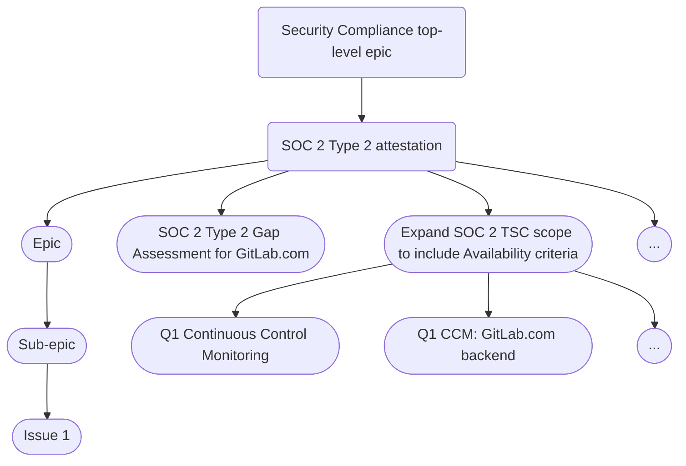

### Security Compliance Team Charter

Last Updated: 2025-03-20

## Mission Statement

The Security Compliance Team safeguards GitLab's position as the industry's most trusted DevSecOps platform through rigorous certification management and risks & controls monitoring. We protect our customers by turning compliance requirements into competitive advantages, using our own product to demonstrate security excellence.

## Value Proposition

Security Compliance maintains GitLab's position as the most trusted DevSecOps platform by providing assurance to our customers and enabling sales through certification maintenance and expansion.

## Core Competencies

1. [Security certifications and attestations](../security-compliance/certifications/)
   - Gap Analysis Program: feasibility analysis for certification expansion
   - External Audit coordination and execution

1. [Continuous Monitoring of GitLab's Security Controls](/handbook/security/security-assurance/security-compliance/sec-controls/) which are mapped to applicable regulatory requirements and security certifications/frameworks we have committed to.

- [Policy-as-code](policy-as-code.md)
- [Automated evidence collection and control testing](automated-control-testing.md)
- [User Access Reviews](access-reviews.md)
- [Risk-based control testing](risk-based-control-testing.md)
- [PCI Internal Control Review](pci-internal-control-review.md)
- [FedRAMP Continuous Monitoring](fedramp-compliance.md)

1. [Observation and Remediation Management](../observation-management-procedure.md)

- Identify control weaknesses and gaps (observations)
- Provide remediation recommendations and guidance
- Track remediation to completion

1. Industry and Regulatory Monitoring and Insights
   - Monitoring drafts and changes to relevant laws, executive orders, directives, regulations, policies, standards, and guidelines.
   - Collaborating on responses to relevant RFIs, RFQs, RFPs, and requests for public comment.
   - Monitoring changes to government contractual language that could impact public sector security and compliance posture.

1. Dogfooding
    - We use the GitLab product to perform our core competencies
    - We recommend GitLab feature solutions to remediate observations and reduce risk
    - We provide feedback to the product by exemplifying the [compliance persona](/handbook/product/personas/_index.md#cameron-compliance-manager).

## Operating Model

We use agile program management and project management best practices to organize our work with the goal of being as efficient as possible while continuously iterating towards our objectives. Security Compliance team members are encouraged to regularly bring up feedback on how we can improve the way we work and this is a standing topic in our weekly team meeting agenda.

### Core Processes

The single source of truth for all of in-progress work is the Security Compliance [team top-level epic](https://gitlab.com/groups/gitlab-com/gl-security/security-assurance/-/epics/289), which has detailed status updates, along with the [team epic board](https://gitlab.com/groups/gitlab-com/-/epic_boards/1063538?label_name[]=seccomp-roadmap) which we use to visualize workflow status and compare to our [roadmap](https://docs.google.com/presentation/d/1TEJzAkdoi_U-ubg7qhj1ZUpi2_VQYNF5DTOT5Mj1Mqo/edit?usp=sharing). All work that is directly associated with our roadmap should take place in these and issues should be opened in the [Security Compliance Team Issue Tracker project](https://gitlab.com/gitlab-com/gl-security/security-assurance/security-compliance/team). This is important for two reasons: It allows us to work efficiently by centralizing and organizing our work in a single place using a robust labeling scheme and it allows us to report on various operational metrics (performance indicators).

Much of our work related to the [FedRAMP Authorization Program](/handbook/security/security-assurance/security-compliance/fedramp-compliance/) is unfortunately not visible to the rest of GitLab due to regulatory mandates outside of our control. In order to bring as much transparency and visibility into our work, and to continue to track basic metrics, it is critical that we continue to use our epic board and issue tracker as much as possible, even if used to track high-level tasks with links to detailed issues within the authorization boundary.

### How We Work

<details><summary>How We Work</summary>

#### Epic hierarchy

The our team top-level epic is simply a SSOT for status updates for epic assignees / directly responsible individuals (DRIs). The immediate child epics get a `seccomp-roadmap` label to appear in our epic board and effectively constitute our roadmap.

1. Sub-epics group tasks required to deliver an item mentioned
1. Sub-epics represent an item from the roadmap and are delivered in a specific phase
1. Sub-epics can span multiple months, but their end date should match the 'anticipated completion date' of the roadmap phase they are added to.

The diagram below shows an example of traversing the complete hierarchy:



#### Epic assignee responsibilities

Each epic has a single DRI who is ultimately responsible for delivering the project. This does not mean they are doing all of the work, rather they are ensuring the work is progressing, blockers are quickly addressed or escalated if needed, and reporting on the status each week.

The DRI needs to:

1. Work with others to move issues through the boards, for example, moving from triage to in progress to complete
1. Ensure epic and any nested child epics and issues are using the appropriate labels
1. Ensure the epic meets criteria outlined in epic structure (next section)
1. Provide status updates on the epic each week including accomplishments, what's next, overall health status, and any blockers

#### Epic structure

Each immediate child epic under our top-level team epic must include the following (adjust quick actions as necessary):

```markdown
## Background

## Objective

## Exit criteria
- [ ]

/label ~"FY26-Q1" ~"seccomp-function::gap assessments"  ~"seccomp workflow::triage" ~"team::security compliance" ~"seccomp-roadmap"
/health_status on_track
/set_parent &289

-----------
<!--DO NOT EDIT BELOW THIS LINE-->

<!--STATUS NOTE START-->

<!--STATUS NOTE END-->
```

The bottom status note comments at the bottom are important as this is what is used to automatically post [status updates](#status-updates) to these epics and the team epic.

**Epic meta data to include**

1. **Assignee** is the DRI which should be populated whenever an epic moves to `seccomp workflow::in progress`
1. **Start date** is set to the expected start date, and updated to be the actual start date when the project begins
1. **Due date** is set to be the expected end date
    1. The due date is set based on the Roadmap
    1. The date that a project actually ended is taken from the date that the epic was closed
1. **Health status** should be kept updated (on track, needs attention, at risk)

Labels are described in the [Labels section](https://gitlab.com/gitlab-com/gl-security/security-assurance/security-compliance/team#labels).

#### Roadmap

All epics and issues are set with due dates according to the official [roadmap](https://docs.google.com/presentation/d/1TEJzAkdoi_U-ubg7qhj1ZUpi2_VQYNF5DTOT5Mj1Mqo/edit?usp=sharing).

Process to update epic due dates / roadmap items:

1. After the end of each month Security Compliance management reviews the epic (expected) due dates and works with epic assignees / DRIs to determine any roadmap changes if an epic extends beyond the epic's planned phase.
1. Management then determines roadmap adjustments so that planned work in future phases remains realistic after shifting open work.
1. Roadmap changes are shared in the next weekly sync.

### Status updates

We leverage automation to ensure team members only need to provide a status update once and management only ever has to go to one place to review it. This has historically been a big problem at GitLab with epics and issues spread across various subgroups and projects.

The status for all work relating to the Security Compliance roadmap is maintained in the description of the [top-level team epic](https://gitlab.com/groups/gitlab-com/gl-security/security-assurance/-/epics/289) so that it is visible at a glance.

#### Weekly status update process

DRIs should provide weekly updates for the DRI's epics according to following process:

1. **Every Thursday afternoon** the epic assignee / DRI of *active* epics (anything that is not `seccomp workflow::triage`) will get @mentioned in a comment on the epic asking them to reply with a status update.
1. **By 17:00 UTC / 12:00 PM ET on Fridays** DRIs of *active* epics (or the person covering if DRI is OOO) provide an update in the [status section of the description](#epic-structure) of the epic regarding status of the epic including any relevant details of child epics and issues.
   - If the DRI for a child-epic is different than the epic DRI, the epic DRI is responsible for getting updates from the child-epic DRI.
     - Format for weekly update should be a brief update (~sentence or couple bullets) for each of these three items:
       - **Progress since last update** - Changes deployed to production, unblocked blockers, any other progress achieved.
       - **Risk and Confidence** - Any new blockers identified or existing blockers that persist? Any other challenges now or in the near future? How do these blockers and/or challenges affect our confidence of completing by scheduled due date per the roadmap?
       - **Mitigations** -  What is required to overcome challenges or blockers identified?  Should this be escalated to other team members, teams, executives, or domain experts?
   - **Update Workflow and Health label** - After each status update, the workflow label and health status should be updated. See the [SecComp Team Issue Tracker Readme](https://gitlab.com/gitlab-com/gl-security/security-assurance/security-compliance/team/-/blob/main/README.md?ref_type=heads) for details on label structure.
1. **Top-Level Epic Status Update** [automation](https://gitlab.com/gitlab-com/gl-infra/epic-issue-summaries) periodically synthesizes updates from the DRI's status update reply comment to automatically populate their epic with the status and the top-level team epic.
1. In order to ensure efficiency we will use these same status updates across any other department, division, or OKR status updates, to include broadcasts in Slack.

### Backlog refinement

Prior to the start of a new quarter, the team will spend time refining the epic backlog. This process will be led by the team Manager, who will go through the epics targeted for the upcoming quarter according to the roadmap and ensure each epic contains the following information (pulling in different stakeholders to help fill in the details as necessary):

- Background (e.g. provide context and the purpose of this work, what is it and why is it relevant?)
- Objective (SMART goal explaining the plan/solution: Specific, Measurable, Achievable, Relevant, Time-bound)
- Exit criteria (break down the work into smaller, logical chunks and highlight dependencies and predecessors)

When the above information is being added, the Epic will move from Triage to Ready status. The goal is to start each quarter with our planned roadmap items for that quarter in the Ready list.

</details>

### Engagement Model

- Slack
  - Feel free to tag `@sec-compliance-team` to reach the entire Security Compliance team
  - The `#sec-assurance` slack channel is the best place for questions relating to our team
- Tag us in GitLab
  - `@gitlab-com/gl-security/security-assurance/security-compliance`

## Success Metrics

| **Key Metric** | **Why It Matters** | **How it's Calculated** | **Target Thresholds** | **Measurement Frequency** | **Reporting Mechanism** | **Additional Notes** |
| ------ | ------ | ------ | ------ | ------ | ------ | ------ |
| Median Time to Remediate| This metric tracks our ability to remediate compliance observations compared to our SLAs.| A calculation of the time between and issues being created and closed within the [observation project](https://gitlab.com/gitlab-com/gl-security/security-assurance/security-compliance-commercial-and-dedicated/observation-management) broken out by quarter and each risk level.| High = 6 months, Medium = 1 year | Quarterly | [Tableau Dashboard](https://10az.online.tableau.com/#/site/gitlab/views/ObservationMetrics/SecCompOperationalMetrics?:iid=1)| n/a|
| TCV / ARR of new business opportunities by certification | This metric tracks demand ($) for certifications to prioritize efforts with Product and Engineering | We are working on adding a drop-down field to Salesforce to capture customer certification requests.| TBD | TBD| TBD | This is not complete. We are working with the sales team to make this possible.|
| Compliance posture by NIST CSF function and category (% of controls passing) | Demonstrates the level of control effectiveness in each function/category, helping management understand which areas are strong or need improvement.| We leverage the testing consculsions for the assessments completed in the fiscal year for each NIST CSF category and function area.| 90% or greater passing in each function and category | Annual | [Tableau Dashboard](https://10az.online.tableau.com/#/site/gitlab/views/FY24SecCompControlMonitoringResults/FY24CMResults?%3Aiid=1)| n/a|
| Number of compliance findings (Observations) that are fresh| This metrics captures our ability to stay engaged with remediation owners and activities that affect our certifications and security posture. | This looks at the last updated date of the open issues in the observation management repo.| 80% of issues are fresh| Real-time| [Tableau Dashabord](https://10az.online.tableau.com/#/site/gitlab/views/ObservationMetrics/SecCompOperationalMetrics?:iid=1)| n/a|

## FY26 Strategic Initiatives

### Primary Focus Areas

| # | Objective | Key Deliverables | Timeline |
|:-:| :-------- | :--------------- | :------: |
| 1| FedRamp ATO| - Achieve Agency ATO Achieve <br> - FedRAMP Authorized on FedRAMP Marketplace <br>| Ongoing in FY26|
| 2| Certification Expansion| - Perform Gap Assessments for ISO 42001 and ISMAP <br> - Prepare and share audit report on our posture and readiness for the certifications <br> - Support remediatation of identified gaps <br>| Assessment and report - End of Q1FY26 <br> Remediation - Ongoing in FY26|
| 3| Control Framework Refinement| - Streamline GitLab's control framework implementation by expanding compliance coverage, automating control management, and enhancing documentation to support future scalability.| Ongoing in FY26|

### Review and Updates

This charter will be reviewed and updated quarterly to ensure alignment with:

1. [GitLab Strategy](/handbook/company/strategy/)
1. [Security Division Mission and Vision](/handbook/security/#i-classfas-fa-rocket-idbiz-tech-iconsi-security-vision-and-mission)
1. [Security's Multi-year Strategy](https://internal.gitlab.com/handbook/security/information_security_goals_and_priorities/) (internal only)
1. [Security Assurance Mission and Vision](/handbook/security/security-assurance/#i-classfas-fa-rocket-idbiz-tech-iconsi-security-assurance-mission-and-vision)
1. Security Assruance Multi-year Strategy - In Development

Next scheduled review: [2025-07-31]

## References

- [Security Certifications](../security-compliance/certifications/)
- [GCF Security Control Lifecycle](/handbook/security/security-assurance/security-compliance/security-control-lifecycle/)
- [GCF Security Controls](/handbook/security/security-assurance/security-compliance/sec-controls/)
- [User Access Reviews](/handbook/security/security-assurance/security-compliance/access-reviews/)
- [Observation Methodology](/handbook/security/security-assurance/observation-management-procedure/)
- [Gap Analysis Program](/handbook/security/security-assurance/security-compliance/gap-analysis-program/)

<a href="/handbook/security/security-assurance/" class="btn bg-primary text-white btn-lg">Return to the Security Assurance Homepage</a>
