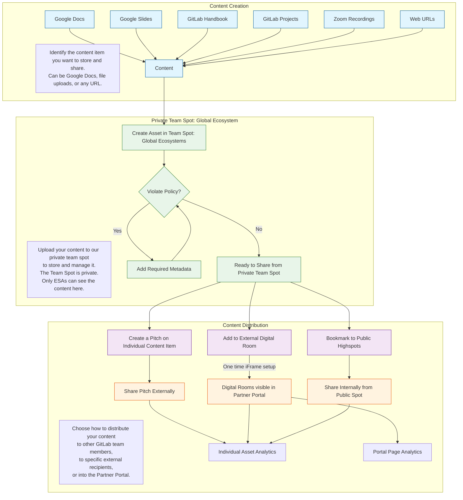

To request assistance from an ESA, you should reach out to the team in the **#ecosystem-solutions-architects** internal Slack channel. Mention any team member to start a 1:1 thread. Using this single work queue helps the team cover for each other and allows tracking issues to be created from the channel. Direct Messages (DMs) may be moved to this public channel.

For issues, the ESA team leverages the following labels: \~Partner-SA, \~Partner Region-AMER|APAC|EMEA, and Partner-Acct-.

Most opportunity-based engagement should begin with the Ecosystem Sales Manager (ESM), who should identify the appropriate ESA to engage. The ESM for every account can be found in the Salesforce (SFDC) customer account record. The ESA for a partner account is listed in the SFDC partner account record. If no ESA is listed, reach out to the ESM for assistance. Details on how to engage an Ecosystem SA can be found on the Ecosystem Solutions Architect Engagement Model handbook page.

The Ecosystem SA team is global. Ecosystem SAs are aligned with global and regional partners of all types, based on the team member's experience and the needs of the region.

## Ecosystem Solutions Architect: Role & Responsibilities

The ESA's vision and strategy focus on increasing partner contribution to revenue, elevating services capability value, and fostering a commitment to invest with GitLab. This is achieved through "Partner Activation," which refines the previous "Partner Capability Journey" to focus on measurable outcomes benefiting GitLab, partners, and customers.

The key activation pillars are:

* Contribution Activation: Qualifying use cases for GitLab, pitching value propositions and demos, and articulating ROI calculations. This leads to converting partner relationships into qualified pipeline and closed revenue.
* Commitment Activation: Creating differentiated service offerings, joint Go-To-Market (GTM) collateral and events, and co-creating contributions. This translates to transforming technical knowledge into artifacts demonstrating partner investment in GitLab.
* Capability Activation: Scaling GitLab Professional Services, facilitating customer use case adoption, and serving vertical markets. This elevates partner services competency to deliver successful customer implementations.

Activation methods include self-serve resources, technical selling workshops, joint account planning, partner-led demos, Champions programs, service and solution development, certifications, and hands-on labs. Health is monitored through metrics such as deal registrations, win rates, revenue growth, the number of generated technical artifacts, service attach registrations, customer health scores, and expansion rates.

An ESA-driven Partner Activation Plan (PAP) is a crucial component of the overall business plan owned by the Ecosystem Sales Manager (ESM). This plan outlines the technical partnership's summary, current and future capability state, partner organization structure, activation strategies, and timelines.

Overall, Ecosystem SAs aim to transition partners from passive awareness to active participation and ultimately to leading high-value activities like partner-sourced revenue, deal registrations, and solution development. Success is defined by engagement outcomes, ranging from low-value activities like attending enablement sessions to high-value activities like developing third-party integrations and contributing code to GitLab.

When **working with Strategic Alliance Partners**, the Ecosystem SA acts as an influential technical representative from GitLab. This involves pre-sales activities, driving partner solutions, and joint GTM initiatives. Key responsibilities include Partner GTM activities like identifying market demand, engaging business leaders for proposal development, and working across partners to develop joint solutions and enablement. They serve as Subject Matter Experts, possessing both soft skills and hands-on technical depth. They are involved in Internal and External Evangelism of partner technology, success stories, and market trends. They contribute to GitLab Strategy formulation for both business and technical considerations. They also assist with Content Curation with the Partner Enablement team.

## ESA Opportunity Responsibility

On GitLab Sourced Opportunities, which are new opportunities sourced by a direct account team where a partner may be involved, the direct account SA owns the technical responsibility. The ESA is there to support the progression of the deal by enabling the aligned Partner account team to collaborate technically with the GitLab SA.

On Partner Sourced Opportunities, where a partner sources a new opportunity, the Ecosystem SA takes responsibility to enable the partner if they need assistance to progress the opportunity, even speaking directly to prospects to enable the partner on Discovery and Demo practices. The Ecosystem team encourages the partner to submit a Deal Registration. Ecosystem SAs participate in direct customer engagements when the Partner needs support in the sales cycle and their account team is not ready to involve GitLab sales teams.

ESAs seek to document all customer interactions and quickly hand off partner-aligned opportunities to Field SAs early in the sales cycle as possible to drive the opportunity with the partner and customer. The ESA will not retain primary opportunity responsibility beyond GitLab deal Stage 2 unless approved by both the Global Ecosystem SA Manager and the Regional SA Manager. This handoff process is a key point of integration with the Field SA team. ESAs can also provide backup to the Field SA community in support of partner-aligned opportunities.

## MBO Guidelines

The charter of the Global Ecosystem Team is to develop a partner ecosystem that can **scale the number and size of GitLab opportunities**, engage with customers for rapid and widespread adoption, and create GTM solutions driving mutual revenue growth. This indirect path to GitLab revenue necessitates an objectives-based compensation model for the team, including ESAs.

**25% of the variable Bonus component** of ESA compensation is awarded based on the completion of quarterly SMART Objectives. Approximately four quarterly SMART Objectives are assigned by the Ecosystem SA Manager to each Ecosystem team member. These objectives vary quarter over quarter within major themes to align with changing business needs. Payout is a single payment after the quarter concludes. The MBO payout evaluation is holistic, with different percentages awarded based on whether the team member does not meet (0%), meets some (75%), meets majority (100%), or exceeds majority (110%) of expectations.

**MBO Categories for FY26** have been established. These categories include:

* **Partner Activation:** Develop and implement Partner Activation Plans to systematically advance partner capability maturity, focusing on structured approaches aligned with Partner Business Plans from Ecosystem Sales Managers and directly supporting revenue/growth objectives.  
* **Technical Sales Readiness:** Elevate partner technical sales capabilities through a structured program, aiming to generate qualified pipeline and revenue contribution. This involves developing standardized enablement materials, tracking conversion of enablement to partner-led opportunities, and supporting partners in landing Ultimate \+ Duo and Premium offers.  
* **Partner Services Capability:** Accelerate customer onboarding and adoption by integrating partner services offerings into customer account relationships. Focus areas include partner attach rates, CAPs Program participation, subcontracting, greater coordination with GitLab Professional Services, and enabling partners to deliver high-quality implementation services.  
* **Champions Program:** Leverage the GitLab Champions program to drive high-value technical investment and advocacy from partner technical resources. This includes driving participation in certification and advocacy programs, cultivating technical champions, and creating a network of GitLab experts across the partner ecosystem.

## Partner Activation

### Partner Activation Planning

The primary content the team leverages for activating partner team members to be able to effectively pitch and demo GitLab is the [Partner Onboarding Workflow & Enablement Resource (POWER) guide.](https://content.gitlab.com/viewer/0ed393608b135917d713d8ddeedf1398)

A well 30-60-90 day  plan for partner onboarding is being developed in this [Onboarding Blueprint](https://content.gitlab.com/viewer/c6d3f8818abe58bb3ee4bba266c4e6c4).  It provides a concise approach to consume the content from the POWER guide above.

### DRIVE the Champions Program

The GitLab Partner Champions program is described on [its own handbook page](/handbook/resellers/partner-champions-program/) which includes the overall vision of the program as well as the onboarding process for new Champions.  A collaboration group and project have been established at a [public group here](https://gitlab.com/gitlab-partners-public/gitlab-champions/champions).

In general to maintain the program over time we seek to:

1. Distribute Champions call responsibilities
2. Rationalize the active Champions participants
3. Implement expectations for Champions
4. Validate the value of the program to GitLab
5. Enable Champions collaboration and call session topics

## ESA Processes

### The Streamlined Portal for ESA Authored Content (SPEAC)

Highspot is the content management system in use at GitLab.  Each major team at GitLab has access to two spots.  For the Global Ecosystems team, we control "Team Spot: Global Ecosystems" and "Global Ecosystems."  The Global Ecosystems spot is the internally public facing spot at GitLab and is curated and maintained by Partner Enablement and other leadership.  The Team Spot Global Ecosystems is the spot the Ecosystem SA team can leverage.

For a video walkthrough of adding content to Highspot, [watch this short 7.5 minute video](https://gitlab.highspot.com/items/67f00eaa1e91c735f53e920b?lfrm=shp.0).

The strength of Highspot as a platform is that content can be remixed at any time in the future.  Also we can decide as a team what to share out through the Partner Portal.

So, while an initial upload of a content piece might be for GitLab Internal Only (bookmarked to the Global Ecosystem Spot page), we might reconsider the content piece for a wider audience at a later time by re-applying the mermaid workflow to the content piece.

We have created Digital Rooms in Highspot with the Partner Enablement team that are shared through the Partner Portal for additional security:

* GitLab Duo
* Duo with Q
* GitLab Dedicated
* Partner Enablement
* Building Pipelines Webinar
* Champions Program
* GitLab Platform (suggested to host free to Premium to Ultimate value messaging)

### GitLab Activity Planning (reporting and collaboration)

1. Login to GitLab and go to https://gitlab.com/gitlab-com/partners
2. Notice there are several subgroups and projects

   1. Ecosystem SA Team subgroup - This is for our team.  In the project: https://gitlab.com/gitlab-com/partners/ecosystem-sa-team/esa-team is where I put MBOs and issues related only to our team
   2. Org - don't worry about it... i may delete it
   3. Ecosystem Programs subgroup - This subgroup is for Ed Cepulis's Program Team
   4. Channel subgroup - Historically channel partners (resellers and services) projects are created here under each Geo.  This gives an internal collaboration project for issues related to that partner.
   5. Alliance subgroup - The same collaboration hierarchy as for Channel, but our Alliance partners like AWS and Google.  The terms Channel and Alliance are historical.  While we're one big Ecosystem, some may reference Cloud and Services.
   6. Partner Management project - This is a top level project available to put any issue related to generally managing activities with partners.

3. For the record, I do not care if you want to create your planning issues in any of these places.  
4. EMEA SAs tend to create issues in the partners/channel/emea/emea-internal project.  
5. Scott tends to use the top level partners/partner-management project
6. GitLab's hierarchical nature allows all reporting to happen at the partners/ top level, and captures everything properly labeled below

### Activity Logging with Rattle and Gong (accounting)

#### Rattle Integration

Ecosystem SAs like all SAs at GitLab will record their partner and customer facing activity by using Rattle every week.  [Here is the main landing page](/handbook/solutions-architects/processes/activity-capture/activity-logging) and scroll down to the Ecosystem SA Activities for activity types and overall guidance in the use of the tool.  A [video supplement](https://gitlab.highspot.com/items/67be46c991e055ef7c36de79?lfrm=shp.0) is available too.  

1. Go to Okta, and login to SFDC from there, just to have it open in your browser
2. Open a new tab and go to https://app.gorattle.com/integrations and click the blue Integrate button next to SFDC
3. After going through the process to integrate the two, validate that the SFDC integration in Rattle has your email listed and not rattle@gitlab.com

#### Gong Integration

Gong is the tool we use to record external calls.  It has AI built in to analyze your calls for sales effectiveness, summaries, actions, etc.  Set up Gong to also include your emails to partners in the reporting analytics below.

1. Go to Okta, and login to Gong from there.
2. In Gong, click on your initials in the top right corner, and select `User Settings`
3. In about the fifth section down, you'll see `Emails` and likely red "x". Click `Connect` next to the entry about emails you send from your CRM contacts being imported.
4. Authenticate as needed using your GitLab credentials and accept the permissions.
5. Verify there is a green "check" next to the email integration. You don't have to turn on compose emails in Gong.
