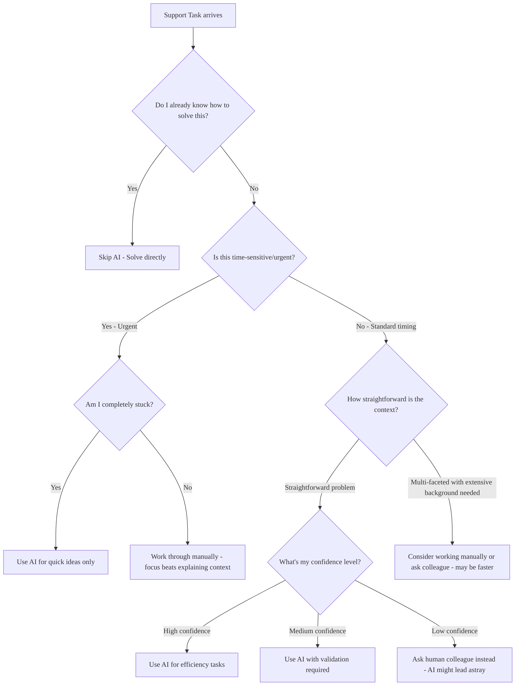

## Overview

GitLab provides access to multiple AI models to enhance Support Engineering efficiency.

It is important to consider when to use AI and select the right tool for your specific tasks.

## When to use AI: Decision Framework

Before reaching for AI, ask yourself: **"Will this AI interaction save me time and improve quality, or am I just adding steps?"**

### Red flags: When AI will waste your time

1. You're learning something new
   - If you don't understand the domain well enough to spot AI mistakes, don't use AI
   - Learn the basics first, then use AI to accelerate your work

1. The customer is frustrated
   - Frustrated customers need authentic human responses and personal attention
   - AI generated empathy often sounds hollow
   - Handle the emotional aspect first, then maybe use AI responsibly for technical research

1. You need to understand "why"
   - AI can provide plausible-sounding explanations for root causes that may be incorrect
   - If you need to understand underlying reasons deeply, verify AI explanations independently

1. Security or compliance issues
   - Never use AI for sensitive data or compliance questions
   - The risk of AI hallucination is too high

1. When you need version-specific guidance
   - AI often provides generic advice that doesn't account for the customer's specific GitLab version, edition, or installation method
   - Version mismatches can lead to incorrect troubleshooting paths

### Green flags: When AI will likely help

1. You need research across multiple resources
   - AI excels at synthesizing information from various docs
   - Good for "find all the ways X can fail" type questions

1. You are doing repetitive analysis
   - Use specialized tools (like [`fast-stats`](https://gitlab.com/gitlab-com/support/toolbox/fast-stats)) for statistical analysis, then AI for interpretation if needed
   - Comparing configurations
   - Finding similar past issues
   - Summarizing important points from a long conversation

1. You want a critical review ([rubber ducking](https://en.wikipedia.org/wiki/Rubber_duck_debugging))
   - Ask AI to "find inconsistencies or problems with my approach"
   - Good for challenging your assumptions rather than seeking validation

1. You're stuck and need ideas
   - AI can suggest troubleshooting paths you hadn't considered
   - Helpful for brainstorming when you hit a wall

1. Identifying missing information in complex issues
   - Good for "what context am I missing?" type questions
   - Helpful when preparing [requests for help issues](../workflows/how-to-get-help.md#how-to-formally-request-help-from-the-gitlab-development-team) for the Development team

1. Refining responses you've already drafted
   - AI can help improve clarity, completeness, and tone of responses you've written
   - Good for polishing communication before sending to customers

## Core Principle: AI as augmentation, not replacement

Use AI to build upon your existing knowledge and responses, not to replace your thinking:

- **Start with your own understanding** - Begin with what you know, then use AI to enhance or validate your approach
- **Build upon your drafts** - Write your initial response based on your expertise, then use AI to refine, expand, or improve it
- **Amplify your expertise** - Let AI help you explore additional angles or catch things you might have missed
- **Maintain ownership** - You remain the expert and decision-maker. AI is your research assistant and writing collaborator

This approach ensures you stay engaged with the problem-solving process while leveraging AI's strengths in research, analysis, and communication enhancement.

### Readiness Self-Assessment

This is a self-assessment. If you're still developing your technical troubleshooting skills or learning how to communicate effectively with customers, focus on building those fundamentals before adding AI to your workflow.

Before using AI on active tickets, try using AI to solve 3-5 already resolved tickets with different problem types. This gives you insight into what AI is good for and where it struggles to move you forward.

You are ready to use AI when:

1. Knowledge foundation
   - You can easily spot incorrect technical advice
   - You know how to verify AI suggestions and technical details (environment variables, configuration options, documentation URLs)
   - You can test and explain any commands or code snippets before sharing them
   - You have a fundamental understanding of the GitLab feature/system you're working with

1. Time management
   - You can estimate how long tasks should take manually
   - You notice when AI is slowing you down vs. speeding you up 

You are not ready to use AI when:

1. Knowledge gaps
   - You can't tell if the technical explanation provided by AI is reasonable
   - You don't know where to find authoritative documentation
   - You don't know how to check if advice applies to the customer's specific GitLab setup
   - You're learning the basics of GitLab functionality

1. Problematic usage patterns
   - You're tempted to send AI responses without proper verification when time constrained
   - You rely on AI because you don't know how to solve problems manually
   - You use AI to avoid learning difficult concepts or developing fundamental troubleshooting skills
   - You rely on AI instead of building necessary technical expertise

### The "AI is working" test

You'll know AI is helping when:

- You finish tasks faster than your manual baseline
- You learn something new that you can apply later  
- The AI suggestions spark ideas you wouldn't have had
- You catch AI mistakes quickly and confidently

You'll know AI is hurting when:

- You spend more time prompting than you would solving manually
- You're blindly following AI advice you don't understand
- You're sharing technical advice you haven't verified or can't explain
- You're using AI to avoid learning things you should know
- Customers or colleagues notice a drop in your response quality
- Colleagues notice you're not building necessary technical expertise

## How to Use AI Tools: Selection and Use Cases

This section is currently being developed.

## Responsible AI use in customer tickets

- See [can I use output from an AI in ticket replies](../workflows/working-on-tickets.md#can-i-use-output-from-an-llm-in-ticket-replies).
