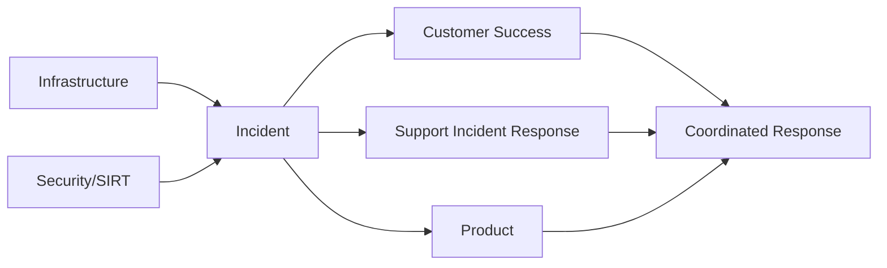
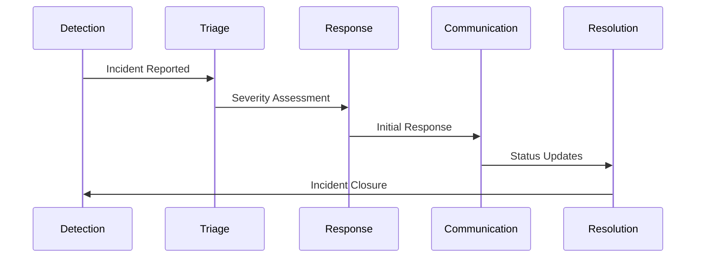

## Support Incident Response Framework

Support Engineers regularly encounter customer-facing incidents that require rapid, coordinated responses while maintaining technical excellence. The Support Incident Response Framework provides structure for these critical moments, helping us balance customer advocacy with effective problem-solving. It provides a structured approach that complements broader organisational incident processes while focusing on the unique requirements of customer advocacy and technical problem-solving in support contexts.

The framework delivers practical benefits through clear processes, defined roles, and systematic knowledge sharing. By transforming individual experiences into team wisdom, it reduces cognitive load during stressful situations and improves our coordination. This ultimately leads to faster resolutions for our customers while supporting our professional growth as Support Engineers.

{}

If you are seeking information to help GitLab ensure incidents are reported, investigated and handled, you might be looking for the [Incident Response Guidance](/handbook/security/product-security/vulnerability-management/incident-response-guidance/).

If an incident requires a non-standard workflow or communication from Support, create the [Support Response issue](https://gitlab.com/gitlab-com/support/support-team-meta/-/blob/master/.gitlab/issue_templates/Support%20Response.md) if this has not yet been done.

If you are looking for details about being on-call in Support, you might find what you need here: [GitLab Support On-Call Guide](/handbook/support/on-call.md)

{}

## In Scope

- Customer-reported production emergencies
- GitLab.com service disruptions requiring support coordination
- Security incidents requiring support response
- Mass-impact product issues
- Post-release customer impact scenarios

## Out of Scope

- Pure infrastructure incidents without customer impact
- Internal system outages
- Individual customer service requests
- Feature requests and bug reports
- Non-emergency support inquiries

## Integration Points





## Working Principles

Working principles are behaviors that empower team members to carry out incident response work in alignment with the needs of our customers and our wider business Incident Response. They help illustrate what applying GitLab's core values and operating principles to your work as a Support Engineering Incident Responder will look like. These working principles are complementary to, and should be subordinate to, GitLab's core values and operating principles. In case of a conflict between the two, please create an MR to propose a change to or removal of the working principles.

### Customer-First Response

Incident decisions prioritize customer impact above technical considerations. Customer experience metrics serve as primary success indicators. Response strategies target minimal workflow disruption and fastest path to resolution. Resource allocation focuses on customer-impacting components first.

### Clear Accountability

Incidents operate with defined RACI matrices and explicit role assignments. Decision authority follows documented hierarchies to prevent ambiguity. Escalation thresholds trigger specific notification protocols. Critical path tasks maintain designated owners throughout incident lifecycle.

### Continuous Improvement

Incidents generate standardized postmortem analysis with tracked action items. Process reviews occur at scheduled intervals with defined completion criteria. Performance metrics drive framework enhancements through data validation. Process changes undergo controlled testing before full implementation.

## Incident Response Guidance

This Support Incident Response Framework is designed to complement existing organisational security and infrastructure incident response processes and should branch off established organisational workflows defined in the [Incident Response Guidance](/handbook/security/product-security/vulnerability-management/incident-response-guidance/).

As improvement efforts progress across the organisation, any content that appears duplicated between the Support Incident Response Framework and other incident frameworks will be identified. When duplication is detected, please create a Merge Request (MR) to remove the duplicated content from this framework and integrate it into the wider organisational incident framework.

This consolidation effort aims to create a unified approach to incident management while preserving the specialised workflows needed for customer-facing Support incidents. The Support Incident Response Framework will evolve accordingly, with emphasis on the unique aspects of customer support during incidents rather than replicating general incident procedures.

If you notice areas of duplication or opportunities for integration, please create an issue or MR in the appropriate project to help facilitate this alignment work.

## Key Roles and Their Responsibilities

The Role Structure and Responsibilities component defines who does what during customer-impacting incidents, establishing clear lines of authority, communication paths, and accountabilities.

Clearly defining these roles, responsibilities, and interfaces, eliminates confusion during critical incidents and high-pressure situations, ensures comprehensive coverage of all necessary functions, and provides a foundation for continuous improvement in our incident response.

## Support-Specific Roles

### CMOC (Communications Manager On-call)

**Primary Focus:** Customer impact management and support coordination

**Handbook:** [CMOC Workflows](/handbook/support/workflows/cmoc_workflows/)

- Assess the scope and nature of customer impact through tickets and monitoring
- Coordinate support team resource allocation based on incident severity
- Develop and execute the customer communications strategy
- Review and approve all customer-facing messaging for clarity and accuracy
- Create and apply incident-specific tags in Zendesk for tracking
- Handle bulk ticket responses for incident-related inquiries
- Manage support documentation and macros specific to the incident
- Coordinate with regional support teams to ensure 24/7 coverage
- Track evolving customer impact patterns throughout the incident

### SMOC (Support Manager On-Call)

**Primary Focus:** Escalation management and support team resource coordination

**Handbook:** [Support Manager On-Call](/handbook/support/workflows/support_manager-on-call/)

- Handle Support Ticket Attention Requests during incidents
- Make definitive determinations on emergency qualification
- Find additional coverage when multiple emergencies occur simultaneously
- Act as notification point for security incidents affecting support
- Lead emergency calls with customers when needed
- Assist with particularly difficult customer communications
- Prevent SLA breaches through proactive intervention
- Find Support Manager DRI for Account Escalations
- Review and validate support team response strategies

## Cross-Functional Coordination

These roles are described in further detail in various handbook pages. The definitions below provide summary context for Support Engineering team members.

### Incident Manager On-Call (IMOC)

- Coordinates overall incident response and technical aspects
- Manages status.io updates and public communications
- Facilitates cross-team collaboration during resolution
- Determines incident severity and closure timing

### Infrastructure Team

- Provides technical resolution for platform issues
- Gives technical status updates to support teams
- Estimates resolution timeframes for customer communications
- Collaborates on post-incident analysis

### Customer Success Team

- Manages communications with strategic customers
- Provides context on customer-specific needs
- Joins customer calls when appropriate
- Helps measure post-incident customer satisfaction

### Product Team

- Assists with product-specific incidents and bugs
- Provides product expertise for customer communications
- Prioritizes fixes based on customer impact data
- Collaborates on bug-related messaging

### Security Incident Response Team (SIRT)

- Provides security expertise during security-related incidents
- Determines appropriate information disclosure restrictions
- Guides support messaging for security incidents
- Reviews security-related customer communications

## Role Interfaces and Handoffs

The framework defines clear interaction points between roles:

### CMOC <-> IMOC

- IMOC provides technical status for customer communications
- CMOC provides customer impact details to inform technical priorities
- Joint approval of public-facing status updates
- Regular sync points at defined intervals based on severity

### CMOC <-> SMOC

- SMOC provides guidance on complex support scenarios
- CMOC escalates resource needs and complex customer situations
- Joint decisions on emergency qualification
- Collaboration on support team resource allocation

### SMOC <-> IMOC

- IMOC provides technical context for support escalations
- SMOC provides support impact details to inform response
- Collaboration on incident severity determinations
- Joint review of customer impact assessment

### Regional Handoffs

- Defined documentation requirements for cross-region transfers
- Structured handoff calls at region boundaries
- Common tools and templates for consistency
- Clear escalation paths across time zones

## Support-Role Engagement and Exit

### Engagement Triggers

- **CMOC:** Multiple customers affected OR bulk communications needed OR support resource coordination required
- **SMOC:** Complex customer impact OR resource conflicts OR SLA risk OR SIRT involvement

### Exit Criteria

- Customer communications stable
- Support queue normalized
- No new impact patterns
- Regular ticket flow resumed
- Documented final status
- Handback to regular support flow

## Future considerations

<details><summary>Measuring Role Effectiveness</summary>

**PROPOSED:** Each role has specific KPIs to evaluate performance | **ISSUE:** TBC

### CMOC Metrics

- Time to first customer communication
- Customer satisfaction during incidents
- Communication consistency across incidents
- Support resource utilization efficiency

### SMOC Metrics

- Time to resolve escalations
- Resource allocation effectiveness
- SLA compliance during incidents
- Escalation appropriateness

</details>

<details><summary>Implementation and Training</summary>

**PROPOSED** | **ISSUE:** TBC

- Role-specific training curricula
- Regular simulation exercises
- Shadowing opportunities for new team members
- Continuous skill development pathways

</details>

<details><summary>Metrics & Success Indicators</summary>

**PROPOSED** | **ISSUE:** TBC

- **Response Time**
  - Description: Time from detection to initial response
  - Target: < ____ minutes for SEV1/SEV2

- **Resolution Time**
  - Description: Time from detection to resolution
  - Target: Varies by severity

- **Customer Satisfaction**
  - Description: CSAT scores for incident handling
  - Target: > 90%

</details>

## Handover Summary Templates

Summary templates as code blocks for various communication scenarios where CMOC and SMOC roles need to share information with other stakeholders in Slack channels, and/or issues.

### CMOC Communication Templates

#### Initial Status Update Template

```markdown
## Incident #[number] - [title]
**Status:** In Progress
**Severity:** [SEV1/SEV2/SEV3]
**Time Detected:** [YYYY-MM-DD HH:MM UTC]

### Issue Summary
[Brief description of the issue - 1-2 sentences]

### Customer Impact
- Systems/services affected: [list affected services]
- Impact type: [complete outage/degraded performance/feature unavailability]
- Estimated affected customers: [number/percentage if known]

### Current Actions
- [Bullet points of what the team is currently doing]

### Next Update
Next status update expected by [time] UTC
```

#### Regular Status Update Template

```markdown
## Incident #[number] - [title] - UPDATE #[X]
**Status:** In Progress
**Severity:** [SEV1/SEV2/SEV3]
**Time Detected:** [YYYY-MM-DD HH:MM UTC]
**Last Updated:** [YYYY-MM-DD HH:MM UTC]

### Current Status
[Brief description of the current state - 1-2 sentences]

### Progress Since Last Update
- [Bullet points of actions taken and progress made]

### Ongoing Customer Impact
- [Updated impact assessment]
- Current ticket volume: [number]
- Notable patterns: [describe any patterns in customer reports]

### Next Steps
- [Bullet points of planned actions]

### Next Update
Next status update expected by [time] UTC
```

#### Resolution Update Template

```markdown
## Incident #[number] - [title] - RESOLVED
**Status:** Resolved
**Severity:** [SEV1/SEV2/SEV3]
**Time Detected:** [YYYY-MM-DD HH:MM UTC]
**Time Resolved:** [YYYY-MM-DD HH:MM UTC]
**Duration:** [X hours Y minutes]

### Resolution Summary
[Brief description of how the issue was resolved]

### Final Impact Assessment
- Systems/services affected: [list affected services]
- Total customers impacted: [number/percentage if known]
- Total tickets received: [number]

### Follow-up Actions
- [Any post-incident actions customers should take]
- [Any monitoring customers should perform]

### Additional Information
A full post-incident review will be conducted and findings shared as appropriate.

For any additional questions, please contact support referencing Incident #[number].
```

#### Regional Handoff Template

```markdown
## Incident #[number] - [title] - HANDOFF
**Status:** In Progress
**Current Region:** [EMEA/AMER/APAC]
**Handoff To:** [EMEA/AMER/APAC]
**Handoff Time:** [YYYY-MM-DD HH:MM UTC]

### Current Situation
[Brief summary of current status - 2-3 sentences]

### Customer Impact Status
- Active tickets: [number]
- Pending responses: [number]
- Escalated issues: [number]

### Communication Status
- Last status.io update: [time] UTC
- Next scheduled update: [time] UTC
- Draft status update: [link or text]

### Priority Actions for Next Shift
1. [Most important action]
2. [Second priority action]
3. [Additional actions as needed]

### Key Stakeholders
- [List of key contacts involved]

### Handoff Acknowledgement
Please acknowledge receipt of this handoff in the incident channel.
```

### SMOC Communication Templates

#### Support Resource Allocation Template

```markdown
## Incident #[number] - [title] - SUPPORT RESOURCES
**Status:** In Progress
**Time:** [YYYY-MM-DD HH:MM UTC]
**Resource Request Type:** [Initial/Update/Release]

### Current Support Load
- Active incident-related tickets: [number]
- Current response time: [time]
- Queue health status: [Healthy/Strained/Critical]

### Resource Allocation
- AMER: [X] engineers allocated to incident
- EMEA: [X] engineers allocated to incident
- APAC: [X] engineers allocated to incident

### Priority Guidelines
1. [Top priority issue type]
2. [Second priority issue type]
3. [Standard handling for other issues]

### Special Handling Instructions
- [Any special routing or handling instructions]
- [Any customer-specific considerations]

### Actions Needed
- [Team leads]: [specific action requested]
- [Regional managers]: [specific action requested]
- [Other stakeholders]: [specific action requested]

### Duration Estimate
This resource allocation is expected to remain in place for approximately [time period].
```

#### Customer Impact Report Template

```markdown
## Incident #[number] - [title] - CUSTOMER IMPACT REPORT
**Status:** [In Progress/Resolved]
**Time:** [YYYY-MM-DD HH:MM UTC]

### Impact Summary
[Brief description of customer impact - 2-3 sentences]

### Impact Metrics
- Total customers reporting issues: [number]
- Percentage of customer base: [estimated percentage]
- Geographic distribution: [regions affected]
- Customer segments affected: [Enterprise/SMB/Personal]

### Common Issues Reported
1. [Most common issue] - [X] reports
2. [Second most common issue] - [X] reports
3. [Third most common issue] - [X] reports

### Customer Sentiment
- Current CSAT trending: [Stable/Declining/Improving]
- Notable customer concerns: [list major themes]

### Recommended Actions
- [Technical team]: [recommended action]
- [Communications team]: [recommended action]
- [Customer success]: [recommended action]

### Additional Information
[Any other relevant details about customer impact]
```

#### CMOC Activation Template

```markdown
## Incident #[number] - [title] - CMOC ACTIVATION
**Status:** In Progress
**Activation Time:** [YYYY-MM-DD HH:MM UTC]
**Requested By:** [Name/Role]

### Activation Criteria Met
- [List specific criteria that triggered activation]

### Current Support Status
- Active tickets: [number]
- Affected customers: [number/types]
- Current response time: [time]

### Initial CMOC Actions
1. [First immediate action]
2. [Second immediate action]
3. [Ongoing monitoring focus]

### Resource Requirements
- Personnel needed: [specific roles/numbers]
- Tools/access needed: [specific requirements]
- Stakeholder engagement needed: [specific teams]

### Actions Needed
- [CMOC]: Acknowledge activation and implement response plan
- [Regional managers]: [specific action requested]
- [Technical teams]: [specific action requested]

### Communication Plan
- Initial customer communication to be sent by: [time]
- Coordination meeting scheduled for: [time]
- Reporting cadence: [frequency]
```

#### Post-Incident Support Summary Template

```markdown
## Incident #[number] - [title] - SUPPORT SUMMARY
**Status:** Resolved
**Incident Duration:** [start time] to [end time] UTC
**Report Time:** [YYYY-MM-DD HH:MM UTC]

### Support Response Summary
[Brief overview of the support response - 3-4 sentences]

### Key Metrics
- Total tickets handled: [number]
- Peak tickets per hour: [number]
- Average response time: [time]
- Support resources utilized: [number of staff]

### Customer Impact Analysis
- Most affected customer segments: [details]
- Geographic distribution: [details]
- Common workarounds provided: [list]

### Effectiveness Assessment
- What worked well: [bullet points]
- Improvement areas: [bullet points]
- Tool/process gaps identified: [bullet points]

### Follow-up Actions
- [Specific action items with owners and timelines]

### Lessons Learned
[Key takeaways for future incident response]
```

### Cross-Functional Templates

#### Technical-to-Support Handoff Template

```markdown
## Incident #[number] - [title] - TECHNICAL TO SUPPORT HANDOFF
**Status:** [In Progress/On Hold/Resolved]
**Time:** [YYYY-MM-DD HH:MM UTC]

### Technical Summary
[Brief technical explanation of the issue - keep simple and customer-focused]

### Customer-Facing Impact
- What customers are seeing: [observable symptoms]
- Affected components/features: [specific details]
- Scope of impact: [broad/limited/specific customers]

### Workaround Instructions
[Step-by-step workaround if available]

### Customer Communication Guidance
- Key points to communicate: [bullet points]
- Points to avoid mentioning: [bullet points]
- Technical accuracy verified by: [name]

### Expected Resolution
- Estimated time to resolution: [timeframe if known]
- Fix delivery method: [hotfix/regular release/etc.]

### Actions Needed
- [Support team]: [specific guidance on ticket handling]
- [CMOC]: [guidance on status.io messaging]
- [Other teams]: [any other coordination needed]
```

#### Executive Update Template

```markdown
## Incident #[number] - [title] - EXECUTIVE SUMMARY
**Status:** [In Progress/On Hold/Resolved]
**Time:** [YYYY-MM-DD HH:MM UTC]

### Situation Overview
[Concise explanation of the incident - 1-2 sentences]

### Business Impact
- Customer impact: [High/Medium/Low] - [brief description]
- Revenue impact: [Yes/No/Unknown] - [brief description if Yes]
- Reputation risk: [High/Medium/Low] - [brief explanation]

### Response Status
- Technical response: [On track/Delayed/Blocked] - [brief status]
- Support response: [On track/Delayed/Blocked] - [brief status]
- Communications: [On track/Delayed/Blocked] - [brief status]

### Key Metrics
- Duration so far: [time]
- Estimated time to resolution: [time or unknown]
- Support tickets: [number]
- Affected customers: [number/percentage]

### Critical Decisions Needed
[List any decisions requiring executive input]

### Next Update
Next executive update scheduled for: [time] UTC
```

These templates provide structured frameworks for different types of communications that CMOC and SMOC roles would need to share with stakeholders during an incident. They're designed to be clear, actionable, and adaptable to different incident scenarios while maintaining consistency in format.
