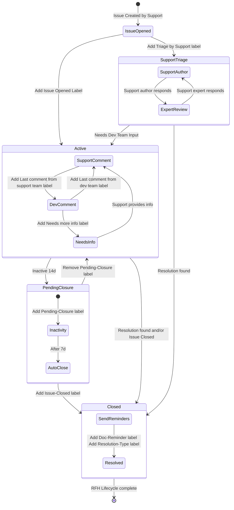

## Getting Help on a Ticket

When [working on tickets](/handbook/support/workflows/working-on-tickets), collaboration is critical, especially when troubleshooting complex issues, or technical areas of focus that fall outside of your experience level. Asking for help means having a [low level of shame](/handbook/values/#low-level-of-shame-when-dogfooding), and also shows that you are putting the customer first because you are working towards resolving their problem.

### Ask good questions

Asking a good question is key to getting the help you need. When in doubt, ask yourself:

> Does my question contain all the information that a reader needs to formulate a good response?

A question should include necessary information that helps the reader get up to speed without switching contexts. It
should also include a clear, direct ask. When asking questions, think about the following:

- Does the question have a brief, descriptive summary of the problem?
- Is there a link to the ticket, issue, docs page, or other relevant resource?
- Are there any error messages or behaviors of note that should be included?
- Is the ask clearly stated at the beginning or end of the question?

Starting with a problem summary or overview lets the reader learn about the situation without requiring them to go
somewhere else, like a ticket. Including a link to other material helps the reader gather any additional information
that they might need, like customer details or log files. Highlighting specific error messages or behavior narrows the
scope. Clearly stating your ask at the beginning or end of your question makes it easy for the reader to identify
what you need help with.

These guidelines are a reference, and **not** a requirement for asking questions. They serve as a starting point to
guide you, but don't let them block you from asking for help.

As a final opportunity for reflection, imagine that a GitLab customer is asking you this question. Is there enough
detail for you to begin formulating a response, or would you need to gather more information?

Often, writing a question out functions like [rubber duck debugging](https://en.wikipedia.org/wiki/Rubber_duck_debugging).
That is, the act of thinking through the items above might highlight missing info, cause you to research something you
hadn't before, or even lead you right to the solution.

{}
While more information is helpful, including too much supporting detail can be confusing. Provide enough information to
satisfy the questions above in your initial post; additional details, such as logs or screenshots, can always be added
to the thread!
{}

### How to Get Help Workflow

If you are stuck on a ticket, the following workflow seeks to help Support Engineers realize and utilize all of the resources available to progress a ticket to resolution. This workflow lists some common resources, you can lean on to get the help you need.

If you're stuck on a ticket, first identify what's causing you to get stuck. Some examples are:

- I don't have the right knowledge to progress this ticket.
- The customer's query is out of scope, but they expect us to resolve this.
- There is a deep technical issue which needs a development expert's consult.

Then consider these options to help unblock you. And remember that
[escalating to unblock](/handbook/values/#escalate-to-unblock)
is an operating principle of Results.

#### Bring the ticket before a group of peers

Other Support Engineers are a great resource to help out with tickets. To get help from peers, you can try one or more of the following:

1. Attend crush or help sessions such as those noted below (see the [GitLab Support calendar](https://calendar.google.com/calendar/u/0?cid=Z2l0bGFiLmNvbV85YnMxNTllaHJjNXRxZ2x1cjg4ZGpiZDUxa0Bncm91cC5jYWxlbmRhci5nb29nbGUuY29t) for times):
    - AMER Senior SE Help Sessions
    - APAC/AMER or EMEA/AMER crush sessions
    - APAC or EMEA crush / collaboration sessions
    - Senior Support Office Hours (varying times)
1. Ask for help in one of the broader
   [Support Slack channels](/handbook/support/#slack).

#### Expand to Support Pods and other subject matter experts

You can also do one or more of the following:

- See if there is a [Support Pod](/handbook/support/workflows/working-with-pods/) that covers the area your ticket is in and ask one of the Pod members for help.
- Ask an expert within Support. You can check the [Skills by Subject](https://gitlab-com.gitlab.io/support/team-pages/skills-by-subject.html)
  Support page to see who might have the skills to assist, or reach out
  to the [Support Stable Counterpart](/handbook/support/support-stable-counterparts/)
  for the appropriate product area. Mention those
  people in the thread and in the ticket to let them know you think they can help.
- Reach out to development teams directly in their Slack channels if you have a straightforward,
  specific question that might be quickly answerable. Don't hesitate to engage development teams
  early in the process if their expertise could help resolve an issue more efficiently. Be
  respectful of their time - the development team may direct you to open a formal [request for help issue](#how-to-formally-request-help-from-the-gitlab-development-team)
  if your question requires more detailed information or investigation.
- [Request help from the relevant GitLab Development Team](#how-to-formally-request-help-from-the-gitlab-development-team).
  Gather what information you have and fill in as much detail as possible for the dev team in the issue. To get more attention, you can post in the relevant group Slack channel with a message and link to the issue.
  If you don't get a response within the SLO, contact the listed engineering manager in the project readme.
  See [below](#how-to-formally-request-help-from-the-gitlab-development-team) for more details.
- If you have a reproducible issue, then go straight to a bug issue in the appropriate [GitLab product tracker](https://gitlab.com/gitlab-org).

#### Bring the ticket to managers

Especially if you feel you're stalled on a ticket and need assistance identifying next steps:

1. Always feel free to reach out to any available manager (such as your manager, or the [Support Manager On-call](/handbook/support/workflows/support_manager-on-call) in the `#support_leadership` channel. They will help you to determine next steps.
   - Avoid messages with no identified DRI for responding in `#support_leadership` as they can be missed or be a victim to the bystander effect.
1. [Open a STAR](/handbook/support/internal-support/support-ticket-attention-requests#submitting-a-support-ticket-attention-request-star--starring-a-ticket) in situations where getting help is urgent and important because:
   - the customer has expressed unhappiness with the service we're delivering via the ticket
   - the support engineer has noticed a correlation between several of a customers tickets that could use a more cohesive response
   - there is an urgent need for action in a different region (for example, finding a ticket owner or scheduling a call)

### How to formally Request Help from the GitLab Development Team

To enhance collaboration between the support and development teams, GitLab has implemented the Request for Help (RFH) process. This allows support engineers to formally request assistance from the specific GitLab development groups responsible for the relevant functionality when facing technical challenges that impede ticket resolution. This section outlines the necessary steps to effectively utilize the RFH process.

It's important to note that this process is part of a broader, iterative strategy aimed at deploying this workflow across all development sections and groups at GitLab. If an RFH template for a particular development group is not yet available, please reach out to [John Lyttle](https://gitlab.com/jlyttle) to initiate the creation of the required RFH template.

#### Are you requesting for Dev help too soon?

NO! To drive this point home, here's what one of our Developers **Chad Woolley** had to say about this:

> _If both Support and the Customer are confused about what the next steps are, at a minimum it's an indicator that something is lacking, either in our docs or support processes, and this is an opportunity to improve those areas._

#### How to find the correct Development Section and Group to reach out for help

The easiest way to determine the correct place for a Support Request for Help issue is to use the docs pages. One possible workflow is as follows:

1. Locate a documentation page for the feature or topic on which you need help.
1. Scroll down to the bottom of the page and click on either the "View page source" link.
1. This will open up the `.md` source file of that docs page, which contains both the `stage` and `group` responsible for it noted on the top.
1. Now go to the [Product Categories handbook page](/handbook/product/categories/) and search for the Development Section to which the group identified on the previous step belongs to.
1. Use the table and workflow below to create a Request for Help issue in the project identified above.

Alternatively, if you have set up the [Support dotfiles](https://gitlab.com/gitlab-com/support/toolbox/dotfiles), you can use the `gls_request_for_help` command to quickly retrieve the "New issue" link with the correct issue template.

_NOTE:_ A video recording of a similar workflow as the one described above can be found in the [Support Training repository](https://gitlab.com/gitlab-com/support/support-training/-/blob/main/Support%20Specific%20Trainings/training-videos/Support%20Request%20for%20Help%20Workflow.mp4)

#### The Request For Help Landing Page

The [Request for Help](https://gitlab.com/gitlab-com/request-for-help) landing page consolidates all GitLab Development Sections and their respective groups into a single repository. Unlike the previous process, all RFH templates are now centralized within this repository for easier access and management. To submit an issue, navigate to the page, locate the relevant GitLab Group, and click on its "Associated Template."

**Change Process:**
If a section or group has been recently modified, please create a confidential issue in the GitLab project tracker, assign to @jlyttle and notify the relevant Slack channel.
For additional details, refer to the [support epic #222](https://gitlab.com/groups/gitlab-com/support/-/epics/222) for more information.

#### Research prior to opening an issue

Use the following repositories and resources for identifying similar issues or requests:

1. Zendesk for related tickets.
1. Previous GitLab Application [bugs and feature requests](https://gitlab.com/gitlab-org/gitlab/-/issues).
1. Previously submitted GitLab.com issues.
1. Previously submitted [Request for Help](https://gitlab.com/gitlab-com/request-for-help) issues.
1. Discuss with knowledge experts and support stable counterparts.

#### Create a detailed issue

1. Open the [Request for Help](https://gitlab.com/gitlab-com/request-for-help) landing page.
1. Review the Development groups and corresponding templates section.
   - Use the provided GitLab Handbook Section Breakdown link at the bottom of the Project ReadMe file if you are unsure about which Section Sub Group and corresponding template to use.
1. Make sure to use the correct corresponding issue template when creating a new issue.
1. Complete all the fields in the issue template and attach all necessary files.
1. Ensure that an appropriate severity is set as defined by the [support impact](https://about.gitlab.com/support/definitions/#definitions-of-support-impact). You should set the appropriate label `severity::1`, `severity::2`, `severity::3`, `severity::4` so that it corresponds with the priority level in Zendesk.
1. If the Zendesk ticket is escalated then add the label `Support::escalated`.
1. Add a 'Customer Impact' statement if necessary, advocating for the customer.
1. Ensure to follow any instructions on the template itself, such as who to assign the issue to (if not automatically assigned).
1. After creating the issue:
   - Add its link to the Zendesk ticket as an internal note and to the ticket field named `GitLab Issues`.
   - Use Duo Chat on the issue to identify any further details/context you should share additionally. You can use a prompt like this:
     > This issue is a request for help from the customer support team to Engineering. Identify any context that has not been shared, but that would be useful for Engineering to help provide a solution for this issue.

#### Tips on getting timely responses

1. Review the Opening a request for help to ensure all steps were covered.
1. Mention the engineer who is helping or assigned with _every_ comment where you need them to review or respond.
1. If an issue is moved to another group (through a label change or moving to another project), check the corresponding template for the new group to see who to assign or mention in a comment.
1. When linking to Kibana, also upload a copy of relevant entries, a screenshot of the graph, etc. as logs rotate out after 7 days. If possible, also link to the relevant Sentry entry.
1. Many teams do not have access to customer information. So make sure if you are accessing information using elevated access (Such as GitLab.com Admin) that you provide information in the issue directly that may be required to understand the problem.

#### When Development Requires Additional Information

Development engineers may apply the `RFH::Needs more info` label to your issue if additional details are needed. This label indicates that your issue requires clarification or additional information to proceed. When you see this label:

1. Review any comments from the development team carefully.
1. Provide all requested information in a new comment.
1. Mention the relevant developer in your response.
1. Ensure you've included a detailed description of the problem, the required logs, screenshots, or the required reproduction steps.

Once you've provided the requested information, the development team will remove the RFH::Needs more info label and continue with the investigation.

Please Note: Providing thorough and prompt responses when this label is applied helps ensure your issue can be investigated and resolved efficiently.

#### Escalate to unblock a request

If you encounter any problems, such as obtaining a timely response from Development, then please take one or more of the following steps:

1. Check if the engineer(s) assisting with the request is on PTO through Slack or their GitLab status. If they are on PTO, mention the contacts (listed in the issue template) in the issue, or their backups if they are also on PTO, requesting an update via the issue. Backups are listed in a coverage issue, or in Slack.
1. Make the corresponding Development group Engineering Manager aware by mentioning them in the issue. You can identify the relevant Engineering Manager by checking the Development Group Handbook Page from each Projects Readme Section which provides a section named `Development Groups with their corresponding templates and labels`.
1. Feel empowered to ping the contacts and/or Engineering Manager in the corresponding product/development group Slack channel along with a link to the issue, requesting an update.
1. Reach out to a Support Engineering Manager for further guidance directly or in the `#support_leadership` Slack channel.

#### Closing: Document and knowledge share

1. Once you receive all the necessary assistance, ensure to close the issue and add a comment explaining why it is being closed.
1. Consider whether the solution or information contained within the issue can be used to update the GitLab documentation.
   1. If you have updated the GitLab documentation, add the label `documentation::created` and link the merge request.
   1. Otherwise, add the label `documentation::candidate`, and create a GitLab issue to update the relevant documentation.

### Quick Links and Resources

- [Needs Collaboration view](https://gitlab.zendesk.com/agent/filters/360080204660) in ZenDesk.
- Create a Support [pairing session issue](https://gitlab.com/gitlab-com/support/support-pairing).
- [Support Workflows](/handbook/support/workflows/) to follow relevant troubleshooting workflow.
- [Support Documentation links](/handbook/support/#documentation) for quick references to helpful GitLab documentation.
- [Skills by Subject](https://gitlab-com.gitlab.io/support/team-pages/skills-by-subject.html) to find a Support Engineer scoped to the skill set needed for help.
- [DevOps Stages](/handbook/product/categories/#devops-stages) to find the right development or product team to reach out to.
- [Emergency runbooks](https://gitlab.com/gitlab-com/support/emergency-runbook/-/tree/master/.gitlab/issue_templates) with troubleshooting tips, even if not an emergency.
- See which [manager is on-call](https://gitlab.pagerduty.com/escalation_policies#PGNLUZ1) if guidance is needed on something urgent.

#### General Troubleshooting Resources

Every problem is a little bit different. Sometimes it makes sense to try a different troubleshooting technique. These resources talk about general purpose approaches to troubleshooting:

- Julia Evans' [comics](https://wizardzines.com/comics/), especially the ones about debugging
- [The Pocket Guide to Debugging (PDF)](https://store.wizardzines.com/products/the-pocket-guide-to-debugging)
- [General Purpose Troubleshooting Principles](https://brie.dev/troubleshooting/)

#### Request for Help Lifecycle diagram

