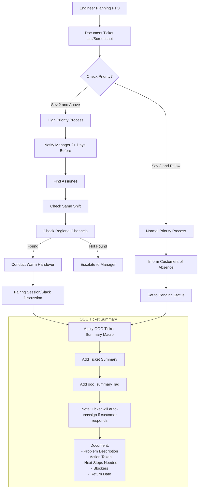

## Overview

These workflows discuss how support engineers can asynchronously manage and summarize on-going assigned tickets within Zendesk before they go on PTO.

### Using the OOO Ticket Summary macro

As part of this workflow, the Support Engineer going on leave will leave notes on currently Open, Pending and On-Hold tickets with a macro. This macro will provide a summary of the ticket, add the Support Engineer to the ticket's CC list, and adds the `ooo_summary` summary tag to the ticket. It is recommended to follow this workflow for all high-priority tickets or when taking three or more days of PTO.

### Ticket Prioritization Workflow

### Before Going on PTO

- Optional: You may choose to document your tickets by making a list or taking a screenshot, including the description and ID numbers. This can serve as a helpful backup reference.
- Understand Automation: A ticket will automatically be unassigned and placed onto the Global Queue if: The tag `ooo_summary` is applied to it AND `the customer responds to the ticket`.

#### For Severity 2 and Above Tickets

When planning PTO with high-priority tickets in your queue:

1. Find an appropriate assignee through the following progression:
   - Check for colleagues on the same shift.
   - Check regional support channels if no one is available on your shift.
   - If no assignee can be found, escalate to your manager.
1. Conduct a warm handover with the new assignee:
   - Schedule a pairing session or have a detailed Slack discussion.
   - Walk through the ticket details, customer context, and current status.
   - Apply the `General::OOO Ticket Summary` macro using the below Flow Chart Workflow.
   - The new Assignee takes assignment of the ticket.

#### For Severity 3 and Below Tickets

For lower-priority tickets:

1. Inform customers of your upcoming absence.
2. Set your ticket to Pending status.
3. Apply the `General::OOO Ticket Summary` macro to all tickets.

### Workflow

Go to the My Assigned Tickets view in Zendesk. For each ticket you wish to summarize because you anticipate on-going work will be required, do the following:

1. Use the `General::OOO Ticket Summary` macro.
2. Fill in the sections of the internal note with details for your peers. It is important that you summarize:
   - What is the problem to be solved?
   - Action Taken?
   - Next Steps Needed? Alternatively, clarify if you are uncertain what the next steps are.
   - Blockers?
   - Return Date.
3. Feel free to also ask regional peers if they can pickup tickets in other forms of communication, such as Slack, but Zendesk should remain as the single source of truth for tickets that need attention from other team members.
4. At the end of your last work day before taking PTO, update your availability using the [Out of Office](/handbook/security/customer-support-operations/docs/zendesk/apps#out-of-office) app in Zendesk. 
    1. Navigate to the [app in Zendesk](https://gitlab.zendesk.com/agent/apps/out-of-office).
    1. If empty, select "Refresh the app" at the top of the page.
    1. Click the `Make unavailable` button in the row with your agent information. It is important that you do this for tickets to be unssigned when the customer responds. 

#### Ticket Handover Process

When taking over a ticket that has the `ooo_summary` tag:

1. Review unassigned tickets for your region from the Global Suppport Ticket View.
1. Remove the `ooo_summary` tag from the ticket.
1. Set the Zendesk field `Handover Status` to `Handover Completed`.
1. Update ticket status and add appropriate comments for any work performed.
1. After the return date specified in the macro, you can liase with the original engineer to hand the ticket back.  If needed, schedule a knowledge transfer session with the returning engineer.

**Important:** If you skip removing the tag `ooo_summary` then the ticket will be automatically unassigned if the customer responds again.

#### Returning from PTO Process

1. Make yourself available in Zendesk by selecting "Make available" in the [Out of office app](https://gitlab.zendesk.com/agent/apps/out-of-office).
1. Optional: Review the status of the tickets assigned to you before your PTO. You can coordinate with the new owner if it makes sense to reclaim ownership. This could be beneficial if you have an established rapport with the customer, possess strong technical expertise on the issue, or had previously agreed to continue the investigation upon your return.

#### PTO FlowChart 

